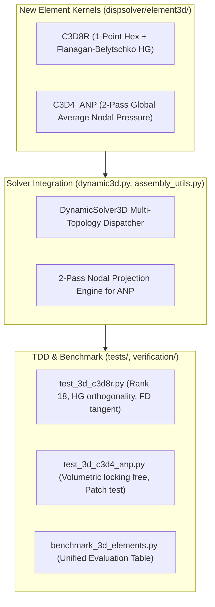

# Implementation Plan: Development of C3D8R, C3D4_ANP Elements and benchmark_3d_elements Suite

## 1. Goal Description

This task focuses on implementing two foundational 3D finite elements to complete our Abaqus-grade element library:
1. **`C3D8R`**: 8-node hexahedron with 1-point reduced numerical integration and Flanagan & Belytschko (1981) / Puso (2000) orthogonal hourglass stabilization. Provides **$3\sim 4\times$ speedup** over full-integration hexes while eliminating shear locking under bending.
2. **`C3D4_ANP`**: 4-node linear tetrahedron equipped with Bonet & Burton (1998) 2-pass global Average Nodal Pressure (F-bar patch projection). Resolves the catastrophic volumetric locking of linear tetrahedra in near-incompressible and plastic regimes ($\nu \to 0.5$).
3. **`benchmark_3d_elements`**: A unified, automated benchmark evaluation suite and tracking matrix ([`verification/benchmark_3d_elements.py`](file:///D:/PythonCodeStudy/WHT_DispFoldSolver/verification/benchmark_3d_elements.py)) covering all 3D solid elements (`C3D8`, `C3D8I`, `C3D8_FBAR`, `C3D8_CR`, `C3D8H`, `C3D8R`, `C3D4`, `C3D4_ANP`, `C3D10`, `C3D10M`, `C3D6`) across bending, incompressibility, eigenvalue spectrum, tangent accuracy, and execution speed.

---

## 2. User Review Required

> [!IMPORTANT]
> **Key Theoretical and Architectural Decisions**:
> 1. **C3D8R Hourglass Stiffness Scaling**:
>    - We adopt the Flanagan & Belytschko (1981) orthogonal projection: $\gamma_\alpha = h_\alpha - \sum_{i=1}^3 (h_\alpha^T \mathbf{x}_i) \mathbf{B}_i$ ($h_\alpha$ base patterns for $\alpha=1..4$).
>    - Scaling parameter $\kappa_{hg} = \frac{1}{2} \alpha_{hg} G \frac{V^{2/3}}{8}$ with $\alpha_{hg} = 0.05$ (Abaqus default `*HOURGLASS, DEFINITION=STIFFNESS`).
>    - Guarantees full Rank 18 (24 DOFs - 6 rigid body modes = 6 uniform strain + 12 hourglass modes).
> 2. **C3D4_ANP 2-Pass Global Assembly Scheme**:
>    - Pass 1 (Element $\rightarrow$ Node): Computes element volumes $V_e$, deformation gradient $F_e$, and accumulates smoothed nodal volume $V_a = \sum_{e \in S_a} \frac{1}{4} V_e$ and nodal Jacobian $J_a = \frac{1}{V_a} \sum_{e \in S_a} \frac{1}{4} V_e \det(F_e)$.
>    - Pass 2 (Node $\rightarrow$ Element): Computes element average volume ratio $\bar{J}_e = \frac{1}{4} \sum_{a=1}^4 J_a$ and modified deformation gradient $\bar{F}_e = (\bar{J}_e / J_e)^{1/3} F_e$, evaluating stress and internal force.
>    - Consistent Tangent: In JAX R&D, exact patch Jacobian is computed via `jax.jacfwd`. In Numba production, the standard decoupled F-bar element tangent $\bar{K}_e = \int \bar{B}^T C \bar{B} dV$ is employed to preserve standard sparsity bandwidth, providing rapid Newton convergence without cross-element matrix fill-in.
> 3. **Unified Tracking Table**:
>    - All benchmark metrics will be recorded in a markdown table and machine-readable JSON format via `verification/benchmark_3d_elements.py`.

---

## 3. Proposed Changes

### Component 1: `C3D8R` (Reduced Integration Hexahedron)

#### [NEW] [`dispsolver/element3d/c3d8r_jax.py`](file:///D:/PythonCodeStudy/WHT_DispFoldSolver/dispsolver/element3d/c3d8r_jax.py)
- JAX implementation of 8-node brick with 1-point integration at $\xi=\eta=\zeta=0$.
- Flanagan-Belytschko orthogonalized hourglass displacement vectors $q_{\alpha i} = \gamma_\alpha^T u_i$ and restoring forces.
- Autodiff verification of internal forces and tangent stiffness.

#### [NEW] [`dispsolver/element3d/c3d8r_numba.py`](file:///D:/PythonCodeStudy/WHT_DispFoldSolver/dispsolver/element3d/c3d8r_numba.py)
- High-performance Numba OpenMP parallel assembly kernel: `assemble_mesh_c3d8r_numba`.
- Single-element function: `compute_c3d8r_element_numba(node_coords, u_elem, mat_type, props, sdvs, dt, elem_controls)`.
- Evaluates centroidal $B_0$, calculates $\gamma_\alpha$ base vectors, adds $K_{hg} = \sum_{\alpha=1}^4 \kappa_{hg} (\gamma_\alpha \otimes \gamma_\alpha) \otimes I_{3\times 3}$.
- Material decoupling with `material_dispatch_3d`.

---

### Component 2: `C3D4_ANP` (Average Nodal Pressure Tetrahedron)

#### [NEW] [`dispsolver/element3d/c3d4_anp_jax.py`](file:///D:/PythonCodeStudy/WHT_DispFoldSolver/dispsolver/element3d/c3d4_anp_jax.py)
- Pure functional 2-pass ANP implementation using `jax.ops.segment_sum` / `jax.vmap`.
- Computes exact patch consistent tangent via `jax.jacfwd` for mathematical baseline verification.

#### [NEW] [`dispsolver/element3d/c3d4_anp_numba.py`](file:///D:/PythonCodeStudy/WHT_DispFoldSolver/dispsolver/element3d/c3d4_anp_numba.py)
- High-performance 2-pass assembly kernel:
  - `compute_nodal_volumes_and_dilatations_numba(...)` (Pass 1).
  - `assemble_mesh_c3d4_anp_numba(...)` (Pass 2 with $\bar{F}_e = (\bar{J}_e / J_e)^{1/3} F_e$ and decoupled B-bar tangent).
- Decoupled material evaluation with `material_dispatch_3d`.

---

### Component 3: Solver Integration & Kernel Routing

#### [MODIFY] [`dispsolver/element3d/__init__.py`](file:///D:/PythonCodeStudy/WHT_DispFoldSolver/dispsolver/element3d/__init__.py)
- Export `Hexa8ReducedElement`, `compute_c3d8r_element_numba`, `assemble_mesh_c3d8r_numba`.
- Export `Tetra4ANPElement`, `assemble_mesh_c3d4_anp_numba`.

#### [MODIFY] [`dispsolver/solver3d/dynamic3d.py`](file:///D:/PythonCodeStudy/WHT_DispFoldSolver/dispsolver/solver3d/dynamic3d.py)
- Update kernel classification groups:
  - `k=8`: `C3D8R` $\rightarrow$ calls `assemble_mesh_c3d8r_numba`.
  - `k=9`: `C3D4_ANP` $\rightarrow$ calls `assemble_mesh_c3d4_anp_numba` (with 2-pass preprocessing).

---

### Component 4: Unified Benchmark Suite & Tracking Table

#### [NEW] [`verification/benchmark_3d_elements.py`](file:///D:/PythonCodeStudy/WHT_DispFoldSolver/verification/benchmark_3d_elements.py)
- Standardized, repeatable benchmark runner testing:
  1. **Cantilever Bending Test**: Pure bending deflection error vs Analytical Timoshenko beam theory.
  2. **Incompressibility Locking Test**: Deflection retention at $\nu = 0.49999$ vs $\nu = 0.3$.
  3. **Eigenvalue Spectrum**: Strictly 6 zero rigid-body modes, positive eigenvalue count, 0 spurious modes.
  4. **Algorithmic Tangent Accuracy**: Central finite-difference vs analytical Jacobian error $< 10^{-5}$.
  5. **Assembly Execution Speed**: Milliseconds per 1,000 elements.
- Generates formatted Markdown comparison table and outputs results to `dev_log/benchmark_3d_elements_20260912.md`.

---

## 4. Verification Plan

### Automated Tests (TDD)
1. **`tests/test_3d_c3d8r.py`**:
   - `test_c3d8r_hourglass_orthogonality`: Verify $\gamma_\alpha^T x_i = 0$ and $\gamma_\alpha^T v_{rigid} = 0$.
   - `test_c3d8r_eigenvalue_spectrum`: Verify 6 zero modes, 18 strictly positive modes (Rank 18).
   - `test_c3d8r_jax_numba_parity`: JAX vs Numba kernel output matching.
   - `test_c3d8r_tangent_consistency`: Finite difference check ($err < 10^{-5}$).
   - `test_c3d8r_cantilever_bending`: Verify freedom from shear locking under bending.
2. **`tests/test_3d_c3d4_anp.py`**:
   - `test_c3d4_anp_patch_test`: Linear displacement patch test passing to machine precision.
   - `test_c3d4_anp_volumetric_locking_free`: Compare standard C3D4 vs C3D4_ANP at $\nu=0.49999$; verify ANP deflections do not lock.
   - `test_c3d4_anp_tangent_consistency`: FD Jacobian verification.
3. **Comprehensive Regression Suite**:
   - Run `pytest tests/test_3d_*.py -q` (all 3D unit tests).
   - Run `python -m verification.run_all` (all 14 baseline benchmarks).
4. **Benchmark Suite Run**:
   - Run `python -u verification/benchmark_3d_elements.py` to produce the complete evaluation table across all 11 solid elements.
