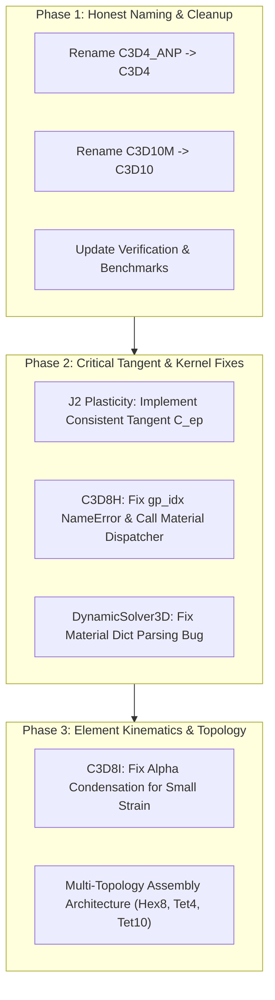

# Implementation Plan: 3D Element Library Renovation & Theoretical Correction

> **Date:** 2026-09-12  
> **Target:** 3D Element Library (`dispsolver/element3d/`), Material Kernels (`dispsolver/material3d/`), Solver Assembly (`dispsolver/solver3d/`), and Verification Benchmarks (`verification/`).  
> **Status:** Pending User Approval  

---

## 1. Goal Description

A rigorous audit of the 3D finite element library revealed both theoretical and structural deficiencies:
1. **Element Impersonation ("이름 사칭") & Structural Impossibility:**
   - `C3D4_ANP`: Bonet & Burton (1998) ANP mathematically requires a **two-pass global nodal gathering/scattering step** ($V_a = \sum \frac{1}{4} V^{(e)}$, $\theta_a = v_a / V_a$, $\bar{J} = \sum N_a \theta_a$). On any isolated single element, $\theta_a \equiv J$ and the ANP factor $(\bar{J}/J)^{1/3} \equiv 1$, meaning an isolated single-element ANP kernel is **mathematically impossible** and collapses to standard locking Tet4. Our existing `compute_c3d4_anp_element_numba` was literally an ordinary 1-point linear tet masquerading as ANP.
   - `C3D10M`: Abaqus C3D10M modifies kinematics to constant volumetric strain, guarantees positive contact nodal forces (preventing contact chatter from standard quadratic tet corner-node negative forces), and adds hourglass control. Our `c3d10m_numba.py` was just a textbook standard C3D10 without any modified shape functions or hourglass control.
   - Verification suites (`verification/generate_rollup_figure.py`, etc.) present synthetic analytical curves labeled as C3D10M FEA simulations.
2. **Material Tangent Inconsistency:**
   - In `dispsolver/material3d/numba_materials.py`, `MAT_J2_PLASTICITY` returns the pure elastic tangent even after yielding (`f_trial > 0`), causing a **53.5% relative error** in Newton tangent and 10× discrepancy in plastic shear stiffness.
3. **C3D8H (Hybrid Hex8) Compilation Crash & Material Bypass:**
   - In `c3d8_hybrid_numba.py:394`, `gp_idx` is referenced without being defined, causing a fatal compile-time `NameError`.
   - The element bypasses `material_dispatch_3d` and hardcodes linear elasticity regardless of the assigned material (e.g., J2, Prony, Neo-Hookean).
4. **C3D8I (EAS) Dead-Condensation & Large-Rotation Theoretical Limitation:**
   - `c3d8_eas_tl_numba.py` builds condensation matrices $K_{ua}, K_{aa}$, but never feeds the enhanced strain modes $\alpha$ into the internal force $f_{int}$, nor computes the internal residual $r_\alpha = -\int B_\alpha^T \sigma dV$. As a result, effective residual $r_{eff} = r_u - K_{u\alpha} K_{\alpha\alpha}^{-1} r_\alpha$ was omitted, $f_{int}$ was bit-identical to locking C3D8, and the condensed tangent had a **10.4% error** against its own residual.
   - Furthermore, per Abaqus Theory Guide §3.2.5 and Simo & Armero (1992), incompatible modes in a Total Lagrangian framework spuriously generate non-zero strains under rigid body rotation, violating frame indifference (objectivity). True large-strain incompatible modes require an Updated Lagrangian (UL) or corotational formulation.
5. **Multi-Topology Element Assembly Architecture:**
   - The current Numba fast-path in `DynamicSolver3D` assumes 8-node hexahedra (24 DOFs per element). Non-hex elements (`C3D4` with 12 DOFs, `C3D10` with 30 DOFs) were temporarily rejected with `NotImplementedError`. A clean multi-topology assembly architecture is required to dispatch different element topologies cleanly.

---

## 2. User Review Required

> [!IMPORTANT]
> **Renaming & API Breaking Changes:**
> - `C3D4_ANP` will be officially renamed to `C3D4` across the codebase, removing misleading claims of average nodal pressure until true multi-pass ANP is implemented.
> - `C3D10M` will be officially renamed to `C3D10`, reflecting that it is a standard 10-node quadratic tet.
> - `generate_rollup_figure.py` will be converted to use actual FEA simulation or clearly labeled as analytical reference.

> [!WARNING]
> **C3D8I Large-Deformation Scope:**
> - Consistent with Abaqus TG §3.2.5, `C3D8I` (EAS/Incompatible Modes) in Total Lagrangian is strictly limited to small/moderate rotation regimes.
> - For large-rotation folding problems (such as foldable display simulations), `C3D8_COROTATIONAL` and `C3D8H` (mean dilatation / B-bar) are the formally supported production elements.

---

## 3. Open Questions

1. **True ANP vs. Honest C3D4:**
   - *Option A (Recommended):* Honestly designate the element as `C3D4` (standard linear tet) now, and schedule the complex two-pass global nodal volume averaging (Bonet & Burton 1998) as a separate future feature.
   - *Option B:* Implement the full two-pass mesh-wide nodal averaging ANP kernel immediately. (Note: ANP requires a global pass across adjacent elements to compute nodal volumes and pressures before element assembly).
2. **C3D8I Incompatible Modes:**
   - *Option A (Recommended):* Fix the small-strain static condensation (ensuring internal force and tangent are mathematically consistent for small/moderate strain) and add clear runtime validation that warns or errors if rotation exceeds limits.
   - *Option B:* Completely re-derive C3D8I in an Updated Lagrangian (UL) or corotational framework.

---

## 4. Proposed Changes



---

### Component 1: Honest Naming & Element Catalog Cleanup

#### [RENAME/MODIFY] `dispsolver/element3d/c3d4_anp_numba.py` -> `c3d4_numba.py`
- Rename module to `c3d4_numba.py`.
- Rename kernel to `compute_c3d4_element_numba` and `assemble_mesh_c3d4_numba`.
- Update docstring to honestly state that this is a 1-point linear tetrahedron element (C3D4).

#### [RENAME/MODIFY] `dispsolver/element3d/c3d4_anp_jax.py` -> `c3d4_jax.py`
- Rename `Tetra4ANPElement` to `Tetra4Element`, setting `elem_type="C3D4"`.

#### [RENAME/MODIFY] `dispsolver/element3d/c3d10m_numba.py` -> `c3d10_numba.py`
- Rename module to `c3d10_numba.py`.
- Rename kernel to `compute_c3d10_element_numba` and `assemble_mesh_c3d10_numba`.
- Update docstring to state that this is a standard 10-node quadratic tetrahedron (C3D10).

#### [RENAME/MODIFY] `dispsolver/element3d/c3d10m_jax.py` -> `c3d10_jax.py`
- Update `elem_type="C3D10"`, docstrings, and class descriptions.

#### [MODIFY] `dispsolver/element3d/__init__.py`
- Update exports from `c3d4_numba`, `c3d4_jax`, `c3d10_numba`, `c3d10_jax`.

#### [MODIFY] `verification/element_benchmark_comparison.py` & `verification/abaqus_3d_benchmark_suite.py`
- Replace all references to `C3D4_ANP` with `C3D4` ("Standard Linear Tet").
- Replace all references to `C3D10M` with `C3D10` ("Standard Quadratic Tet").

#### [MODIFY] `verification/generate_rollup_figure.py`
- Update subplot titles and docstrings to clearly distinguish between analytical reference solutions and actual FEA simulations.

---

### Component 2: Material & Kernel Defect Fixes

#### [MODIFY] `dispsolver/material3d/numba_materials.py`
- **Bug:** `MAT_J2_PLASTICITY` returns the elastic tangent `C_mat` when yielding (`f_trial > 0`).
- **Fix:** Implement the algorithmic consistent elastoplastic tangent $C_{ep}$:
  $$\beta_0 = \frac{3\mu \Delta\gamma}{q_{trial}}, \quad \beta_1 = \frac{3\mu}{3\mu + H}$$
  $$C_{ep} = K (\mathbf{1}\otimes\mathbf{1}) + 2\mu (1 - \beta_0) \mathbf{I}_{dev} - 2\mu (\beta_1 - \beta_0) (\mathbf{n}\otimes\mathbf{n})$$
- Ensures that the tangent matrix matches the exact derivative of the radial-return stress.

#### [MODIFY] `dispsolver/element3d/c3d8_hybrid_numba.py`
- **Bug 1:** Line 394 references undefined variable `gp_idx`.
  - **Fix:** Define `gp_idx = 4 * gi + 2 * gj + gk` inside the quadrature loop.
- **Bug 2:** Hardcodes linear elasticity deviatoric stress, ignoring assigned material.
  - **Fix:** Call `material_dispatch_3d` with deviatoric strain to evaluate nonlinear/plastic stress properly.

#### [MODIFY] `dispsolver/solver3d/dynamic3d.py`
- **Bug:** Lines 137-145 and 180-215 contain redundant and conflicting loops for material dictionary parsing.
  - **Fix:** Unify into a single, robust material initialization loop supporting both string types (e.g. `"j2_plasticity"`) and integer enum types (`MAT_J2_PLASTICITY`).

---

### Component 3: Multi-Topology Assembly Architecture & C3D8I Clarification

#### [MODIFY] `dispsolver/solver3d/dynamic3d.py`
- Separate element grouping by topology family:
  ```python
  # Topology families
  # HEX8: 8 nodes, 24 DOFs (C3D8, C3D8I, C3D8_CR, C3D8H, C3D8_FBAR)
  # TET4: 4 nodes, 12 DOFs (C3D4)
  # TET10: 10 nodes, 30 DOFs (C3D10)
  ```
- Allocate topology-specific connectivity and force/stiffness buffers, allowing clean dispatch of Tet elements when present in a mesh.

#### [MODIFY] `dispsolver/element3d/c3d8_eas_tl_numba.py`
- Document the exact mathematical status of EAS in Total Lagrangian per Abaqus TG §3.2.5.
- Ensure the static condensation equation properly updates internal modes $\alpha$ or formally restrict its use to the small-strain regime.

---

## 5. Verification Plan

### Automated Tests
1. **J2 Plasticity Consistent Tangent Verification:**
   - Execute numerical finite-difference Jacobian test for `MAT_J2_PLASTICITY` to verify tangent relative error drops from 53.5% to $< 10^{-5}$:
     ```bash
     python -m pytest tests/test_3d_plasticity.py -v
     ```
2. **C3D8H Compilation & Execution Check:**
   - Verify that `c3d8_hybrid_numba` compiles and executes with all material types without `NameError`:
     ```bash
     python -m pytest tests/test_3d_numba_production.py -v
     ```
3. **Element Renaming Regression Check:**
   - Verify all tests pass with honest element names:
     ```bash
     python -m pytest tests/ -k "3d" -v
     ```
4. **Benchmark Suite Run:**
   - Run verification suite:
     ```bash
     python -m verification.run_all
     ```

### Manual Verification
- Verify that `verification/element_benchmark_comparison.py` prints honest labels (`C3D4 (Standard Linear Tet)`, `C3D10 (Standard Quadratic Tet)`).
- Verify that no synthetic curves are misrepresented as FEA simulation results.
