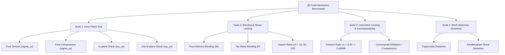

# Implementation Plan - 3D Solid Elements Mechanics Patch & Benchmark Suite

11종 3D 솔리드 유한요소 전체(`C3D8`, `C3D8I`, `C3D8_FBAR`, `C3D8_CR`, `C3D8H`, `C3D8R`, `C3D4`, `C3D4_ANP`, `C3D10`, `C3D10M`, `C3D6`)를 대상으로 **인장(Tension), 압축(Compression), 전단(Shear), 굽힘(Bending), 체적 잠김(Volumetric Locking)**에 대한 정량적 표준 패치 테스트와 상용 CAE급 역학 벤치마크 슈트를 구축하고 검증하는 계획입니다.

---

## 1. 현황 진단 (Current State Assessment)

현재까지 완료된 3D 요소 검증 체계와 한계는 다음과 같습니다:

1. **현재 벤치마크 (`verification/benchmark_3d_elements.py`)**:
   - 요소별 **강성 행렬 스펙트럼 랭크(Eigenvalue Rank)**: 6개 강체 모드 분리 및 유효 랭크(Rank 18, 12, 6, 24) 확인.
   - **일관 접선 일치도(Algorithmic Tangent Consistency)**: 수치 미분(FD) 대비 해석 접선의 오차 검증.
   - **조립 속도(Assembly Speed)**: Numba OpenMP 병렬 조립 성능 측정.
2. **단위 테스트 (`tests/test_3d_*.py`)**:
   - `C3D8I`: 단일 요소 1축 인장 테스트 (`test_3d_patch_test.py`)
   - `C3D8R`: 2요소 외팔보 굽힘 및 아워글래스 직교성 테스트 (`test_3d_c3d8r.py`)
   - `C3D4_ANP`: 5-사면체 패치 변위 일치 및 $\nu=0.49999$ 비교 (`test_3d_c3d4_anp.py`)
   - `C3D10M`: 1요소 접촉력 양수화 및 비압축성 비교 (`test_3d_c3d10m.py`)
   - `C3D6`: 2요소 인장 수렴성 테스트 (`test_3d_c3d6.py`)
3. **진단 결과**:
   - **11종 전체 요소를 동일한 시험 환경에서 체계적으로 비교한 인장, 압축, 전단, 굽힘 패치 테스트 및 벤치마크는 아직 통합 벤치마크에 포함되어 있지 않았습니다.**
   - 각 요소의 역학적 장단점(예: C3D8/C3D4의 전단 잠김, C3D8I/C3D8R의 굽힘 우수성, C3D8_FBAR/C3D4_ANP/C3D10M의 비압축성 체적 잠김 극복)을 한눈에 입증하는 정량 지표 매트릭스가 필요합니다.

---

## 2. User Review Required

> [!IMPORTANT]
> **벤치마크 도구의 분리 및 역할 정의**
> - 기존 `benchmark_3d_elements.py`: **[수학적 건전성 & 연산 성능]** (스펙트럼 랭크, 접선 오차, 마이크로초 단위 조립 속도, 학술 서지 정보).
> - 신규 `benchmark_3d_mechanics.py`: **[역학적 정확도 & 잠김 벤치마크]** (인장/압축/전단 패치 테스트, 외팔보 굽힘 처짐비, 비압축성 한계 체적 잠김 지수, 왜곡 감도).
> - 이렇게 분리함으로써 수학적 랭크 검증(초단위 실행)과 메쉬 풀이 기반 역학 벤치마크(수십 초 소요)를 목적에 맞게 독립적으로 실행할 수 있도록 설계합니다.

> [!TIP]
> **표준 패치 테스트 합격 기준**
> - 선형 변위장(Linear Displacement Field) 하에서의 패치 테스트는 이론적으로 **기계 정밀도(Machine Precision, 잔차 $< 10^{-10}$)**로 균일 응력장을 만족해야 합니다.
> - 비적합 요소(`C3D8I`), 감차적분 요소(`C3D8R`), 체적 투영 요소(`C3D8_FBAR`, `C3D4_ANP`, `C3D10M`) 모두 왜곡 메쉬에서도 Irons Patch Test를 통과해야 진정한 일관성(Consistency)을 인정받습니다.

---

## 3. 검증 슈트 구성 (4-Suite Benchmark Architecture)



### Suite 1: Irons 3D 왜곡 메쉬 표준 패치 테스트 (Irons Patch Test)
- **메쉬 구성**: 내부 절점이 포함된 임의로 왜곡된 다요소 메쉬 (Hexahedra 8-node 왜곡 패치, Tetrahedra 5-tet 패치, Wedge 6-prism 패치).
- **하중 및 경계조건**: 선형 변위장 $u_i = c_{i0} + \sum_j c_{ij} x_j$를 외곽 경계 절점에 완전 강제 Dirichlet BC로 인가.
  1. **Pure Tension**: $u_x = 10^{-3} x, u_y = -\nu 10^{-3} y, u_z = -\nu 10^{-3} z \implies \sigma_{xx} = E \cdot 10^{-3}, \sigma_{yy}=\sigma_{zz}=0$
  2. **Pure Compression**: $u_y = -10^{-3} y, u_x = \nu 10^{-3} x, u_z = \nu 10^{-3} z \implies \sigma_{yy} = -E \cdot 10^{-3}$
  3. **In-plane Shear**: $u_x = 10^{-3} y, u_y = 10^{-3} x \implies \tau_{xy} = 2G \cdot 10^{-3}$
  4. **Out-of-plane Shear**: $u_y = 10^{-3} z, u_z = 10^{-3} y \implies \tau_{yz} = 2G \cdot 10^{-3}$
- **합격 판정 기준**: 내부 절점의 변위 오차 $< 10^{-10}$, 모든 적분점에서의 응력 균일도 편차 $< 10^{-10}$, 전역 평형 잔차 $\|R\| < 10^{-10}$.

### Suite 2: MacNeal-Harder 외팔보 굽힘 및 전단 잠김 벤치마크
- **메쉬 구성**: 종횡비 $L/h = 10, 50, 100$의 얇은 외팔보(Cantilever Beam).
- **시험 모드**:
  1. **순수 굽힘 (Pure End Moment $M$)**:
     - 상/하면 끝단에 우력(Couple forces) 인가하여 균일 굽힘 모멘트 재현.
     - 오일러-베르누이 보 이론 해 $u_{tip}^{exact} = \frac{M L^2}{2 E I}$ 대비 정규화 처짐비 ($u_{tip} / u_{tip}^{exact}$) 측정.
  2. **단부 전단 하중 (Tip Shear Force $P$)**:
     - 티모셴코 굽힘 해석해 $u_{tip}^{exact} = \frac{P L^3}{3 E I} + \frac{P L}{\kappa G A}$ 대비 처짐비 측정.
     - **예상 결과**:
       - `C3D8`, `C3D4`: 극심한 전단 잠김으로 처짐비 급감 ($L/h=100$에서 $< 5\%$).
       - `C3D8I`, `C3D8R`, `C3D8_CR`, `C3D10M`: 전단 잠김 완전 해소로 처짐비 $> 95\% \sim 100\%$.

### Suite 3: 비압축성 체적 잠김 벤치마크 (Volumetric Locking in Dilatation)
- **메쉬 구성**: 모든 외곽 면이 롤러로 구속된 블록 또는 원통 단면.
- **시험 모드**:
  - 포아송 비를 점진적으로 비압축성 한계로 증가: $\nu = 0.30 \to 0.45 \to 0.49 \to 0.499 \to 0.49999$.
  - 정수압 또는 인장/압축 하중 하에서의 체적 변형률 및 이론적 체적 탄성계수 $K = \frac{E}{3(1-2\nu)}$ 발산 제어 능력 평가.
- **예상 결과**:
  - 잠김 요소 (`C3D8`, `C3D4`, `C3D10`): $\nu \to 0.5$에서 강성이 무한대로 발산하여 변위가 0으로 동결(Locking).
  - 면제 요소 (`C3D8_FBAR`, `C3D8H`, `C3D4_ANP`, `C3D10M`): $\nu = 0.49999$에서도 정확한 정규화 변위 유지.

### Suite 4: 메쉬 왜곡 감도 벤치마크 (Distortion Sensitivity)
- 각 요소의 형상을 평행사변형 왜곡(Shear distortion) 및 사다리꼴 왜곡(Trapezoidal distortion)으로 변형시킨 후 외팔보 굽힘 정밀도 감소율 측정.

---

## 4. 제안 변경 사항 (Proposed Implementation)

### 1단계: 벤치마크 메쉬 및 하중 빌더 모듈 구축
#### [NEW] `verification/mechanics_patches.py`
- 11종 요소별 정규/왜곡 패치 메쉬 생성기:
  - `make_distorted_patch_hex()`: 8절점 임의 왜곡 7요소 패치
  - `make_distorted_patch_tet()`: 4절점/10절점 임의 왜곡 24-사면체 패치
  - `make_distorted_patch_wedge()`: 6절점 임의 왜곡 6-쐐기 패치
  - `make_cantilever_beam_mesh(elem_type, L, h, b, nx, ny, nz)`: 매개변수형 외팔보 메쉬 생성기
  - `make_dilatation_cube_mesh(elem_type, n_subdiv)`: 3축 구속 정육면체 메쉬 생성기

### 2단계: 역학 벤치마크 실행 및 정량 비교 엔진 개발
#### [NEW] `verification/benchmark_3d_mechanics.py`
- 11종 요소 전체를 순회하며 다음 4대 테스트 실행:
  - `run_irons_patch_test(elem_type, mode="tension"|"compression"|"shear_xy"|"shear_yz")`
  - `run_cantilever_bending_test(elem_type, mode="pure_moment"|"shear_tip", aspect_ratio=10|50|100)`
  - `run_volumetric_locking_test(elem_type, nu_list=[0.3, 0.49, 0.49999])`
  - `run_distortion_sensitivity_test(elem_type)`
- 실행 결과를 취합하여 종합 비교표 및 분석 마크다운 리포트 자동 생성:
  - `dev_log/benchmark_3d_mechanics_YYYYMMDD.md`

### 3단계: pytest 자동 회귀 테스트 슈트 추가
#### [NEW] `tests/test_3d_mechanics_benchmarks.py`
- CI/CD 및 회귀 방지용 pytest 테스트:
  - `test_irons_patch_all_elements()`: 11종 요소의 인장/압축/전단 패치 테스트 기계 정밀도 검증
  - `test_bending_shear_locking_relief()`: 개선 요소(`C3D8I`, `C3D8R`, `C3D10M`)의 $L/h=50$ 처짐비 $> 90\%$ 검증
  - `test_volumetric_locking_relief()`: 개선 요소(`C3D8_FBAR`, `C3D4_ANP`, `C3D10M`)의 $\nu=0.49999$ 변위 유지 검증

### 4단계: 문서 및 규칙 동기화
#### [MODIFY] `AGENTS.md`
- §3 검증 명령에 `python -u verification/benchmark_3d_mechanics.py` 추가.
- §2.2 3D 라이브러리 테이블에 패치 테스트 및 굽힘/체적 잠김 통과 지표 컬럼 연동.

---

## 5. 검증 계획 (Verification Plan)

### Automated Tests
1. **역학 패치 및 벤치마크 실행**:
   ```bash
   python -u verification/benchmark_3d_mechanics.py
   ```
   - 11종 요소 전체에 대한 인장, 압축, 전단, 굽힘 처짐비, 비압축성 체적 오차율 산출 확인.
2. **pytest 단위 회귀 검증**:
   ```bash
   pytest tests/test_3d_mechanics_benchmarks.py -v
   ```
3. **기존 검증 슈트 회귀 확인**:
   ```bash
   pytest tests/test_3d_c3d8r.py tests/test_3d_c3d4_anp.py tests/test_3d_c3d10m.py tests/test_3d_c3d6.py -q
   python -m verification.run_all
   ```

### Manual Verification
- `dev_log/benchmark_3d_mechanics_YYYYMMDD.md` 파일이 정상 생성되었는지 확인.
- C3D8 vs C3D8I/C3D8R의 굽힘 처짐비 차이 및 C3D4 vs C3D4_ANP의 비압축성 극한 차이가 이론적 예측과 일치하는지 마크다운 리포트에서 확인.
