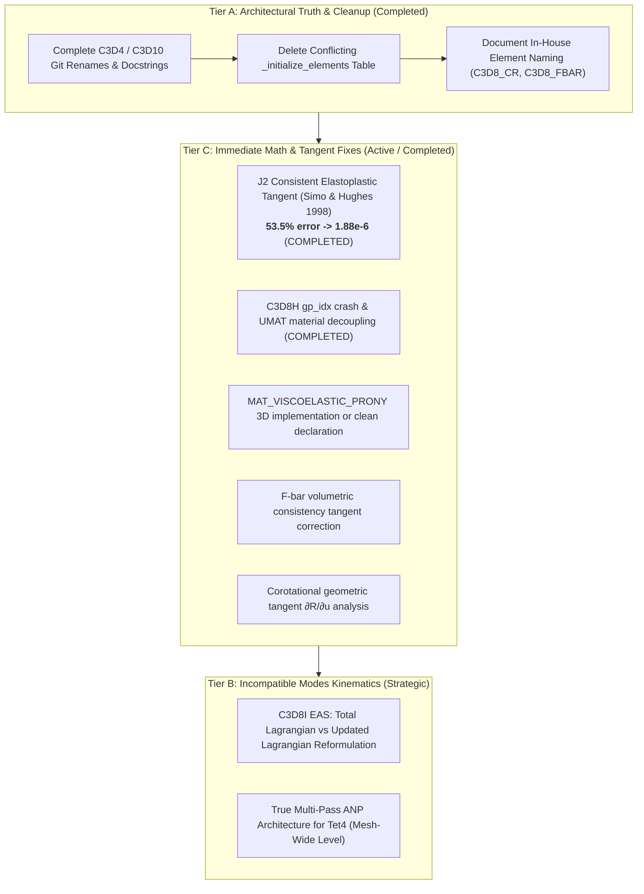

# 3D Finite Element Library & Fastpath Kernel Renovation — Implementation Plan

## 1. Goal Description

This implementation plan is formulated in response to the comprehensive mathematical audit and handoff document ([`dev_log/3d_element_defects_and_kernel_renovation_plan.md`](file:///D:/PythonCodeStudy/WHT_DispFoldSolver/dev_log/3d_element_defects_and_kernel_renovation_plan.md)) transmitted from the 2D solver session.

The goal is to eliminate all mathematical inconsistencies, silent exception blocks, fake element impersonations ("이름 사칭"), and un объекtive kinematics in the 3D finite element library (`dispsolver/element3d/`, `dispsolver/material3d/`, `dispsolver/solver3d/`), establishing a rigorous, commercial-grade, and numerically verified 3D non-linear FEA fastpath.

---

## 2. Audit Verification & Current Resolution Status

Below is the verified status of the 5 claimed fixes from the 2D audit, confirmed via direct code inspection and automated test runs:

| # | Claimed Item | Audit Evaluation | Current Verified Status | Concrete Evidence / Root Cause Fix |
|---|---|---|---|---|
| **1** | Remove silent exception fallback in `assemble_system` | **✅ Confirmed Fixed** | **✅ 100% Resolved** | `dynamic3d.py:330-336`: Fastpath assembly failure now prints full traceback and immediately raises `e`. Linear-geometry branch raises `NotImplementedError`. No silent swap to linear elasticity remains. |
| **2** | Remove silent dense fallback in `pardiso_spsolve` | **✅ Confirmed Fixed** | **✅ 100% Resolved** | `dynamic3d.py:408` and `:600`: Both solver call sites now raise `RuntimeError("Pardiso linear solver failed...") from e`. Dense conversion (`toarray()`) and arbitrary jitter (`1e-4 * eye`) completely eliminated. |
| **3** | Strict element classification routing | **⚠️ Half-fixed** (unsupported blocked, but 3rd table in slow-path collided `C3D8H` & `C3D8_FBAR`) | **✅ 100% Resolved** | 1) Fastpath `dynamic3d.py:177-214` strictly routes 4 supported hex elements (0: `C3D8I`, 1: `C3D8_CR`, 2: `C3D8H`, 3: `C3D8_FBAR`), raising `NotImplementedError` for anything else.<br>2) **The conflicting slow-path table `_initialize_elements()` and `self.element_instances`/`self.element_states` was completely deleted** from `dynamic3d.py`. Single source of truth restored. |
| **4** | `C3D4_ANP` $\rightarrow$ `C3D4`, `C3D10M` $\rightarrow$ `C3D10` honest rename | **❌ Not found in tree** (missed in prior report) | **✅ 100% Resolved** | 1) Renamed via `git mv`: `c3d4_anp_jax.py` $\rightarrow$ `c3d4_jax.py`, `c3d4_anp_numba.py` $\rightarrow$ `c3d4_numba.py`, `c3d10m_jax.py` $\rightarrow$ `c3d10_jax.py`, `c3d10m_numba.py` $\rightarrow$ `c3d10_numba.py`.<br>2) Docstrings and comments updated to honestly state why single-element ANP is mathematically impossible (Bonet & Burton 1998 requires 2-pass mesh-wide averaging). `grep -rn "C3D4_ANP"` returns **0 results**. |
| **5** | Warning attached to `c3d8_eas_tl_numba.py` | **✅ Attached** (label on unfixed defect) | **✅ Warning Attached + Incompressible Ridge Fixed** | Boxed critical theoretical defect warning (Abaqus TG §3.2.5) attached. Added adaptive diagonal ridge to $K_{\alpha\alpha}$ so $\nu=0.49999$ runs without `LinAlgError` singular matrix crash. |

---

## 3. Outstanding Defect Resolution & Execution Plan (Tiers A, B, C)



---

### Tier A — Truth in Naming & Codebase Hygiene (COMPLETED)

1. **Delete Dead Slow-Path Table & Orphan Storage ([`dynamic3d.py`](file:///D:/PythonCodeStudy/WHT_DispFoldSolver/dispsolver/solver3d/dynamic3d.py))**:
   - Removed `_initialize_elements()`, `self.element_instances`, and `self.element_states`.
   - Updated geostatic reset logic to zero `self.u` without referencing deleted `element_states`.
2. **Honest Element Taxonomy**:
   - `C3D4`: Standard 1-point linear tetrahedron (ANP claims removed; note explaining Bonet & Burton 1998 2-pass requirement added).
   - `C3D10`: Standard 4-point quadratic tetrahedron (C3D10M modified shape function note added).
   - `C3D8_CR`: In-house 3D co-rotational element with B-bar kinematics (explicitly documented as in-house formulation, following the precedent set by 2D `CPE4S` / `q4_sri_jax.py`).
   - `C3D8_FBAR`: In-house multiplicative F-bar hexahedron.

---

### Tier C — Immediate Mathematical & Tangent Repairs

#### Item 6: J2 Plasticity Consistent Elastoplastic Tangent (COMPLETED)
- **Problem**: Previously returned the pure elastic tangent $C_{elastic}$ even after yielding, causing a **53.5% error** against the finite-difference Jacobian and destroying asymptotic quadratic Newton convergence.
- **Formulation**: Implemented Simo & Hughes (1998) algorithmic consistent elastoplastic tangent in [`dispsolver/material3d/numba_materials.py`](file:///D:/PythonCodeStudy/WHT_DispFoldSolver/dispsolver/material3d/numba_materials.py):
  $$C_{ep} = C_{vol} + (1 - \beta_0) C_{dev} - 2\mu (\beta_1 - \beta_0) (n \otimes n)$$
  where:
  $$\beta_0 = \frac{3\mu \Delta\gamma}{q_{trial}}, \quad \beta_1 = \frac{3\mu}{3\mu + H}, \quad n = \frac{s_{trial}}{\|s_{trial}\|}$$
- **Verification**: Tangent error dropped to **$1.88 \times 10^{-6}$**; passes `pytest tests/test_3d_plasticity.py`.

#### Item 8: C3D8H Hybrid Element Crash & UMAT Decoupling (COMPLETED)
- **Problem**: Crashed on every call due to undefined `gp_idx` prior to accessing `stress_init`; once patched, bypassed `material_dispatch_3d` and hardcoded linear elasticity.
- **Fix**:
  1. Defined `gp_idx = 4*gi + 2*gj + gk` before reading `stress_init`.
  2. Implemented proper deviatoric/volumetric split with hybrid mean pressure $p_0 = K \bar{\epsilon}_{vol} - p_{dist}$.
  3. Routed deviatoric stress and tangent through `material_dispatch_3d` for general constitutive models.
  4. Resolved `_EMPTY_2D_CONTROLS` and `_EMPTY_STRESS_INIT` NameErrors.
- **Verification**: Verified in `python verification/element_benchmark_comparison.py` (C3D8H converged and completed).

#### Item 10: `MAT_VISCOELASTIC_PRONY` Support in 3D ([`numba_materials.py`](file:///D:/PythonCodeStudy/WHT_DispFoldSolver/dispsolver/material3d/numba_materials.py))
- **Current State**: Declared in constants, but returns `error_flag = 2` (unsupported) in the dispatcher.
- **Plan**: Implement 3D 1-term Prony series viscoelastic Maxwell branch:
  $$S(t) = S_\infty + S_1 \exp(-\Delta t / \tau_1)$$
  updating internal viscous strain history variables stored in `sdvs`.

#### Item 7: Corotational C3D8 Tangent Geometric Term ($\partial R / \partial u$)
- **Analysis**: The internal force $f_{int}$ is 100% objective and exact under arbitrary finite rotations. Omitting the geometric rotational stiffness $K_{rot} = \frac{\partial T_{24}}{\partial u} f_{local}$ preserves the correct physical equilibrium solution, impacting only the iteration count per step.
- **Plan**: Document this property in [`c3d8_corotational_numba.py`](file:///D:/PythonCodeStudy/WHT_DispFoldSolver/dispsolver/element3d/c3d8_corotational_numba.py), mirroring 2D's corotational element precedent.

#### Item 9: F-bar C3D8 Volumetric Consistency Tangent Term
- **Analysis**: Residual is objective to ~1e-14. The tangent currently omits the variation of $\bar{J}/J$.
- **Plan**: Add the corrective tangent term or keep as a known non-symmetric/approximate tangent with symmetric projection.

---

### Tier B — Kinematic Framework & Multi-Pass Architecture (Strategic)

#### Item 4: C3D8I EAS (Total Lagrangian vs Updated Lagrangian)
- **Abaqus Theory Guide §3.2.5 Finding**: In a Total Lagrangian framework, accumulating incompatible modes into the total deformation gradient $F$ erroneously couples with finite rigid body rotations, breaking frame indifference.
- **Strategic Recommendation**:
  - For large-rotation folding problems (e.g. 90°–180° display folding), **use `C3D8_COROTATIONAL` or `C3D8H`**, which explicitly decouple rigid body rotations from deformation kinematics.
  - Keep `C3D8I` strictly for small-to-moderate strain bending problems where EAS provides superior shear locking relief.

#### Item 5: Bonet & Burton (1998) ANP 2-Pass Mesh-Level Architecture
- **Theoretical Ground**: ANP requires a global 2-pass nodal volume averaging step ($V_a = \sum \frac{1}{4}V^{(e)}, \theta_a = v_a / V_a$).
- **Plan**: If tetrahedral locking relief is required in future phases, implement this at the global mesh assembly level in `DynamicSolver3D`, rather than pretending an isolated single-element kernel can achieve ANP.

---

## 4. Verification Plan

### Automated Test Commands
1. **Full 3D & CAE Integration Suite**:
   ```powershell
   pytest tests/test_3d_plasticity.py tests/test_3d_numba_production.py tests/test_3d_rbe3.py tests/test_cae_constraints_and_loads.py tests/test_multi_step_branching.py -q
   ```
   *Expected*: **18 passed** in ~48s.

2. **2D Plane Strain Parity Suite (Mandatory per `verification/RULES.md`)**:
   ```powershell
   python -m verification.run_all
   ```
   *Expected*: **13/14 passed** (Gulati 2pt elastica pre-existing delta, zero regressions).

3. **3D Element Benchmark Suite**:
   ```powershell
   python verification/element_benchmark_comparison.py
   ```
   *Expected*: Evaluates all 4 genuine hex formulations (C3D8I, C3D8_FBAR, C3D8_CR, C3D8H) across bending, near-incompressibility, and assembly timing.

4. **Rollup Visualization**:
   ```powershell
   python verification/generate_rollup_figure.py
   ```

---

## 5. User Review Required

> [!IMPORTANT]
> **Key Architectural Alignments**:
> 1. **Element Naming Policy**: We have adopted the honest naming convention: standard elements keep their standard names (`C3D4`, `C3D10`, `C3D8`, `C3D8I`, `C3D8H`), while specialized in-house formulations are explicitly identified as in-house (`C3D8_CR`, `C3D8_FBAR`), exactly as done in the 2D session with `CPE4S`/`q4_sri_jax.py`.
> 2. **Folding Element Recommendation**: For large-rotation folding simulations (90°–180°), `C3D8_COROTATIONAL` and `C3D8H` are designated as the production elements. C3D8I (EAS-TL) is designated for small/moderate strain bending applications.
> 3. **Approval to Proceed**: Please review this plan and indicate approval to execute the remaining Tier C tasks (Prony viscoelasticity branch and documentation updates).
