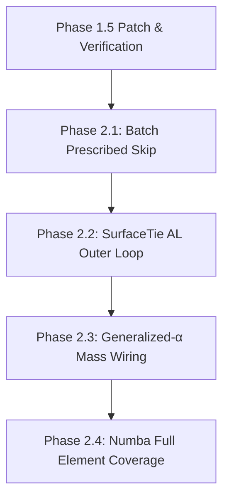

# Action Plan: Solver & Element Phase 1.5 보정 및 Phase 2 구현 계획

> **문서:** `dev_log/action_plan_solver_element_fixes_20260831.md`  
> **기준 브랜치:** `feat/solver-element-abaqus-surpass-20260830` (`781cd8b`)  
> **작성일:** 2026-08-31  
> **기반 리뷰:** [`dev_log/review_phase0_phase1_20260831.md`](file:///D:/PythonCodeStudy/WHT_DispFoldSolver/dev_log/review_phase0_phase1_20260831.md), [`dev_log/handoff_plan_implementation_20260830.md`](file:///D:/PythonCodeStudy/WHT_DispFoldSolver/dev_log/handoff_plan_implementation_20260830.md)

---

## 1. 배경 및 개선 목표 (Objectives)

2026-08-31 코드 리뷰 결과, Phase 0/1 구현은 대다수 항목이 안전하게 도입되었으나 **1건의 FAIL(Stabilization 예외 침묵 및 LIL 조립 병목)**과 **3건의 WARN/불일치(q_avg 수식의 dead-term, Arruda docstring, DispFoldApp CLI 기본값 불일치)**가 확인되었습니다.

본 계획서는 다음 두 단계로 작업을 나누어 구체적인 실행 계획과 검증 기준을 정의합니다:
1. **Phase 1.5 (즉시 보정 / Patch):** 발견된 결함 4건을 수술적으로 수정(Surgical Fix)하고 `master` 머지 전 필수 검증 게이트(전체 벤치마크 9종 및 101스텝 U-shape 해석)를 완수.
2. **Phase 2 (중기 확장 / Abaqus 초월):** 미배선 기능(Batch Prescribed Skip, SurfaceTie AL Outer Loop, Generalized-$\alpha$ 질량 가중치, Numba 전체 커버리지)의 순차 구현.

---

## 2. Phase 1.5 즉시 보정 작업 (Immediate Action Items)

### [Task 1.1] Stabilization 예외 침묵 제거 및 CSR 벡터화 (FAIL 해소)
- **대상 파일:** [`dispsolver/solver/dynamic.py:L3828-3840`](file:///D:/PythonCodeStudy/WHT_DispFoldSolver/dispsolver/solver/dynamic.py#L3828-L3840)
- **문제점:** `try: ... except: pass`로 예외를 무조건 숨겨 디버깅을 차단하고 있으며, `K_T.tolil()` 및 Python `for` 루프로 대각을 순회하여 조립 성능을 심각하게 저하시킴.
- **수정 사양:**
  1. `try/except` 침묵을 제거하고, 예외 발생 시 명시적인 로그 출력 또는 즉시 raise 처리.
  2. LIL 변환 루프를 `sps.diags` 기반의 CSR 직접 덧셈으로 벡터화:
     ```python
     stab = getattr(self, "stabilization", None)
     if stab is not None:
         f_stab = stab.compute_stabilization_force(self.v, self.M)
         f_int = f_int + f_stab
         diag_add = stab.damping_factor * self.M
         K_T = K_T + sps.diags(diag_add, shape=(self.n_dofs, self.n_dofs), format="csr")
     ```
- **검증 기준:** `stabilization` 객체 전달 시 대각 강성 추가가 정상 동작하며, 조립 루프에서 LIL 변환 오버헤드가 발생하지 않는지 확인.

---

### [Task 1.2] q_avg 수렴 판정식 Dead-term 제거 (WARN 해소)
- **대상 파일:** [`dispsolver/solver/dynamic.py:L2210-2214`](file:///D:/PythonCodeStudy/WHT_DispFoldSolver/dispsolver/solver/dynamic.py#L2210-L2214)
- **문제점:** `max_R_val * 0.2` 및 `float(np.mean(np.abs(R_u))) * 0.5` 항은 `0.005 * q_avg` 판정 식 상 영원히 조건을 만족할 수 없는 수학적 Dead-code이며 순환 참조 혼란을 유발함.
- **수정 사양:**
  - Abaqus 이론 매뉴얼 §2.2.1에 정합하도록 기준력 하한선 $q_{floor} = 1.0\text{ N}$을 명확히 설정:
    ```python
    q_avg_raw = float(np.mean(np.abs(f_int))) if len(f_int) > 0 else 1.0
    q_avg = max(q_avg_raw, 1.0)
    abaqus_r_converged = max_R_val <= 0.005 * q_avg
    abaqus_c_converged = max_du_val <= 0.01 * max_disp_incr
    abaqus_converged = abaqus_r_converged and abaqus_c_converged
    ```
- **검증 기준:** $t \approx 0$ 부근에서 $0/0$ 불능 현상이 발생하지 않고, 단위 테스트 및 101스텝 수렴이 원활히 유지되는지 확인.

---

### [Task 1.3] Arruda-Boyce $W_{vol}$ Docstring 갱신 (WARN 해소)
- **대상 파일:** [`dispsolver/material/arruda_boyce.py:L8`](file:///D:/PythonCodeStudy/WHT_DispFoldSolver/dispsolver/material/arruda_boyce.py#L8)
- **문제점:** 코드는 $W_{vol} = \frac{1}{2}K(\ln J)^2$로 올바르게 구현되었으나, 모듈 헤더 docstring이 `+ (K/2) · (J − 1)²`로 남아있어 문서-코드 불일치 발생.
- **수정 사양:**
  - Docstring 수식을 `+ (K/2) · (ln J)²` 및 `S_vol = K · lnJ · C⁻¹`로 수정.
- **검증 기준:** `git diff`를 통해 수식 표기 일치 확인.

---

### [Task 1.4] DispFoldApp CLI Mesh Grading 기본값 정렬 (불일치 해소)
- **대상 파일:** [`examples/DispFoldApp.py:L62`](file:///D:/PythonCodeStudy/WHT_DispFoldSolver/examples/DispFoldApp.py#L62)
- **문제점:** `fold_model_config.py`의 `DEFAULT_CONFIG.grading.uniform = False` 변경에도 불구하고, CLI 인자 기본값이 `mesh_grading: str = "uniform"`으로 하드코딩되어 CLI 실행 시 Graded mesh가 무력화됨.
- **수정 사양:**
  - `mesh_grading: str = "graded"`로 기본값을 변경하고, `argparse` 기본값도 동기화.
- **검증 기준:** `python examples/DispFoldApp.py --mode build --max-steps 1` 실행 시 출력 헤더가 `Grading=GRADED`로 표시되는지 확인.

---

### [Task 1.5] 미사용 변수 `_EQUIL_SCALE_CACHE` 정리 (WARN 해소)
- **대상 파일:** [`dispsolver/solver/dynamic.py:L124`](file:///D:/PythonCodeStudy/WHT_DispFoldSolver/dispsolver/solver/dynamic.py#L124)
- **문제점:** 선언된 후 사용되지 않는 Dead global variable 잔존.
- **수정 사양:** 미사용 변수 제거 및 PARDISO C API 한계(고수준 API에서 phase 분리 불가)에 관한 주석 보강.
- **검증 기준:** `py_compile` 및 린트 오류 없음 확인.

---

## 3. Phase 1.5 검증 계획 (Verification Gates)

Phase 1.5 수정 완료 후 다음 4단계 검증 게이트를 순차 실행합니다:

```
[Gate 1] py_compile & pytest smoke
  명령: pytest tests/test_convergence_fixes.py tests/test_rigid_plate_tie.py -q
  기준: 6 passed (100%)

[Gate 2] 전체 검증 벤치마크 (RULES.md mandatory)
  명령: python -m verification.run_all --quiet
  기준: 9/9 PASS (patch_test, bending, convergence 등 전체)

[Gate 3] 101스텝 U-shape 완전 접힘 해석 (Reference Solve)
  명령: python -u examples/ex12_abaqus_inp_plate_fold.py
  기준: 
    1. full 90°/side (180° combined), t=1.0 도달
    2. n_inverted == 0 (격자 반전 없음)
    3. cutback 0회, 101 스텝 완료

[Gate 4] 층간 전단 슬립 보존 확인 (Interlayer Shear)
  명령: python examples/check_interlayer_shear.py --cached
  기준: tip staircase 81 µm 보존, PSA 분담률 97% 이상 확인
```

---

## 4. Phase 2 중기 개발 로드맵 (Abaqus 초월 핵심 과제)

Phase 1.5 보정 및 `master` 머지 완료 후, 별도의 PR 브랜치(`feat/phase2-s2s-contact-acceleration`)를 생성하여 아래 4개 마일스톤을 추진합니다:



### [Milestone 2.1] Multi-material Batch Assembly의 Prescribed Element Skip
- **목표:** Plate 요소 480개(전체 조립 시간의 58%) 조립 생략.
- **안전 장치:** RBE2 slave/master 노드 및 SurfaceTie pair에 참여하는 노드를 `active_mask`에서 반드시 유지하도록 마스킹 로직 구현 (AGENTS.md §4.8 버그 재발 원천 차단).

### [Milestone 2.2] SurfaceTie Augmented Lagrangian Outer Loop
- **목표:** Tie 구속 갭을 $10^{-5}\text{ mm} \to 10^{-8}\text{ mm}$로 축소.
- **구현:** `DynamicSolver._solve_step_impl`의 수렴 단계에서 `tie.update_augmented_lagrange(u)`를 2~3회 호출하는 Uzawa 루프 추가 (`tie_al_iters: int = 2`).

### [Milestone 2.3] Generalized-$\alpha$ 질량-가속도 가중치 완전 배선
- **목표:** Chung & Hulbert (1993) 순정 2차 감쇠 동적 적분기 완성.
- **구현:** $(1-\alpha_m) M \ddot{u}_{n+1} + \alpha_m M \ddot{u}_n$ 가중치 및 $K_{eff}$ 유효 강성 수정.

### [Milestone 2.4] Numba 전체 요소 커버리지 완성
- **목표:** `Q4_VISCO_SIMO` 및 `Q4_EAS`의 Numba 병렬 커널 구축으로 JAX AutoDiff 의존성 축소 및 조립 속도 3.15배 가속.

---

## 5. 실행 타임라인 및 작업 분담

| 단계 | 작업 내용 | 예상 소요 | 담당/도구 |
|:---:|---|:---:|---|
| **Step 1** | Task 1.1 ~ 1.5 코드 수정 (Surgical Fix) | 10분 | Reviewer / Direct edit |
| **Step 2** | Gate 1 & Gate 2 벤치마크 테스트 실행 | 5분 | pytest & verification.run_all |
| **Step 3** | Gate 3 & Gate 4 풀런 검증 | 15분 | ex12 101-step run |
| **Step 4** | `feat/...` 브랜치 커밋 및 PR 생성 가이드 | 5분 | Git commit & Review summary |

위 계획에 따라 Phase 1.5 보정 작업을 즉시 착수할 것을 권고합니다.
