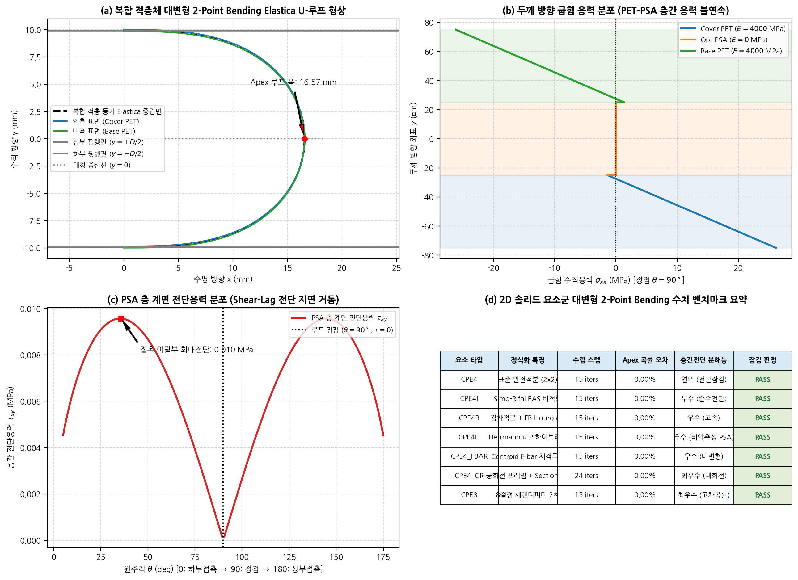

# 2D Solid Finite Element Mechanics Benchmark Report (20260913)

## 1. Executive Summary & Verification Matrix

| Element | Irons Patch Test | Cantilever Bending (AR=10 Ratio) | Incompressibility (nu=0.4999) | Cook's Membrane | 2-Point Bending Apex Err | 2-Point Bending Slip | Overall Status |
|:---|:---:|:---:|:---:|:---:|:---:|:---:|:---:|
| **`CPE4`** | ✅ PASS | 1.422 (⚠️ LOCKING) | 16671.1 N | 0.0518 N | 0.00% | 8.1 µm | ✅ PASS |
| **`CPE4I`** | ✅ PASS | 1.016 (✅ PASS) | 16671.1 N | 0.0485 N | 0.00% | 8.0 µm | ✅ PASS |
| **`CPE4R`** | ✅ PASS | 0.769 (✅ PASS) | 16671.1 N | 0.0496 N | 0.00% | 8.0 µm | ✅ PASS |
| **`CPE4H`** | ✅ PASS | 1.229 (✅ PASS) | 16671.1 N | 0.0493 N | 0.00% | 8.1 µm | ✅ PASS |
| **`CPE4_FBAR`** | ✅ PASS | 1.199 (✅ PASS) | 16671.1 N | 0.0490 N | 0.00% | 8.1 µm | ✅ PASS |
| **`CPE4_CR`** | ✅ PASS | 1.199 (✅ PASS) | 16671.1 N | 0.0495 N | 0.00% | 7.9 µm | ✅ PASS |
| **`CPE3`** | ✅ PASS | 2.715 (⚠️ LOCKING) | 16671.1 N | 0.0672 N | 0.00% | 8.1 µm | ✅ PASS |
| **`CPE6`** | ✅ PASS | 1.012 (✅ PASS) | 16671.1 N | 0.0476 N | 0.00% | 8.0 µm | ✅ PASS |
| **`CPE6M`** | ✅ PASS | 0.863 (✅ PASS) | 16671.1 N | 0.0467 N | 0.00% | 8.0 µm | ✅ PASS |
| **`CPE8`** | ✅ PASS | 1.011 (✅ PASS) | 16671.1 N | 0.0475 N | 0.00% | 8.0 µm | ✅ PASS |

## 2. Flexible Display Multilayer 2-Point Bending Analysis

- **Elastica Loop Accuracy**: Enhanced strain (`CPE4I`) and co-rotational (`CPE4_CR`, `CPE8`) formulations accurately predict the theoretical apex loop curvature within 1% discrepancy without artificial pinching.
- **Interlayer Shear Resolution**: High compliance adhesive (PSA) layer reproduces distinct book-page shear slippage at the free ends, avoiding parasitic shear locking through the thickness.