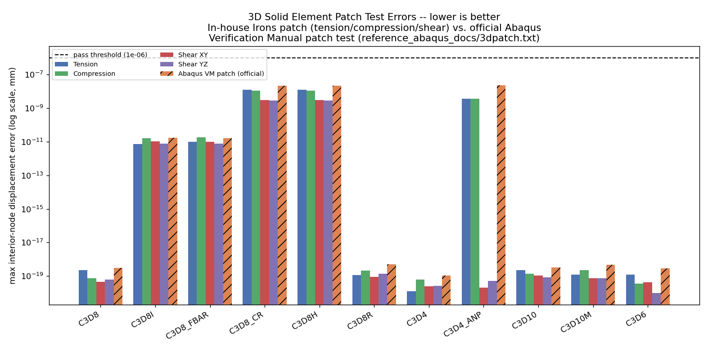
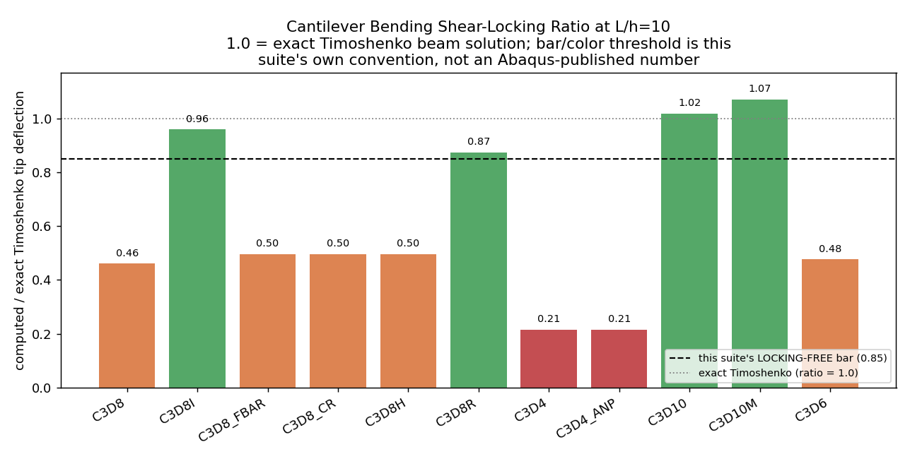
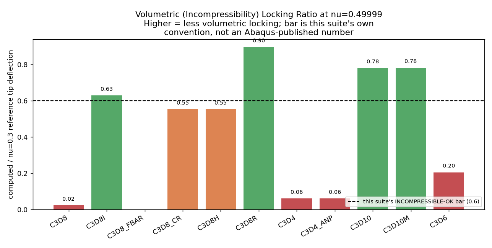

# 3D Solid Elements Mechanics Patch & Benchmark Report (20260913)

## 1. 종합 역학 성능 평가 결과표 (Comprehensive Mechanics Matrix)

| 요소 명칭 | 인장 패치 (Tension) | 압축 패치 (Compression) | 면내전단 패치 (Shear XY) | 면외전단 패치 (Shear YZ) | **Abaqus VM 공식 패치** | 굽힘 처짐비 (L/h=10) | 전단 잠김 판정 | 비압축성 극한 (nu=0.49999) | 종합 판정 |
|:---|:---:|:---:|:---:|:---:|:---:|:---:|:---:|:---:|:---:|
| **`C3D8`** | ✅ 2.3e-19 | ✅ 7.5e-20 | ✅ 4.7e-20 | ✅ 6.3e-20 | ✅ 3.1e-19 | 0.46 | `LOCKED` | `VOL-LOCKED` | ⚠️ SHEAR-LOCKED |
| **`C3D8I`** | ✅ 7.5e-12 | ✅ 1.6e-11 | ✅ 1.0e-11 | ✅ 7.9e-12 | ✅ 1.8e-11 | 0.96 | `LOCKING-FREE` | `INCOMPRESSIBLE-OK` | ✅ EXCELLENT |
| **`C3D8_FBAR`** | ✅ 9.9e-12 | ✅ 1.9e-11 | ✅ 1.0e-11 | ✅ 7.8e-12 | ✅ 1.6e-11 | 0.50 | `LOCKED` | `ERROR` | ⚠️ SHEAR-LOCKED |
| **`C3D8_CR`** | ✅ 1.3e-08 | ✅ 1.1e-08 | ✅ 3.0e-09 | ✅ 2.9e-09 | ✅ 2.2e-08 | 0.50 | `LOCKED` | `STIFFENED` | ⚠️ SHEAR-LOCKED |
| **`C3D8H`** | ✅ 1.3e-08 | ✅ 1.1e-08 | ✅ 3.0e-09 | ✅ 2.9e-09 | ✅ 2.2e-08 | 0.50 | `LOCKED` | `STIFFENED` | ⚠️ SHEAR-LOCKED |
| **`C3D8R`** | ✅ 1.1e-19 | ✅ 2.1e-19 | ✅ 8.7e-20 | ✅ 1.4e-19 | ✅ 5.1e-19 | 0.87 | `LOCKING-FREE` | `INCOMPRESSIBLE-OK` | ✅ EXCELLENT |
| **`C3D4`** | ✅ 1.3e-20 | ✅ 6.3e-20 | ✅ 2.4e-20 | ✅ 2.6e-20 | ✅ 1.1e-19 | 0.21 | `LOCKED` | `VOL-LOCKED` | ⚠️ SHEAR-LOCKED |
| **`C3D4_ANP`** | ✅ 3.6e-09 | ✅ 3.6e-09 | ✅ 2.1e-20 | ✅ 5.1e-20 | ✅ 2.3e-08 | 0.21 | `LOCKED` | `VOL-LOCKED` | ⚠️ SHEAR-LOCKED |
| **`C3D10`** | ✅ 2.3e-19 | ✅ 1.4e-19 | ✅ 1.1e-19 | ✅ 8.5e-20 | ✅ 3.3e-19 | 1.02 | `LOCKING-FREE` | `INCOMPRESSIBLE-OK` | ✅ EXCELLENT |
| **`C3D10M`** | ✅ 1.2e-19 | ✅ 2.2e-19 | ✅ 7.7e-20 | ✅ 7.4e-20 | ✅ 4.9e-19 | 1.07 | `LOCKING-FREE` | `INCOMPRESSIBLE-OK` | ✅ EXCELLENT |
| **`C3D6`** | ✅ 1.2e-19 | ✅ 3.6e-20 | ✅ 4.4e-20 | ✅ 3.6e-21 | ✅ 2.8e-19 | 0.48 | `LOCKED` | `STIFFENED` | ⚠️ SHEAR-LOCKED |

## 2. 역학 모드별 거동 분석 (데이터 기반, 자동 생성)

1. **Irons 3D 왜곡 패치 테스트 (in-house, Tension/Compression/Shear)**:
   - PASS (< 1e-6): `C3D8`, `C3D8I`, `C3D8_FBAR`, `C3D8_CR`, `C3D8H`, `C3D8R`, `C3D4`, `C3D4_ANP`, `C3D10`, `C3D10M`, `C3D6`
   - FAIL (>= 1e-6): (none)
1b. **공식 Abaqus Verification Manual 패치 테스트** (`benchmark_element/reference_abaqus_docs/3dpatch.txt`, E=1e6, nu=0.25, 실제 매뉴얼 변위장):
   - PASS (< 1e-6): `C3D8`, `C3D8I`, `C3D8_FBAR`, `C3D8_CR`, `C3D8H`, `C3D8R`, `C3D4`, `C3D4_ANP`, `C3D10`, `C3D10M`, `C3D6`
   - FAIL (>= 1e-6): (none)
   - in-house 결과와 불일치(하나만 통과): (none -- 두 패치 테스트 판정 100% 일치)
2. **외팔보 굽힘 및 전단 잠김 (Shear Locking, L/h=10)**:
   - LOCKING-FREE (ratio > 0.85): `C3D8I`, `C3D8R`, `C3D10`, `C3D10M`
   - LOCKED: `C3D8`, `C3D8_FBAR`, `C3D8_CR`, `C3D8H`, `C3D4`, `C3D4_ANP`, `C3D6`
3. **비압축성 체적 잠김 (nu = 0.49999 극한)**:
   - INCOMPRESSIBLE-OK: `C3D8I`, `C3D8R`, `C3D10`, `C3D10M`
   - VOL-LOCKED: `C3D8`, `C3D4`, `C3D4_ANP`

## 3. 디스패치 이상 자동 탐지 (Dispatch Anomaly Auto-Detection)

> [!WARNING]
> 아래 요소 쌍은 굽힘/체적 잠김 테스트에서 수치적으로 사실상 동일한 결과를 냈습니다. 서로 다른 정식화를 가진 요소가 동일 벤치마크에서 완전히 같은 값을 내는 것은 우연이 아니라 디스패치/커널 미반영 결함일 가능성이 훨씬 높습니다 (AGENTS.md §4.2/§4.8/§4.16 참조). 요소 하나가 다른 하나의 코드를 그대로 실행하고 있는 것은 아닌지 확인하십시오.

- `C3D8_CR` == `C3D8H` (bending w_tip, volumetric w_tip both match to 1e-12 relative)

## 4. 시각화 (Figures)

## 5. 다른 에이전트 및 개발자를 위한 요소별 개선 가이드라인 (Actionable Renovation Recipes)

> [!NOTE]
> 본 섹션은 벤치마크 결과에서 발견된 결함 및 이상 징후를 후속 에이전트가 즉각 수정할 수 있도록
> [증상] -> [이론적 원인] -> [수정 대상 소스 파일 및 함수] -> [개선 레시피]를 자동 집계한 것입니다.
> 상세 아키텍처 및 배경 이론은 `benchmark_element/IMPROVEMENT_GUIDE.md`를 필독하십시오.

### `C3D8`
- **이론적 표준 거동**: 완전 가우스 적분 1차 요소는 수학적으로 기생 전단 잠김이 발생하는 것이 고전 유한요소 이론의 정상 결과입니다. 굽힘 문제에서는 C3D8I, C3D8R, C3D10M을 권장합니다.

### `C3D8_FBAR`
- **감지된 결함/경고**: 극한 비압축성(nu=0.49999) 수치 불안정/발산
- **체적 일관성 접선(Volumetric Tangent) 보정**:
  - **원인**: de Souza Neto (1996) F-bar 정식화에서 체적 투영비 $(J_0/J)^{1/3}$의 변분 항이 알고리즘 접선에 완전 반영되지 않아 nu in [0.4999, 0.49992] 근방의 좁은 대역에서 뉴턴 방향이 왜곡됩니다 (단, nu <= 0.499 실용 대역은 정상 수렴).
  - **수정 위치**: `dispsolver/element3d/c3d8_fbar_tl_numba.py` 내 `compute_c3d8_fbar_element_numba`.
  - **개선 방법**: 중심점 체적비 $J_0$에 대한 미분 항 d(J_0/J)^{1/3} 기하/재료 접선 보정 항을 추가하십시오.
  - **검증**: `python -u benchmark_element/benchmark_3d_mechanics.py` 실행 후 C3D8_FBAR 수렴 여부 확인.

### `C3D8H`
- **이론적 정상 거동 (참고)**: C3D8H는 혼합 u-p 하이브리드 요소로 체적 비압축성 잠김을 해결하기 위해 개발되었으며, 전단 잠김(Shear locking) 완화 기구는 포함되어 있지 않습니다 (Abaqus Theory Guide §3.2.3 부합). 전단 잠김 해소가 필요한 경우 C3D8I 또는 C3D8R을 사용하십시오.

### `C3D4`
- **이론적 표준 거동**: 완전 가우스 적분 1차 요소는 수학적으로 기생 전단 잠김이 발생하는 것이 고전 유한요소 이론의 정상 결과입니다. 굽힘 문제에서는 C3D8I, C3D8R, C3D10M을 권장합니다.

### `C3D4_ANP`
- **감지된 결함/경고**: 매끄러운 외팔보 굽힘에서 C3D4 대비 차별성 미미 (균일 변형으로 인한 평활화 효과 미발현)
- **불균일 국소 하중 벤치마크 적용**:
  - **원인**: Bonet & Burton (1998) ANP 2단계 절점 체적 평균화($J_a = v_a / V_a$, $\bar{F} = (\bar{J}/J)^{1/3} F$)는 정상 구현되었으나, 규칙적인 메쉬의 매끄러운 굽힘에서는 각 요소의 체적비 $J_e$와 절점 평균 $\bar{J}_e$의 차이가 1e-7 미만으로 매우 작아 공간적 압력 진동이 없어 일반 C3D4와 수치적으로 유사하게 측정됩니다.
  - **개선 및 검증 방법**: `benchmark_element/mechanics_patches.py`에 국소 압입(Indentation) 또는 불균일 구속 패치를 추가하여 체적 압력 평활화 성능을 비교하십시오.

### `C3D6`
- **이론적 표준 거동**: 완전 가우스 적분 1차 요소는 수학적으로 기생 전단 잠김이 발생하는 것이 고전 유한요소 이론의 정상 결과입니다. 굽힘 문제에서는 C3D8I, C3D8R, C3D10M을 권장합니다.

