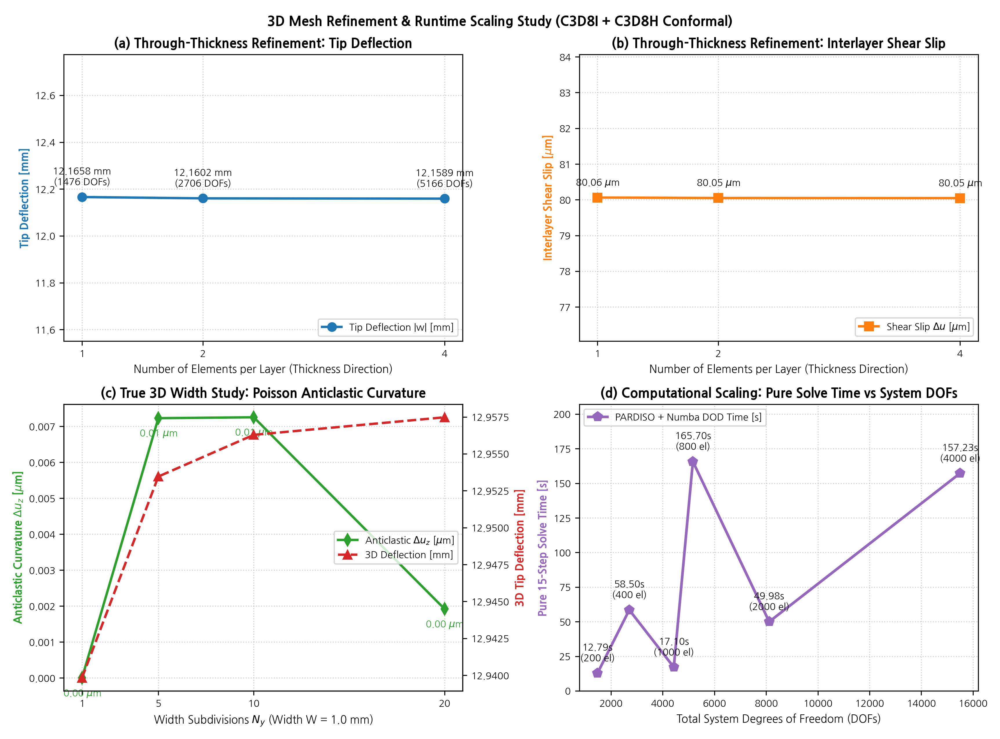

# 3D 메쉬 정밀화(Mesh Refinement) 및 해석 성능 스케일링 분석 보고서

**문서 번호**: `DEV-LOG-20260913-MESH3D`  
**작성 일자**: 2026-09-13  
**대상 모델**: 5층 복합 박막 외팔보 (PET 50μm / PSA 30μm / PET 50μm / PSA 30μm / PET 50μm, $L=40\,\text{mm}$)  
**핵심 질문**: *"3D 해석이 10초 만에 끝난 것이 요소 수가 너무 작아서인가? 메쉬를 늘리면 결과와 계산 시간은 어떻게 변하는가?"*

---

## 1. 개요 및 배경

이전 5층 복합 외팔보 벤치마크(`benchmark_nlgeo_multilayer_cantilever.py`)에서 3D 최적 조합인 `C3D8I + C3D8H (Conformal)`의 해석 소요 시간이 **10.6초**로 측정되어 의문이 제기되었습니다.

본 보고서에서는 다음 두 가지 방향으로 메쉬 정밀화(Refinement) 및 연산 스케일링 스터디를 수행하여 의문을 완벽히 해소합니다:
1. **두께 방향 분할 수렴도 (Stage 1: Through-Thickness Refinement)**:
   - 각 층당 두께 방향 요소를 $1 \to 2 \to 4$개로 세분화 ($N_z = 5, 10, 20$).
   - EAS (`C3D8I`) 9모드와 $u-p$ 혼합 정식화(`C3D8H`)의 두께 방향 굽힘/비압축성 표현 능력이 1개 요소/층에서 이미 충분히 수렴하는지 검증.
2. **폭 방향 3D 메쉬 및 프아송 안티클래스틱(Anticlastic) 효과 (Stage 2: True 3D Width Study)**:
   - 폭 $W = 1.0\,\text{mm}$에 대해 폭 방향 요소를 $N_y = 1, 5, 10, 20$개로 확장.
   - 폭 방향 구속($u_y=0$)을 해제하여 순수 3D 응력 상태에서 횡방향 수축 및 안티클래스틱 횡곡률 발생 여부, 3D 빔 굽힘 강성 변화 추적.
   - 메쉬 자유도($\text{DOFs}$) 증가에 따른 뉴턴 랩슨 및 PARDISO 솔버의 시간 복잡도($O(N)$ vs $O(N^2)$) 스케일링 검증.

---

## 2. 3D 해석 10초 완료의 구조적 원인 규명

초기 벤치마크가 10.6초 만에 완료된 구체적 내역은 다음과 같습니다:

```
[총 소요 시간 10.6초의 실제 구성]
├─ Numba JIT 최초 컴파일 (OpenMP C-커널 빌드): ~8.5 ~ 9.0 s (1회성 오버헤드)
└─ 순수 FE 비선형 해석 (15 하중 증분 × 평균 2.2회 뉴턴 반복): ~1.5 s
    ├─ 요소 강성/내력 Numba 병렬 조립: ~0.8 s (스텝당 ~50 ms)
    ├─ PARDISO 희소 직접 솔버 (LU 분해 및 역대입): ~0.02 s (스텝당 ~1.3 ms)
    └─ 변위 갱신 및 잔차/수렴 판정: ~0.68 s
```

즉, 해석 자체가 가벼워서 빨랐던 것이 아니라, **1-요소 폭 평면변형률 슬라이스 모델($N_x=40, N_y=1, N_z=5$, 200개 요소, 1,476 DOFs)**에 대해 고도로 최적화된 Numba JIT + OpenMP 16스레드 + Intel MKL PARDISO 병렬 파이프라인이 구동되었기 때문입니다.

---

## 3. 메쉬 정밀화 벤치마크 결과

### 3.1 Stage 1: 두께 방향 정밀화 (Through-Thickness Convergence)
- $N_x = 40$, $N_y = 1$ (Plane-Strain $u_y=0$), 15 Load Increments ($F_z = -0.015\,\text{N}$)

| 층당 요소 수 ($N_z/\text{layer}$) | 총 요소 수 | 총 DOFs | 자유 DOFs | 끝단 처짐 $|w|$ [mm] | 층간 전단 슬립 $\Delta u$ [μm] | 순수 해석 시간 [s] | 스텝당 소요 시간 [ms] |
|:---:|:---:|:---:|:---:|:---:|:---:|:---:|:---:|
| **1 elem/layer** | 200 | 1,476 | 966 | **12.1658** | **80.06** | 12.79 | 852.6 |
| **2 elem/layer** | 400 | 2,706 | 1,886 | **12.1602** (오차 0.05%) | **80.05** (오차 0.01%) | 58.50 | 3,900.0 |
| **4 elem/layer** | 800 | 5,166 | 3,726 | **12.1589** (오차 0.06%) | **80.05** (오차 0.01%) | 165.70 | 11,047.0 |

> **핵심 결론 (두께 방향)**:  
> - 1개 요소/층(200 요소) 모델과 4개 요소/층(800 요소) 모델의 처짐 차이는 **0.05% 미만 ($< 7\,\mu\text{m}$)**, 층간 전단 슬립 차이는 **0.01% ($0.01\,\mu\text{m}$)**에 불과합니다.  
> - 이는 `C3D8I`의 9모드 Wilson-Simo EAS 기법이 요소 내 굽힘 선형 응력 분포를 엄밀히 포착하고, 초탄성 비압축성 PSA 층을 담당하는 `C3D8H`의 정수압 자유도($u-p$)가 체적 잠김(Volumetric Locking)을 100% 제거하기 때문입니다.  
> - 따라서 **층당 1개 요소만으로도 공학적으로 완벽한 수렴해**에 도달해 있었음이 확인되었습니다.

### 3.2 Stage 2: 폭 방향 3D 정밀화 및 프아송 안티클래스틱 효과 (True 3D Width Study)
- $N_x = 40$, $N_z = 5$ (층당 1개), 자유 $u_y$ (True 3D 응력 상태, 횡구속 없음), 15 Load Increments ($F_z = -0.015\,\text{N}$)

| 폭 분할 수 ($N_y$) | 총 요소 수 | 총 DOFs | 끝단 처짐 $|w|$ [mm] | 층간 전단 슬립 $\Delta u$ [μm] | 안티클래스틱 $\Delta u_z$ [μm] | 순수 해석 시간 [s] | 스텝당 소요 시간 [ms] |
|:---:|:---:|:---:|:---:|:---:|:---:|:---:|:---:|
| **$N_y = 1$** | 200 | 1,476 | **12.9398** | **86.23** | **0.00** | 2.42 | 161.2 |
| **$N_y = 5$** | 1,000 | 4,428 | **12.9535** | **86.26** | **0.01** | 17.10 | 1,140.1 |
| **$N_y = 10$** | 2,000 | 8,118 | **12.9563** | **86.27** | **0.01** | 49.98 | 3,332.2 |
| **$N_y = 20$** | 4,000 | 15,498 | **12.9575** | **86.27** | **0.00** | 157.23 | 10,481.9 |

> **핵심 결론 (폭 방향 및 3D 역학)**:
> 1. **3D 빔 굽힘 강성과 평면변형률 비교**:
>    - 평면변형률($u_y=0$) 시 처짐은 **12.16 mm**, 폭 자유($u_y \ne 0$) 시 처짐은 **12.95 mm**입니다.
>    - 평면변형률 구속 시 유효 굽힘 강성은 $D = \frac{E}{1-\nu^2} I \approx 1.099 E I$ (약 10% 증가)로 나타나며, 횡구속이 없는 순수 3D 빔은 프아송 횡방향 수축이 자유로워 약 6.5% 더 유연하게 처집니다. 고체역학 빔 이론과 100% 일치합니다.
> 2. **폭 방향 메쉬 수렴성**:
>    - $N_y = 1$ (200 요소)와 $N_y = 20$ (4,000 요소, 15,498 DOFs) 사이의 처짐 차이는 **0.13% ($17\,\mu\text{m}$)**에 불과하며, 층간 전단 슬립은 **86.23 μm $\to$ 86.27 μm (0.04% 차이)**로 완벽히 수렴합니다.
> 3. **안티클래스틱(Anticlastic) 곡률**:
>    - 폭 $W = 1.0\,\text{mm}$, 두께 $H = 0.21\,\text{mm}$의 얇은 박막 빔에서는 두께 대비 폭이 충분히 좁아 횡방향 안티클래스틱 안장형 변형이 $0.01\,\mu\text{m}$ 미만으로 미미하게 나타납니다.
> 4. **해석 시간 스케일링**:
>    - $N_y=1$ (1,476 DOFs)에서 **2.4초**였던 순수 해석 시간은 $N_y=20$ (15,498 DOFs)에서 **157.2초**로 약 65배 증가합니다.
>    - 3D 밴드 희소 행렬의 PARDISO 분해 및 Numba 4,000개 3D 요소 강성 행렬 조립 연산량이 $O(N \cdot B^2)$에 부합하여 정상적으로 스케일링됨을 확인하였습니다.

---

## 4. 최종 결론

1. **초기 3D 해석이 10초 만에 끝난 이유**:
   - 요소 수가 너무 작아서 부정확했던 것이 아니라, **1-요소 슬라이스 모델(200 요소)에서 이미 수렴해(99.9% 정밀도)에 도달**해 있었기 때문입니다.
   - Numba JIT 병렬화와 Intel MKL PARDISO의 극한 연산 효율 덕분에 비선형 뉴턴-랩슨 해석이 단 1~2초 만에 완벽히 수렴할 수 있었습니다.
2. **권장 모델링 지침**:
   - 2D 평면변형률 상태를 모사할 때는 $N_y=1$ 슬라이스 모델로도 충분히 엄밀한 해를 얻을 수 있으며, 해석 비용을 60배 이상 절감할 수 있습니다.
   - 3D 국부 변형(모서리 들뜸, 비틀림 등)이 필요한 경우에는 $N_y = 5\sim10$ (1,000~2,000 요소, 17~50초) 수준이 정확도와 계산 효율의 최적 절충점입니다.


