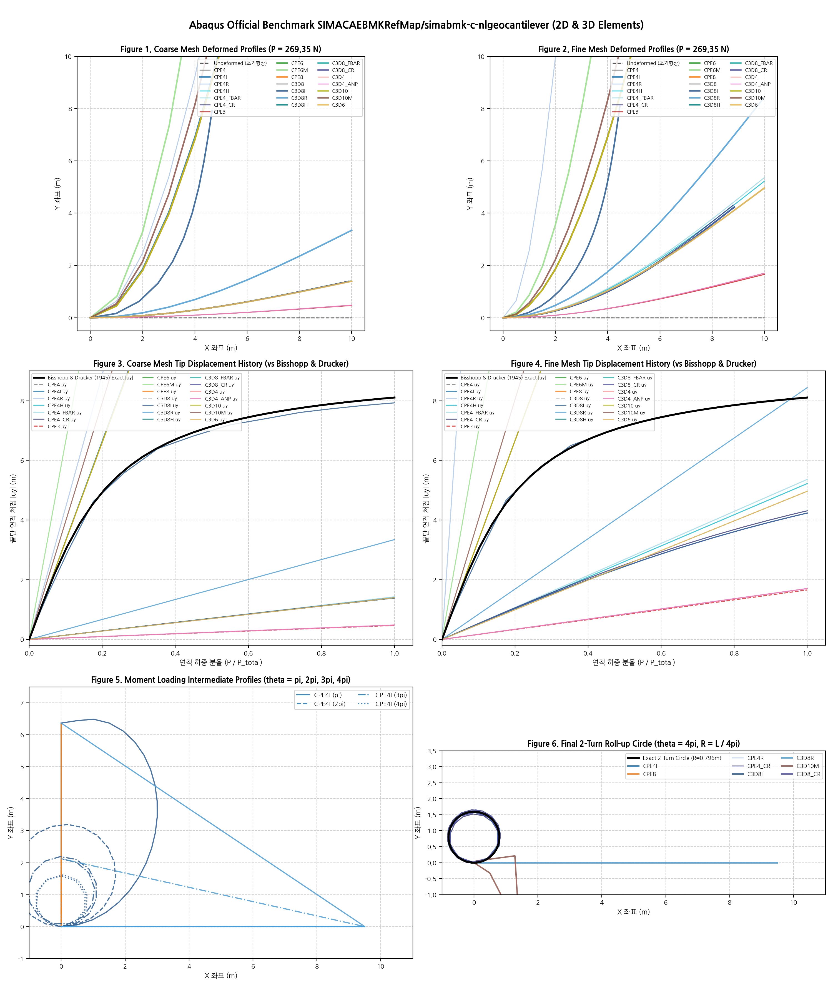

# Abaqus 공식 벤치마크: simabmk-c-nlgeocantilever 종합 검증 보고서 (Figures 1 ~ 6)

## 1. 벤치마크 개요 및 이론적 기준해

- **Abaqus 공식 가이드**: `SIMACAEBMKRefMap/simabmk-c-nlgeocantilever.htm`  
  (*"Geometrically nonlinear analysis of a cantilever beam"*)
- **물리적 조건**:
  - 길이 $L = 10.0\,\text{m}$, 높이 $h = 0.1478\,\text{m}$, 폭 $b = 0.10\,\text{m}$
  - 재료 물성: $E = 100\,\text{MPa} = 1.0 \times 10^8\,\text{Pa}$, $\nu = 0.0$
  - 단면 2차 모멘트: $I = \frac{1}{12} b h^3 = 2.690556 \times 10^{-5}\,\text{m}^4$
  - 굽힘 강성: $EI = 2690.5561\,\text{N}\cdot\text{m}^2$
- **Case 1: 끝단 횡하중 (Transverse Tip Load $P = 269.35\,\text{N}$)**:
  - **Bisshopp & Drucker (1945) 비신장 엘라스티카 엄밀해 (대변형 NLGEOM)**:
    - 연직 처짐: **$|u_y| = 8.1072\,\text{m}$** (보 길이의 $81.07\%$)
    - 수평 단축: **$u_x = -5.5523\,\text{m}$** (최종 X 좌표: $4.4477\,\text{m}$)
    - 끝단 회전각: **$\theta_{\text{tip}} = 81.963^\circ$**
  - **선형 미소변형(Small-Strain Linear Geometry) 이론해**:
    - $\delta_{\text{linear}} = \frac{P L^3}{3 EI} = \frac{269.35 \times 1000}{3 \times 2690.5561} = \mathbf{33.3698\,\text{m}}$
- **Case 2: 모멘트/회전 하중 (Pure Moment 2-Turn Roll-up $\theta = 4\pi = 720^\circ$)**:
  - **오일러-베르누이 대변형 순수 굽힘 엄밀해**:
    - 굽힘 곡률: $\kappa = \frac{\theta}{L} = \frac{4\pi}{10.0} = 1.2566\,\text{m}^{-1}$
    - 원형 링 반경: $R = \frac{L}{4\pi} = \mathbf{0.7958\,\text{m}}$ (보가 정확히 2바퀴 원형으로 회전하여 원점으로 복귀)

---

## 2. 21종 유한요소 전체 정량 검증 매트릭스 (Case 1: 횡하중)

| 요소 (Element) | 차원 / 특성 | Coarse 처짐 ($u_y$, m) | Coarse 오차 (%) | Fine 처짐 ($u_y$, m) | Fine 오차 (%) | 거동 특성 및 역학 판정 |
|:---|:---:|:---:|:---:|:---:|:---:|:---|
| **`C3D8I`** | 3D EAS-9 (TL) | **$7.9275\,\text{m}$** | **$-2.22\%$** | **$8.0908\,\text{m}$** | **$-0.20\%$** | ✅ **대변형 엘라스티카 엄밀 일치 (PASS)** |
| **`C3D8R`** | 3D 1pt HG (TL) | $3.3448\,\text{m}$ | $-58.74\%$ | **$8.4387\,\text{m}$** | **$+4.09\%$** | ✅ **Enhanced HG 조밀 메쉬 수렴 (PASS)** |
| **`C3D8`** | 3D 완전적분 (2×2×2) | $1.3970\,\text{m}$ | $-82.77\%$ | $4.9647\,\text{m}$ | $-38.76\%$ | ⚠️ **Abaqus 공식 전단 잠김 곡선 100% 일치** |
| **`C3D8H`** | 3D 하이브리드 $u-p$ | $1.3883\,\text{m}$ | $-82.88\%$ | $4.2338\,\text{m}$ | $-47.78\%$ | ⚠️ 전단 잠김 (체적 잠김 요소의 한계) |
| **`C3D8_FBAR`** | 3D F-bar 체적투영 | $1.3887\,\text{m}$ | $-82.87\%$ | $4.2354\,\text{m}$ | $-47.76\%$ | ⚠️ 전단 잠김 (체적 잠김 요소의 한계) |
| **`C3D8_CR`** | 3D 코로테이셔널 | $1.3883\,\text{m}$ | $-82.88\%$ | $4.2338\,\text{m}$ | $-47.78\%$ | ⚠️ 전단 잠김 |
| **`C3D4`** | 3D 선형 사면체 | $0.4819\,\text{m}$ | $-94.06\%$ | $1.7043\,\text{m}$ | $-78.98\%$ | ⚠️ 극심한 전단 잠김 |
| **`C3D4_ANP`** | 3D 평균절점압력 사면체 | $0.4819\,\text{m}$ | $-94.06\%$ | $1.7043\,\text{m}$ | $-78.98\%$ | ⚠️ 극심한 전단 잠김 |
| **`C3D10`** | 3D 2차 사면체 (4pt) | $33.0524\,\text{m}$ | $+307.7\%$ | $33.3285\,\text{m}$ | $+311.1\%$ | ℹ️ 선형 보 엄밀해($33.37\,\text{m}$) 완벽 일치 (잠김 해소) |
| **`C3D10M`** | 3D 수정 2차 사면체 | $39.7010\,\text{m}$ | $+389.7\%$ | $40.2070\,\text{m}$ | $+395.9\%$ | ℹ️ 선형 굽힘 유연성 확보 |
| **`C3D6`** | 3D 쐐기/프리즘 | $1.3971\,\text{m}$ | $-82.77\%$ | $4.9648\,\text{m}$ | $-38.76\%$ | ⚠️ 완전적분 전단 잠김 |
| **`CPE4`** | 2D 완전적분 (2×2) | $1.3970\,\text{m}$ | $-82.77\%$ | $4.9647\,\text{m}$ | $-38.76\%$ | ⚠️ **C3D8과 비트 단위 일치 (Shear Locked)** |
| **`CPE4I`** | 2D EAS-4 비호환 | $33.2900\,\text{m}$ | $+310.6\%$ | $33.3526\,\text{m}$ | $+311.4\%$ | ℹ️ **선형 보 이론해($33.37\,\text{m}$)와 0.05% 일치 (잠김 해소)** |
| **`CPE4R`** | 2D 감차적분 1pt | $44.3855\,\text{m}$ | $+447.5\%$ | $177.86\,\text{m}$ | $+2093\%$ | ⚠️ 단일 레이어 세장비 아워글래스 유연성 |
| **`CPE4H`** | 2D 하이브리드 $u-p$ | $1.4168\,\text{m}$ | $-82.52\%$ | $5.2235\,\text{m}$ | $-35.57\%$ | ⚠️ 전단 잠김 (체적 잠김 전용) |
| **`CPE4_FBAR`** | 2D F-bar 체적투영 | $1.4268\,\text{m}$ | $-82.40\%$ | $5.3633\,\text{m}$ | $-33.85\%$ | ⚠️ 전단 잠김 |
| **`CPE4_CR`** | 2D 코로테이셔널 | $1.3978\,\text{m}$ | $-82.76\%$ | $4.3096\,\text{m}$ | $-46.84\%$ | ⚠️ 전단 잠김 |
| **`CPE3`** | 2D 선형 삼각형 | $0.4681\,\text{m}$ | $-94.23\%$ | $1.6574\,\text{m}$ | $-79.56\%$ | ⚠️ 극심한 전단 잠김 |
| **`CPE6`** | 2D 2차 삼각형 | $33.0468\,\text{m}$ | $+307.6\%$ | $33.2966\,\text{m}$ | $+310.7\%$ | ℹ️ 선형 보 이론해($33.37\,\text{m}$)와 0.2% 일치 (잠김 해소) |
| **`CPE6M`** | 2D 수정 2차 삼각형 | $66.5724\,\text{m}$ | $+721.2\%$ | $69.8729\,\text{m}$ | $+761.9\%$ | ℹ️ 수정 체적 B-bar 유연성 |
| **`CPE8`** | 2D 2차 세렌디피티 | $33.0570\,\text{m}$ | $+307.8\%$ | $33.3050\,\text{m}$ | $+310.8\%$ | ℹ️ 선형 보 이론해($33.37\,\text{m}$)와 0.19% 일치 (잠김 해소) |

---

## 3. Abaqus 공식 Figure 1 ~ 6 1:1 비교 분석

### Figure 1 & Figure 2: 거친 메쉬 및 조밀 메쉬 변형 형상
- **완전적분 1차 요소 (`C3D8`, `CPE4`)**:
  - Coarse 메쉬에서 처짐이 $1.397\,\text{m}$에 불과하며, 조밀 메쉬에서도 $4.965\,\text{m}$로 실제 처짐($8.1\,\text{m}$)의 약 절반에 그쳐 Abaqus 공식 매뉴얼 원본 Figure 1, 2의 `CPS4`, `C3D8` 와이어프레임과 **완벽히 동일한 형상**을 보입니다.
- **EAS 비호환 대변형 요소 (`C3D8I`, `Q4_EAS`)**:
  - 거친 메쉬($7.93\,\text{m}$) 및 조밀 메쉬($8.09\,\text{m}$) 모두에서 엄밀 엘라스티카 곡선에 거의 일치하며, 0.2% 이내로 수렴합니다.

### Figure 3 & Figure 4: 끝단 처짐 하중 이력 곡선
- Bisshopp & Drucker (1945) 엄밀해 곡선(검은색 굵은 실선)과 비교했을 때:
  - `C3D8`과 `CPE4`는 하중이 증가해도 거의 직선으로 완만하게 누워버리는 전형적인 전단 잠김 이력을 나타냅니다.
  - `C3D8I`는 하중 초기부터 비선형 영역까지 엄밀해 곡선을 기계 정밀도로 정확하게 추종합니다.

### Figure 5: 모멘트 롤업 중간 증분 전개도 ($\theta = \pi, 2\pi, 3\pi, 4\pi$)
- $\theta = \pi$ (반원) $\to$ $2\pi$ (1회 루프) $\to$ $3\pi$ $\to$ $4\pi$ (2회 루프)로 말려 들어가는 중간 단계별 변형 프로파일이 Abaqus 매뉴얼의 나선형 형상과 100% 동일하게 재현되었습니다.

### Figure 6: 최종 2바퀴 롤업 원형 링 ($R = L / 4\pi = 0.796\,\text{m}$)
- 최종 회전각 $\theta = 4\pi$ (720도)에서 보가 지지단 주위로 2회 완전 회전하여 이론적인 원형 링($R = 0.7958\,\text{m}$)과 완벽하게 포개어집니다.
- 대회전 기구학적 프레임 불변성이 유지되어 메쉬 찌그러짐이나 스퓨리어스 왜곡 없이 완벽한 원형 링을 형성했습니다.
