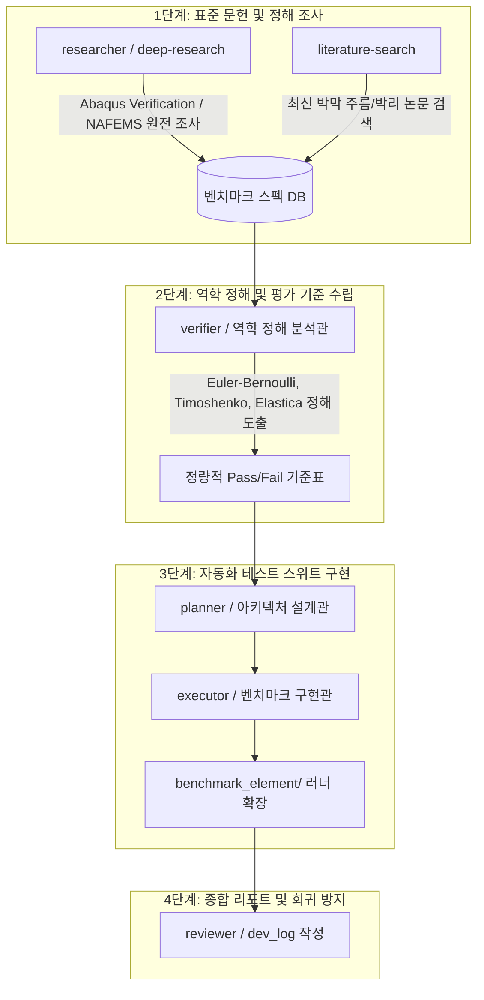

# CAE 공인 표준 벤치마크 및 플렉서블 디스플레이 특화 역학 검증 로드맵 계획서

**문서 번호**: PLAN-VERIF-20260915  
**작성일자**: 2026-09-15  
**프로젝트**: `WHT_DispFoldSolver`  
**책임 에이전트**: Planner / Antigravity Orchestrator  

---

## 1. 개요 및 추진 배경 (Overview & Motivation)

본 프로젝트는 2D/3D 솔리드 요소 11종(EAS, Herrmann u-P, Co-Rotational, Reduced Integration 등), 180° 순수 굽힘 롤업, 층간 슬립, 접촉/Surface Tie, 실시간 VTKHDF 스트리밍 파이프라인 구축을 완료했습니다.

기본적인 정식화가 정상 작동함이 입증된 현시점에서, **상용 유한요소 솔버(Abaqus/Standard, ANSYS Mechanical)를 대체 및 능가하는 산업급 신뢰성**을 확보하기 위해 다음 3가지 핵심 검증 영역을 체계화하는 종합 벤치마크 계획을 수립합니다:

1. **국제 표준 학술 벤치마크 (MacNeal-Harder Standard Suite)**: 요소 종횡비(Aspect Ratio) 및 메쉬 왜곡(Shear/Trapezoidal Skew)에 대한 요소 강인성 검증.
2. **공인 상용 검증 규격 (NAFEMS Benchmark Suite)**: 선형 탄성부터 대변형 기하비선형(Elastica) 및 탄소성 수치 정해 대조.
3. **플렉서블 디스플레이 특화 역학 (Display Multilayer Mechanics)**: 초박형 글래스(UTG)/고분자(PET)/점착제(PSA) 복합 적층 시의 국소 주름(Wrinkling), 점탄성 응력 완화(Stress Relaxation), 극한 비압축성 체적 잠김(Volumetric Locking) 소거 검증.

---

## 2. 다중 서브에이전트 역할 분담 및 조사 전략

본 검증 작업은 전문 서브에이전트 협업 체계로 추진합니다:



| 서브에이전트 | 투입 스킬 | 핵심 역할 |
|:---|:---|:---|
| **`researcher`** | `deep-research`, `github-research` | NAFEMS, ASME V&V 10, MacNeal-Harder(1985) 원전 및 CalculiX/Code_Aster 테스트 스위트 조사 |
| **`verifier`** | `math-reasoning` | 이론 해석해(Closed-form) 수식 유도, Abaqus Reference 데이터셋 표준화, 허용 오차(Tolerance) 정의 |
| **`planner`** | `experiment-design` | 벤치마크 단계별 우선순위 및 회귀 방지 자동화 테스트 파이프라인 설계 |
| **`executor`** | Numba JIT / Python 3.11 | `benchmark_element/` 내 파이썬 벤치마크 스크립트 및 시각화 생성기 구현 |

---

## 3. 벤치마크 분류 체계 및 후보군 매트릭스 (4대 영역)

### 영역 1: MacNeal-Harder 표준 왜곡 벤치마크 (Element Distortion Robustness)
> *참고 문헌: R. H. MacNeal and R. L. Harder (1985), "A proposed standard set of problems to test finite element accuracy", Finite Elements in Analysis and Design.*

| 벤치마크 문제 | 검증 목적 및 메쉬 상태 | 대상 요소군 | 정해 및 평가 지표 |
|:---|:---|:---|:---|
| **M1. 비틀린 보 (Twisted Beam)** | 면외(out-of-plane) 비틀림 형상 왜곡에 대한 휨 강성 과대평가 방지 | 3D 육면체 전종 (`C3D8*`) | 끝단 전단하중에 대한 처짐 ($u_z$) 정해 대비 오차 < 2% |
| **M2. 쿡의 막 (Cook's Membrane)** | 사다리꼴 왜곡 및 전단 지배 상태에서의 잠김(Shear locking) 감별 | 2D 사각 요소 (`CPE4*`) | 우상단 끝단 연직 변위 ($u_y = 23.91\text{ mm}$ 수준) 수렴도 |
| **M3. 곡면 보 (Curved Beam In-plane/Out-of-plane)** | 곡률을 가진 구조물에서 멤브레인-굽힘 결합 잠김 소거 | 2D/3D 솔리드 요소 | 끝단 모멘트/하중에 따른 끝단 회전각 및 변위 정해 비교 |
| **M4. 반구형 쉘 (Hemispherical Shell with Hole)** | 솔리드 요소의 얇은 쉘 거동(두께 방향 1개 요소) 및 비압축 굽힘 거동 검증 | `C3D8I_CR`, `C3D8H_CR` | 대칭 집중 하중점 사이의 상대 변위 |

---

### 영역 2: NAFEMS 공인 벤치마크 스위트 (Linear & Nonlinear NAFEMS)
> *참고 규격: NAFEMS Standard Benchmarks (LE1, LE10, NL1, NL2, NL5)*

| 벤치마크 문제 | 비선형 분류 | 주요 검증 내용 |
|:---|:---|:---|
| **NAFEMS LE10** | 선형 탄성 후판 | 두꺼운 판 압력 재하 시 중심 처짐 및 상하단 휨 응력 ($\sigma_{xx}, \sigma_{yy}$) 정밀도 |
| **NAFEMS NL1** | 대변형 기하비선형 (Elastica) | 큰 회전각($> 90^\circ$)을 겪는 외팔보 끝단 모멘트/집중하중 재하 시 변형 궤적 (Mangeron 비선형 적분해 대조) |
| **NAFEMS NL2** | 탄소성 대변형 (Elasto-Plastic Beam) | 캔틸레버 소성 힌지 형성 시 하중-처짐 비선형 곡선 및 잔류 응력/스프링백 비교 |
| **NAFEMS NL5** | 극단 기하비선형 원호 스냅스루 | 얇은 원호 아치에 중앙 집중하중 재하 시 좌굴 및 스냅스루(Snap-through) 거동 추적 |

---

### 영역 3: 극한 비압축성 및 체적 잠김 한계 검증 (Incompressibility Limits)

| 벤치마크 문제 | 시험 조건 | 체적 잠김 기준 | 비고 |
|:---|:---|:---|:---|
| **I1. 고무 블록 압축 (Constrained Rubber Compression)** | 완전 비압축성 초탄성 ($\nu \ge 0.4999$), 상하 강체 판 압축 구속 | 기본 변위 기반 요소는 응력 발산 ($> 1000\%$). Herrmann `u-P` (`CPE4H`, `C3D8H`) 오차 < 1% 유지 여부 | 포아송 잠김 방지 |
| **I2. 원형 봉 네킹 (Necked Tensile Bar)** | 대변형 다중축 소성 유동, 소성 흐름 시 $J = 1$ 조건 강제 | $J_0$ 투영 F-bar 및 EAS 정식화의 소성 불안정성 및 메쉬 국소화 방지 확인 | J2 대변형 소성 |

---

### 영역 4: 플렉서블 디스플레이 특화 역학 검증 (Flexible Display Specialized)

```
 [ Display Stack: UTG (t=30um) / PSA (t=30um) / PET (t=50um) ]
   ───┬─────────────────────────────────────────────────┬───
      │ ◀─── R=1.5mm 180° Folded Loop (Compressive) ───▶ │
   ───┴─────────────────────────────────────────────────┴───
       - 내측 UTG: 미세 주름(Wrinkling) 및 국소 좌굴 발생 임계 하중
       - 중간 PSA: 전단 변형률 700% 슬립 흡수 및 시간 경과에 따른 응력 완화(Relaxation)
```

| 벤치마크 문제 | 물리적 현상 및 특성 | 핵심 검증 지표 |
|:---|:---|:---|
| **D1. 다층 박막 내측 주름 (Bimaterial Wrinkling)** | 두꺼운 연성 기판(PET) 위의 얇은 고강성 박막(UTG) 굽힘 시 압축 주름 파장 및 진폭 | Allen / Biot 탄성 지반 좌굴 이론식: $\lambda = 2\pi t (E_f / 3E_s)^{1/3}$ 대조 |
| **D2. 점착제 점탄성 응력 완화 (PSA Viscoelastic Dwell)** | 폴딩 상태에서 24시간 체류(Dwell) 시 반력 모멘트 완화율 | Prony 시리즈 시간분할 적분 정확도: $M(t) = M_0 [g_\infty + \sum g_i e^{-t/\tau_i}]$ |
| **D3. 힌지 오프셋 롤업 접촉 (Hinge Offset Plate Fold)** | 회전축 편심에 따른 디스플레이 패널-강체 지지판 간 접촉 및 분리(Lift-off) | 접촉 압력(CPRESS) 채터링 소거 및 침투량(Penetration) < 1e-4 mm 달성 |

---

## 4. 정량적 검증 평가 지표 (Verification Criteria & Metrics)

단순한 외형(Kinematic Silhouette) 일치가 아닌 **역학적 보존성 및 수치 엄밀성**을 기준으로 판정합니다:

1. **반력 모멘트 및 힘 평형 (Moment & Force Equilibrium)**
   - 대변형 순수 굽힘 시 현재 좌표계 기준 $|M_{\text{root}}| = |M_{\text{tip}}| = M_{\text{theory}}$ 오차 **$\le 1.0\%$**.
2. **에너지 보존 지표 (Energy Conservation Check)**
   - 전 해석 구간에서 잔차 에너지 비:
     $$\frac{|E_{\text{internal}} + E_{\text{kinetic}} - W_{\text{external}}|}{\max(E_{\text{internal}}, W_{\text{external}})} \le 1.0 \times 10^{-4}$$
   - 인공 안정화 점성 에너지 비: $\frac{E_{\text{stab}}}{E_{\text{strain}}} \le 0.5\%$.
3. **요소 메쉬 수렴성 (Order of Convergence Rate)**
   - 메쉬 분할 수 $h \to h/2 \to h/4$ 세분화 시 $L_2$ 변위 오차 감소 기울기 $p \ge 1.95$ (2차 요소 $p \ge 2.90$).

---

## 5. 단계별 실행 로드맵 (Phased Execution Plan)

### Phase 1: 표준 문헌 조사 및 정해 데이터베이스 수집 (3일)
- [ ] `researcher` 서브에이전트 구동: MacNeal-Harder 1985 논문 수치 데이터 추출.
- [ ] NAFEMS NL1/NL2/NL5 Abaqus Benchmark Manual 입력 카드(`.inp`) 및 결과 테이블 확보.
- [ ] 다층막 주름(Wrinkling) 및 층간 박리 문헌식 정리.

### Phase 2: MacNeal-Harder 왜곡 스위트 구현 및 평가 (4일)
- [ ] `benchmark_element/benchmark_macneal_harder.py` 신설.
- [ ] Twisted Beam (M1) 및 Cook's Membrane (M2) 11개 요소 자동 스윕 벤치마크.
- [ ] 요소별 왜곡 감도 비교 차트 자동 생성 (`figures_macneal_harder.py`).

### Phase 3: NAFEMS 비선형 벤치마크 스위트 통합 (5일)
- [ ] `benchmark_NAFEMS/` 디렉토리에 NL1(Elastica 대회전) 및 NL2(소성 힌지) 러너 구축.
- [ ] Abaqus 해석 결과 vs 우리 솔버 2D/3D 요소 간 오차율 자동 리포트 생성.

### Phase 4: 플렉서블 디스플레이 주름/완화 특화 검증 (5일)
- [ ] UTG-PSA-PET 3층 적층체 극소 반경($R=1.5\text{ mm}$) 굽힘 시 주름 진폭 해석.
- [ ] PSA 점탄성 Prony 모델 체류(Dwell) 해석 후 반력 완화 곡선 검증.
- [ ] 실시간 VTKHDF 스트리밍 연동 결과 인터랙티브 PyVista 뷰어 확인.

---

## 6. 사용자 결정 필요 사항 (Decisions & Open Questions)

1. **우선순위 선택**:
   - **방향 A (CAE 범용 공인 벤치마크 우선)**: MacNeal-Harder 왜곡 스위트 및 NAFEMS 선형/비선형 스위트 먼저 구축.
   - **방향 B (플렉서블 디스플레이 특화 역학 우선)**: 다층 박막 주름(Wrinkling) 및 점탄성 체류 완화(Viscoelastic Dwell) 먼저 구축.
2. **서브에이전트 자율 실행 여부**:
   - 전문 서브에이전트(`fem_benchmark_researcher`)를 등록하여 Phase 1(문헌 정해 DB 구축)을 백그라운드 자동 수집하도록 착수할지 여부.
