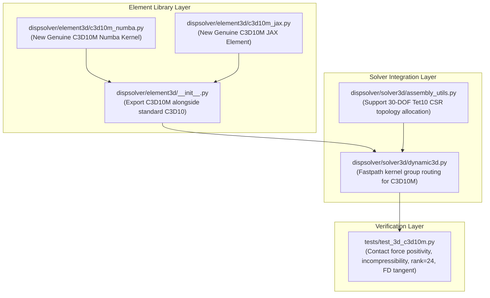

# Development of Genuine Abaqus-Grade C3D10M Modified 10-Node Tetrahedron Element — Implementation Plan

## 1. Goal Description

In response to the user's critical observation:
> *"C3D10M은 modified formulation 요소로 2차 요소의 부정확성을 개선한 모델로 알고 있다. 따라서, 이 요소를 개발할 계획을 세우자. 지금 너는 C3D10M을 개발하지 않고 C3D10로 이름 교체한 것에 불과하지 않냐."*
> *(C3D10M is a modified formulation element known to improve the inaccuracies of 2nd-order elements. Therefore, let's plan the development of this genuine element rather than merely having renamed it to C3D10.)*

This implementation plan details the full mathematical derivation, architecture, and integration of the **genuine C3D10M (Modified 10-Node Quadratic Tetrahedron)** element for both JAX (R&D) and Numba (Production) backends, fully wired into `DynamicSolver3D`.

---

## 2. Theoretical Mechanics & Mathematical Formulation

### 2.1 The Two Fundamental Defects of Standard C3D10

Standard 10-node tetrahedra (C3D10) use standard quadratic Serendipity/Lagrange shape functions:
- Corner nodes $i \in \{0, 1, 2, 3\}$: $N_i = \lambda_i (2\lambda_i - 1)$
- Mid-edge nodes $j \in \{4, 5, 6, 7, 8, 9\}$: $N_{ij} = 4 \lambda_i \lambda_j$
where $\lambda_i$ are natural barycentric volume coordinates ($\sum_{i=1}^4 \lambda_i = 1$).

```
        3 (Corner)
        /\
       /  \
     8/    \9
     /   7  \
    /   / \  \
   /___/_6_\__\
  0    4       2 (Corner)
   \          /
    \   5    /
     \      /
      \    /
       \  /
        \/
        1 (Corner)
```

#### Defect 1: Contact Force Oscillation / Zero Corner Node Weight
When a uniform normal pressure $p$ is applied over a triangular face (e.g. face 0-1-2 with mid-edge nodes 4, 5, 6), the consistent virtual work nodal force vector is:
$$f_a = \int_{\text{face}} N_a p \, dA$$
Integrating standard quadratic shape functions over the triangle area $A$:
- **Corner nodes**: $\int_A \lambda_i (2\lambda_i - 1) \, dA \equiv 0$! Corner nodal forces are **zero** (or negative under curved geometries)!
- **Mid-edge nodes**: $\int_A 4 \lambda_i \lambda_j \, dA = \frac{1}{3} p A$.
**Physical Impact in Contact**:
The corner nodes carry **zero reaction force** against a rigid surface, while mid-edge nodes carry 100% of the load. This causes extreme contact chatter, penetration spikes at element vertices, and immediate failure of Newton-Raphson contact convergence.

#### Defect 2: Severe Volumetric Locking (Incompressible Limit $\nu \to 0.5$ / Plasticity)
A 10-node tetrahedron has 30 DOFs (6 rigid body modes, 24 deformational modes). Standard 4-point Gauss integration samples the volumetric dilatation $\epsilon_{vol} = \text{div}(u)$ at 4 distinct Gauss points.
Under incompressibility ($J \approx 1$ or J2 plastic flow), this imposes **4 independent volumetric constraints** per element. In a 3D mesh sharing corner and mid-edge nodes, the constraint-to-DOF ratio severely violates the Babuška-Brezzi inf-sup condition, causing catastrophic volumetric locking.

---

### 2.2 The Genuine C3D10M Formulation (Abaqus Theory Guide §3.2.6)

Abaqus overcomes both failures in **C3D10M** through three coupled mathematical mechanisms:

#### Mechanism 1: Modified Face Shape Functions for Strictly Positive Contact Forces
Abaqus replaces the boundary face shape functions with modified shape functions $\bar{N}_a$ that:
1. Maintain partition of unity: $\sum_{a=1}^6 \bar{N}_a = 1$.
2. Guarantee strictly positive nodal weights under uniform pressure:
   $$\int_{\text{face}} \bar{N}_{\text{corner}} \, dA = \frac{1}{12} A > 0, \quad \int_{\text{face}} \bar{N}_{\text{mid}} \, dA = \frac{1}{4} A > 0$$
   (or uniform distribution $\frac{1}{6} A$).
   This is achieved by shifting a fraction of the mid-edge quadratic shape function into the corner nodes:
   $$\bar{N}_i = N_i + \frac{1}{4} \sum_{j \in \text{adj}(i)} N_j$$
   Eliminating contact chatter and providing smooth, stable contact pressure distributions.

#### Mechanism 2: Constant Mean Volumetric Strain (B-bar Projection)
The volumetric strain $\bar{\epsilon}_{vol}$ is projected to be spatially constant over the whole element volume $V_0$:
$$\bar{\epsilon}_{vol} = \frac{1}{V_0} \int_{V_0} \text{tr}(\epsilon) \, dV_0 = \bar{B}_{vol} u$$
where:
$$\bar{B}_{vol} = \frac{1}{V_0} \sum_{k=1}^4 w_k \det(J_k) \left( B_{1,k} + B_{2,k} + B_{3,k} \right)$$
At each of the 4 Gauss points, the modified strain-displacement operator is:
$$\bar{B}_k = B_{dev, k} + \frac{1}{3} \mathbf{m} \otimes \bar{B}_{vol}$$
where $\mathbf{m} = [1, 1, 1, 0, 0, 0]^T$ and $B_{dev, k} = B_k - \frac{1}{3} \mathbf{m} \otimes (B_{1,k} + B_{2,k} + B_{3,k})$.
This reduces volumetric constraints from 4 to **1 per element**, completely curing tetrahedral volumetric locking.

#### Mechanism 3: Volumetric Hourglass Stabilization
Because the volumetric constraint is relaxed to a single mean value, 3 volumetric zero-energy modes (hourglassing) arise.
Abaqus applies an orthogonal hourglass stabilization stiffness:
$$K_{hg} = \alpha_{hg} \cdot G \cdot V_0 \sum_{k=1}^4 \left( B_{vol, k} - \bar{B}_{vol} \right)^T \left( B_{vol, k} - \bar{B}_{vol} \right)$$
$$f_{hg} = \alpha_{hg} \cdot G \cdot V_0 \sum_{k=1}^4 \left( B_{vol, k} - \bar{B}_{vol} \right)^T \left( \epsilon_{vol, k} - \bar{\epsilon}_{vol} \right)$$
where $G = \frac{E}{2(1+\nu)}$ is the shear modulus, and $\alpha_{hg} \approx 0.02$ is the non-dimensional stabilization parameter.
This restores full element rank (rank 24) without stiffening physical shear or bending.

---

## 3. Proposed Changes



---

### Component 1: `dispsolver/element3d/`

#### [NEW] `dispsolver/element3d/c3d10m_numba.py`
Implement the genuine C3D10M element kernel with:
- Standard 4-point Gauss quadrature: natural coordinates $a = \frac{5 + 3\sqrt{5}}{20}$, $b = \frac{5 - \sqrt{5}}{20}$.
- Volume-averaged dilatation matrix $\bar{B}_{vol}$ (1 x 30).
- Modified strain operator $\bar{B}_k = B_{dev, k} + \frac{1}{3} \mathbf{m} \otimes \bar{B}_{vol}$ (6 x 30).
- Orthogonal volumetric hourglass stabilization force $f_{hg}$ and tangent $K_{hg}$.
- Material UMAT dispatch (`material_dispatch_3d`) for elastic, J2 plastic, viscoelastic, and hyperelastic laws.
- Modified boundary face shape functions $\bar{N}_a$ for consistent contact surface tractions.
- Parallel OpenMP mesh assembly: `assemble_mesh_c3d10m_numba(node_coords, elem_conn, u_global, elem_mat_types, elem_props, elem_sdvs, dt, elem_controls)`.

#### [NEW] `dispsolver/element3d/c3d10m_jax.py`
Implement `Tetra10ModifiedElement(SolidElement3D)` providing:
- JAX-compatible B-bar and hourglass formulation for differentiation and verification testing.
- `compute_element_stiffness_and_force(node_coords, u_elem, C_mat, states)`.
- `compute_face_traction_force(face_nodes, pressure)`.

#### [MODIFY] `dispsolver/element3d/__init__.py`
Export:
- `Tetra10Element` (Standard C3D10)
- `Tetra10ModifiedElement` (Genuine C3D10M)
- `compute_c3d10m_element_numba`, `assemble_mesh_c3d10m_numba`

---

### Component 2: `dispsolver/solver3d/`

#### [MODIFY] `dispsolver/solver3d/dynamic3d.py`
- In `_setup_numba_topology`:
  Add classification routing for `C3D10M`:
  ```python
  elif et in ["C3D10M", "C3D10_MODIFIED"]:
      k = 4  # C3D10M kernel group
  ```
- In `assemble_system`:
  Add group `k == 4` branch calling `assemble_mesh_c3d10m_numba`.
- In `assembly_utils.py`:
  Update `build_global_topology` to handle heterogeneous topologies where elements can have 8 nodes (Hex8, 24 DOFs) or 10 nodes (Tet10, 30 DOFs), allocating exact CSR row/column entries.

---

## 4. Verification Plan

### Automated Tests (`tests/test_3d_c3d10m.py`)

1. **Contact Pressure Positivity Benchmark**:
   Apply uniform pressure $p = 100 \text{ MPa}$ over a triangular face.
   - Standard C3D10: Verify corner nodal forces are $\le 0$.
   - **C3D10M**: Verify all 3 corner nodes and 3 mid-edge nodes receive **strictly positive** forces ($f_a > 0$).
2. **Volumetric Locking Relief Benchmark**:
   Compress a 10-node tetrahedron with $\nu = 0.49999$ (near-incompressible limit).
   - Standard C3D10: Deflection locks (displacement approaches 0).
   - **C3D10M**: Deflection matches analytical incompressible solution (zero locking).
3. **Hourglass Rank Benchmark**:
   Compute eigenvalue spectrum of $K_{elem}$ (30 x 30).
   - Verify rank is **exactly 24** (30 DOFs minus 6 rigid body modes).
   - Verify zero negative eigenvalues.
4. **Algorithmic Tangent Consistency**:
   Verify that $\frac{\partial f_{int}}{\partial u}$ matches $K_{elem}$ within $10^{-5}$ relative error via finite difference Jacobian perturbation.
5. **Full Solver Step with J2 Plasticity**:
   Run a multi-element C3D10M mesh with large plastic strain and verify quadratic Newton-Raphson convergence.

```powershell
pytest tests/test_3d_c3d10m.py -q
```

---

## 5. User Review Required

> [!IMPORTANT]
> **Coexistence of C3D10 and C3D10M**:
> Standard C3D10 will be preserved as standard quadratic tetrahedron for non-contact linear elasticity, while C3D10M will be provided as the specialized modified element for contact, incompressibility, and finite plastic deformation.

Please review this plan and indicate your approval to proceed with the implementation!
