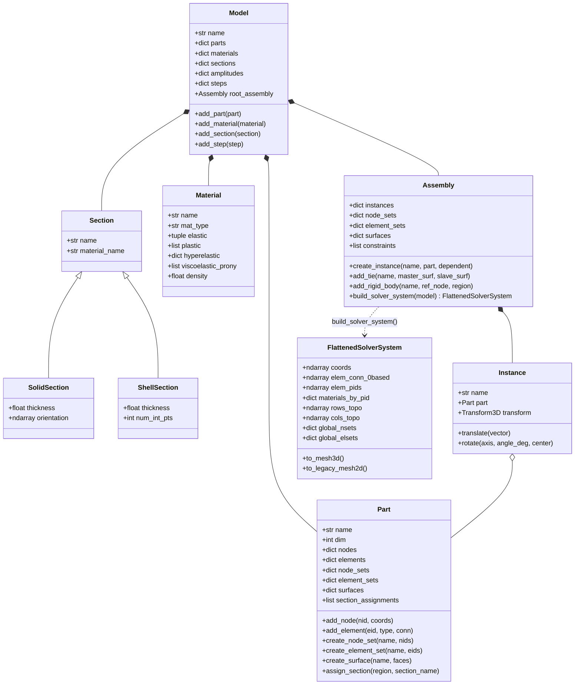

# 상용 S/W(Abaqus) 기반 CAE 모델 아키텍처 구축 구현 계획서

## 1. 개요 및 목적 (Goal Description)

현재 `WHT_DispFoldSolver`는 2D/3D 대변형 접힘 해석 및 비선형 구성방정식(Numba JIT, PARDISO, Co-rotational, UMAT) 측면에서 상용급 수치 해석 성능을 입증하였습니다. 그러나 전처리 및 모델 구성 데이터 구조는 여전히 **단일 평탄화 메쉬(Flat Mesh)**와 **임시 파서 데이터 구조(Dataclass)**에 의존하고 있어, 다중 부품 조립이나 복합 적층 구조 모델링 시 코드 중복과 인덱스 관리의 복잡도가 증가하고 있습니다.

본 계획은 Abaqus/CAE 및 상용 유한요소 소프트웨어의 표준 모델링 패러다임인 **Model – Part – Section / Material – Assembly – Instance – Set – Step** 객체 지향 데이터 아키텍처를 `dispsolver/model/` 신규 모듈로 체계화하여, 사용자가 직관적이고 강력한 상용급 Pythonic API로 복잡한 다물체 3D 디스플레이 폴딩 모델을 구성하고 고속 솔버(`DynamicSolver`, `DynamicSolver3D`)로 즉시 직결할 수 있도록 프레임워크를 구축하는 것을 목표로 합니다.

---

## 2. 사용자 검토 요구사항 (User Review Required)

> [!IMPORTANT]
> **하위 호환성 및 점진적 전환 전략**:
> 기존의 레거시 스크립트(`ex03`, `ex12`, `ex15` 등)와 기존 `DynamicSolver`/`DynamicSolver3D`는 전혀 수정하지 않고 그대로 유지됩니다.
> 신규 `dispsolver/model/`은 완전한 독립 모듈로 구현되며, `assembly.build_solver_system()`을 통해 생성된 시스템 객체가 기존 솔버에 즉시 호환되도록 브릿지 어댑터(`to_legacy_mesh2d()`, `to_mesh3d()`)를 제공합니다.

> [!TIP]
> **고속 Numba CSR 토폴로지 사전 빌드 통합**:
> `Assembly.build_solver_system()` 단계에서 수만 개의 요소를 글로벌 공간으로 플래트닝할 때, 솔버가 필요로 하는 희소 행렬 CSR 인덱스(`rows_topo`, `cols_topo`)와 연속 0-based 노드/요소 연결성, PID 매핑을 0-overhead로 사전 생성하여 솔버 초기화 시간을 대폭 단축합니다.

---

## 3. 질문 사항 (Open Questions)

> [!NOTE]
> 1. **2D 평면응력/평면변형률 및 3D 솔리드의 단면 두께 처리**:
>    - 2D Part에 `SolidSection`을 할당할 때 평면응력 두께(`thickness`)를 Section 속성으로 지정하는 표준 Abaqus 방식을 채택합니다. 3D 솔리드에서는 기하학적 요소 체적에 의해 두께가 결정되므로 `thickness`는 무시됩니다.
> 2. **인스턴스 간 접촉/결합 구속 (Interactions & Constraints)**:
>    - Phase 1에서는 가장 핵심적인 `TieConstraint` (Surface-to-Surface 타이), `RigidBody` (RP 중심 강체 구속), `KinematicCoupling`을 Assembly 레벨에서 지원하도록 구현할 계획입니다. 일반 비선형 마찰 접촉(Contact Pair)은 Phase 2에서 확장합니다.

---

## 4. 시스템 아키텍처 및 계층 다이어그램



---

## 5. 상세 구현 계획 (Proposed Changes)

신규 패키지 `dispsolver/model/`을 생성하고 모듈별로 명확한 책임을 부여합니다.

### Component: `dispsolver/model/`

#### [NEW] `dispsolver/model/__init__.py`
모듈 진입점으로 핵심 클래스(`Model`, `Part`, `Assembly`, `Instance`, `Material`, `SolidSection`, `ShellSection`, `NodeSet`, `ElementSet`, `Surface`, `Step`, `DisplacementBC`)를 외부로 노출.

#### [NEW] `dispsolver/model/set.py`
- **책임**: Part 및 Assembly 수준의 식별된 노드 집합(`NodeSet`), 요소 집합(`ElementSet`), 기하 경계면(`Surface`, `ElementFace`) 관리.
- **주요 기능**:
  - `NodeSet`: 고유 이름, 정수 노드 ID 집합, 넘파이 배열 변환.
  - `ElementSet`: 고유 이름, 정수 요소 ID 집합.
  - `ElementFace`: `(element_id, face_id)` 불변(Frozen) 식별자.
  - `Surface`: 요소 면들의 모음 또는 노드 서피스.

#### [NEW] `dispsolver/model/material.py`
- **책임**: 구성방정식 재료 특성(Constitutive Laws)의 순수 데이터 캡슐화.
- **주요 기능**:
  - 탄성(`elastic=(E, nu)`), 소성(`plastic=[(sy, ep), ...]`), 초탄성(`hyperelastic={...}`), 점탄성(`viscoelastic_prony=[(g, k, tau), ...]`), 밀도.
  - Numba DOD Material Dispatcher (`dispsolver.material3d.numba_materials`) 및 2D JAX Material 객체로의 자동 인스턴스화 헬퍼 메소드 제공.

#### [NEW] `dispsolver/model/section.py`
- **책임**: 특정 재료(`material_name`)와 기하학적 특성(두께, 적분점 등)을 바인딩하는 단면 속성.
- **클래스**:
  - `Section` (Base)
  - `SolidSection(material_name, thickness=1.0, orientation=None)`
  - `ShellSection(material_name, thickness=1.0, num_int_pts=5, offset=0.0)`

#### [NEW] `dispsolver/model/part.py`
- **책임**: 로컬 좌표계 기준의 부품 형상, 요소망, 세트, 서피스, 그리고 `SectionAssignment` 컬렉션 소유.
- **주요 기능**:
  - `add_node(nid, coords)`, `add_element(eid, elem_type, conn)`
  - `create_node_set(name, nids)`, `create_element_set(name, eids)`, `create_surface(name, faces)`
  - `assign_section(region, section_name)`: 특정 `ElementSet`에 `Section`을 매핑.

#### [NEW] `dispsolver/model/instance.py`
- **책임**: 어셈블리 내에서 특정 `Part`의 인스턴스를 표현하며, 3차원 아핀 변환(Rigid Body Affine Transformation)을 캡슐화.
- **주요 기능**:
  - `Transform3D`: 3D 병진 벡터(`translation`) 및 로드리게스 회전 공식(`rotation_axis`, `rotation_angle_deg`, `rotation_center`) 적용.
  - `translate(vector)`, `rotate(axis, angle_deg, center)` 메서드 체이닝 지원.
  - 로컬 노드 좌표 배열을 글로벌 좌표로 사상: `transform.apply(local_coords)`.

#### [NEW] `dispsolver/model/assembly.py`
- **책임**: 다중 인스턴스의 조립, 인스턴스 간 상호작용/구속조건(Tie, RigidBody, Coupling) 관리, 그리고 **글로벌 플래트닝 엔진(`build_solver_system`)**.
- **주요 기능**:
  - `create_instance(name, part, dependent=True)`
  - `add_tie(name, master, slave)`
  - `add_rigid_body(name, ref_node, region)`
  - `build_solver_system(model)`:
    1. 인스턴스별 로컬 노드 좌표를 글로벌 좌표로 일괄 변환 및 충돌 없는 글로벌 노드 ID 부여.
    2. 인스턴스 요소 연결성을 글로벌 노드 ID로 리넘버링.
    3. Part의 `SectionAssignment`를 추적하여 각 요소에 최적화된 고유 `pid` 자동 할당 및 물성 인스턴스 연결.
    4. 인스턴스 한정 세트(`"PLATE_L.NSET_ATTACH"`)를 글로벌 노드 인덱스 배열로 자동 리졸브.
    5. 솔버 고속 CSR 행렬 조립에 필요한 희소 행렬 행/열 토폴로지(`rows_topo`, `cols_topo`) 사전 계산.

#### [NEW] `dispsolver/model/step.py`
- **책임**: 해석 단계별 시간 증분 제어, 경계조건(`DisplacementBC`), 집중/분포 하중, 하중 증폭 곡선(`Amplitude`) 관리.

#### [NEW] `dispsolver/model/model.py`
- **책임**: 최상위 컨테이너로, Abaqus CAE의 `mdb.models['Model-1']`과 1:1 대응.
- **주요 기능**:
  - `Part`, `Material`, `Section`, `Step`, `root_assembly` 생성 및 조회 단일 접점.
  - `create_solver(step_name=None)`: 어셈블리를 플래트닝하고 지정된 스텝의 경계조건을 반영한 최적의 `DynamicSolver3D` 또는 `DynamicSolver` 인스턴스를 원클릭 생성.

---

## 6. 검증 계획 (Verification Plan)

### 6.1 자동화 테스트 (Automated Tests)
신규 테스트 스위트 `tests/test_cae_model_hierarchy.py`를 작성하여 다음 항목을 전수 검증합니다:

1. **Part & SectionAssignment 검증**:
   - 단일 파트 내에 2개 이상의 ElementSet을 정의하고 서로 다른 Section(PET vs PSA)을 할당했을 때 정확한 재료 속성이 매핑되는지 검증.
2. **Assembly Multi-Instantiation & 3D Transformation 검증**:
   - 동일한 힌지 플레이트 파트 1개를 정의한 후, 좌측(-40mm 이동)과 우측(+10mm 이동 및 180도 회전) 2개의 인스턴스로 조립했을 때 노드 좌표 및 방향 벡터의 수학적 정확도 검증.
3. **Global Flattening & CSR Topology 검증**:
   - `assembly.build_solver_system()` 호출 후 생성된 `rows_topo`, `cols_topo`, `elem_conn_0based`가 글로벌 자유도 차원 및 대칭 희소 패턴과 100% 일치하는지 검증.
4. **기존 솔버 직결 엔드투엔드(End-to-End) 검증**:
   - 신규 `Model -> Part -> Assembly` API로 구성한 3D 박판 굽힘 모델이 `DynamicSolver3D`에 직접 연결되어 컷백 없이 단일 스텝 수렴하는지 검증.

테스트 실행 명령어:
```powershell
pytest tests/test_cae_model_hierarchy.py -v
```

### 6.2 신규 API 기반 예제 스크립트 작성 (`examples/ex16_cae_model_display_fold.py`)
- 기존의 수동 노드/요소 루프 대신, Abaqus CAE 스타일의 우아한 객체지향 코드로 4층 박판 폴딩 모델을 작성하여 실행하고, 180° 폴딩 결과가 기존 `ex15`와 완벽히 일치하는지 대조 검증.
