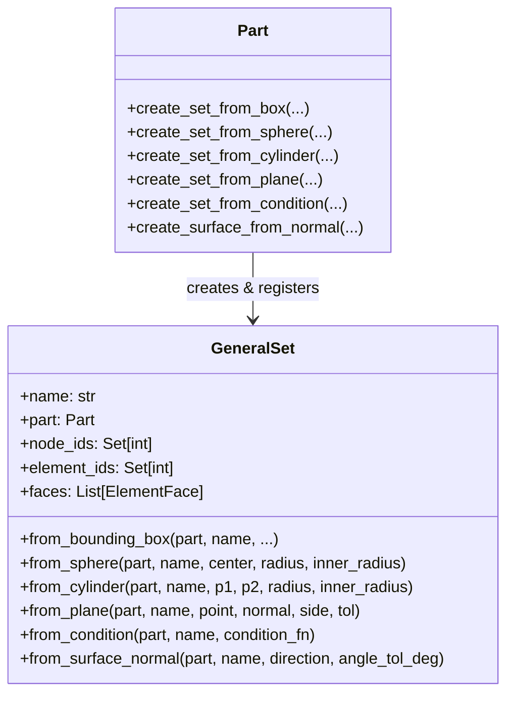

# Advanced Geometric Region Filtering Plan (Sphere, Cylinder, Plane, Normal, Predicate)

## 1. Goal Description
현재 구현된 `create_set_from_box` (축 정렬 직육면체 바운딩 박스)를 확장하여, 상용 CAE(Abaqus의 `getByBoundingSphere`, `getByBoundingCylinder`, `findAt`, HyperMesh 등) 수준을 뛰어넘는 **다양한 지오메트리 기반 스마트 세트 생성 기능**을 구축합니다.

특히 디스플레이 폴딩 해석 및 구조 해석에서 빈번히 사용되는 **힌지 축(Hinge Axis), 롤러 접촉면(Roller Contact), 대칭 경계면(Symmetry Plane), 상/하면 외곽 표면(Top/Bottom Faces by Normal)**을 사용자가 노드/요소 번호를 전혀 몰라도 단 한 줄의 기하 파라미터로 완벽하게 추출할 수 있도록 합니다.

---

## 2. 아이디어 제안: 어떤 지오메트리 필터가 유용할까?

| 필터 종류 | 주요 파라미터 | CAE 및 폴딩 해석에서의 실제 활용처 |
|---|---|---|
| **1. Sphere / Hollow Sphere (구 / 구형 쉘)** | `center, radius, inner_radius=0` | • 볼 조인트, 인덴터 포인트 접촉 영역<br>• 크랙 팁(Crack tip) 주변 국소 메쉬 영역 추출<br>• 점 하중 부근 국소 구속 영역 |
| **2. Cylinder / Hollow Cylinder (원통 / 파이프)** | `point1, point2, radius, inner_radius=0` | • **힌지 핀(Hinge Pivot) 축 주변 영역 추출 (폴딩 핵심)**<br>• 볼트 체결 홀(Bolt Hole) 및 롤러(Roller) 원호 접촉면<br>• 샤프트/베어링 지지면 |
| **3. Plane / Half-Space (평면 / 반공간)** | `point, normal, side="ON"\|"POS"\|"NEG", tol=1e-4` | • **대칭 경계조건 (XSYMM, YSYMM 대칭면) 노드 일괄 추출**<br>• 모델 절단면(Cross-section) 분할 선택<br>• 특정 경계 기준 전반부/후반부 일괄 선택 |
| **4. Surface by Normal Vector (외측 법선 벡터 기반 표면)** | `direction, angle_tol_deg=15.0` | • **디스플레이 상면(Top Face: $+Y$ or $+Z$) 자동 추출**<br>• **디스플레이 하면(Bottom Face: Surface Tie 결합면) 자동 추출**<br>• 압력 하중 인가면, 도포 코팅면 자동 선택 |
| **5. Line Segment Proximity (선분 근접 필터)** | `point1, point2, distance` | • 힌지 중심선 및 가이드 레일 주변 완충 영역 추출 |
| **6. Custom Condition / Predicate (사용자 정의 람다식)** | `condition_fn: Callable[[np.ndarray], bool]` | • 수식 $x^2/a^2 + y^2/b^2 \le 1$ 같은 타원, 포물선 등 임의의 모든 형상을 수식 한 줄로 필터링 |

---

## 3. User Review Required

> [!IMPORTANT]
> **Abaqus API와의 호환성 및 명명 규칙 (Naming Conventions)**
> - Abaqus CAE에서는 `getByBoundingBox`, `getByBoundingCylinder`, `getByBoundingSphere` 방식을 사용합니다.
> - 본 프로젝트에서는 Pythonic한 직관성을 위해 `Part` 클래스에 다음 메서드들을 제공하고자 합니다:
>   - `part.create_set_from_sphere(name, center, radius, inner_radius=0.0, entity_type="ALL")`
>   - `part.create_set_from_cylinder(name, point1, point2, radius, inner_radius=0.0, entity_type="ALL")`
>   - `part.create_set_from_plane(name, point, normal, side="ON_PLANE", tol=1e-4, entity_type="ALL")`
>   - `part.create_set_from_condition(name, condition_fn, entity_type="ALL")`
>   - `part.create_surface_from_normal(name, direction, angle_tol_deg=15.0)`

> [!TIP]
> **벡터화(Vectorized) 성능 보장**
> 수천~수십만 개의 노드와 요소에 대해 루프를 돌지 않고, `numpy` 브로드캐스팅 벡터 연산으로 필터링을 수행하여 0.001초 이내에 세트 생성이 완료되도록 최적화합니다.

---

## 4. Open Questions

1. **내경(Inner Radius) 지원 여부**:
   - 원통이나 구에서 파이프/쉘 형태(예: $r_{min} \le r \le r_{max}$)의 중공 형상 필터링을 기본 지원할지 여부? (제안: `inner_radius=0.0` 기본값으로 두어 기본은 꽉 찬 원통/구이고, 필요시 파이프 형태도 지원하도록 설계).
2. **요소(Element) 필터링 기준**:
   - 현재는 "요소 중심점(Centroid)이 영역 내부인가?"를 기준으로 합니다.
   - 혹시 "요소의 모든 절점이 영역 내부인가?(Strict)" 또는 "하나라도 포함되는가?(Any)" 옵션(`element_selection="CENTROID" | "ALL_NODES" | "ANY_NODE"`)이 필요하신가요? (기본값: `"CENTROID"` 추천).

---

## 5. Proposed Changes



---

### [Component: `dispsolver/model/set.py`]

#### [MODIFY] `dispsolver/model/set.py`
1. `GeneralSet.from_sphere(cls, part, name, center, radius, inner_radius=0.0, entity_type="ALL", element_selection="CENTROID")`
   - 벡터화 연산: $d^2 = \sum (x_i - c_i)^2$, $r_{in}^2 \le d^2 \le r_{out}^2$.
2. `GeneralSet.from_cylinder(cls, part, name, point1, point2, radius, inner_radius=0.0, entity_type="ALL", element_selection="CENTROID")`
   - 축 방향 단위 벡터 $\hat{\mathbf{a}} = (\mathbf{p}_2 - \mathbf{p}_1) / L$.
   - 축 투영 거리: $t = (\mathbf{x} - \mathbf{p}_1) \cdot \hat{\mathbf{a}}$, 조건: $0 \le t \le L$.
   - 반지름 거리: $d_\perp^2 = \|\mathbf{x} - \mathbf{p}_1\|^2 - t^2$, 조건: $r_{in}^2 \le d_\perp^2 \le r_{out}^2$.
3. `GeneralSet.from_plane(cls, part, name, point, normal, side="ON_PLANE", tol=1e-4, entity_type="ALL", element_selection="CENTROID")`
   - 거리 $h = (\mathbf{x} - \mathbf{p}) \cdot \hat{\mathbf{n}}$.
   - `side="ON_PLANE"`: $|h| \le tol$
   - `side="POSITIVE"`: $h \ge -tol$
   - `side="NEGATIVE"`: $h \le tol$
4. `GeneralSet.from_surface_normal(cls, part, name, direction, angle_tol_deg=15.0)`
   - 외곽 바운더리 페이스(`get_faces(exterior_only=True)`)를 순회하며 페이스 외측 법선 벡터 계산.
   - $\cos\theta = \frac{\mathbf{n} \cdot \mathbf{d}}{\|\mathbf{n}\| \|\mathbf{d}\|} \ge \cos(\theta_{tol})$ 조건의 페이스 및 해당 노드를 포함하는 세트 생성.
5. `GeneralSet.from_condition(cls, part, name, condition_fn, entity_type="ALL", element_selection="CENTROID")`
   - `condition_fn(coords: np.ndarray) -> bool`을 호출하여 만족하는 엔티티 추출.

---

### [Component: `dispsolver/model/part.py`]

#### [MODIFY] `dispsolver/model/part.py`
- 파트 인터페이스에 편의 메서드 추가:
  - `create_set_from_sphere(...)`
  - `create_set_from_cylinder(...)`
  - `create_set_from_plane(...)`
  - `create_set_from_condition(...)`
  - `create_surface_from_normal(...)`

---

## 6. Verification Plan

### Automated Tests
- 단위 테스트 파일 [`tests/test_geometric_sets.py`](file:///D:/PythonCodeStudy/WHT_DispFoldSolver/tests/test_geometric_sets.py) 신규 작성:
  1. **Sphere Test**: 3D 구 영역 내 노드/요소 필터링 및 hollow sphere(내경) 검증.
  2. **Cylinder Test**: 힌지 축을 따라 정의된 실린더 영역 및 파이프 쉘 영역 검증.
  3. **Plane / Symmetry Test**: $X=0$ 대칭면 노드 추출 및 $Y > 0$ 반공간 필터링 검증.
  4. **Surface Normal Test**: 3D 블록 메쉬에서 상면($+Z$) 및 하면($-Z$) 표면 페이스 자동 추출 검증.
  5. **Custom Condition Test**: 타원 영역 $x^2/4 + y^2 \le 1$ 람다식 조건 필터링 검증.
  6. **기존 테스트 회귀 검증**: `pytest tests/test_cae_model_hierarchy.py tests/test_general_set.py -v`.

```powershell
pytest tests/test_geometric_sets.py tests/test_cae_model_hierarchy.py tests/test_general_set.py -v
```
