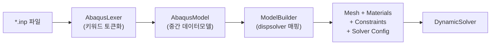
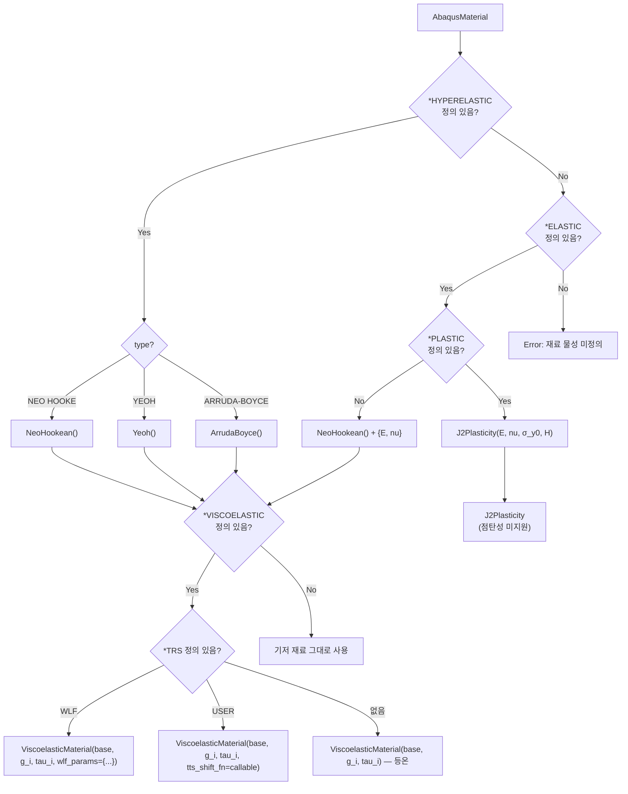

# Abaqus `.inp` 파서 구현 계획

Abaqus 표준 입력 파일(`.inp`)을 읽어 기존 `dispsolver`의 `Mesh`, `Material`, `Constraint`, `DynamicSolver`에 직접 매핑하는 파서를 구현합니다. 목표는 **Abaqus/CAE에서 생성한 `.inp` 파일을 한 줄로 불러와 즉시 해석을 실행**할 수 있게 하는 것입니다.

## User Review Required

> [!IMPORTANT]
> **지원 범위 결정**: 아래 제안하는 키워드 목록은 현재 솔버가 지원하는 기능(2D 평면변형, Q4/T3 요소, NeoHookean/J2/Viscoelastic 재료, RBE2/Tie 구속)에 한정됩니다. 3D 요소, 쉘 요소, 열전달 등 미지원 키워드를 만나면 경고 후 스킵할지, 에러를 발생시킬지 결정이 필요합니다.

> [!WARNING]
> **Abaqus `.inp`는 2D 전용 포맷이 아닙니다**. Abaqus는 기본적으로 3D 해석기이므로 `.inp`의 `*NODE` 데이터에 z좌표가 포함됩니다. 평면변형(CPE4, CPE3) 요소 타입이 명시된 경우에만 2D로 처리하고, 그 외 요소 타입은 명시적 에러를 발생시키는 전략을 제안합니다.

## Open Questions

> [!IMPORTANT]
> 1. **`*INCLUDE` 지원 여부**: Abaqus `.inp`는 `*INCLUDE, INPUT=subfile.inp`로 외부 파일을 참조할 수 있습니다. 초기 버전에서 지원할까요, 아니면 단일 파일만 지원할까요?
> 2. **단위계**: Abaqus `.inp`는 단위를 명시하지 않습니다(사용자 일관성 책임). 현재 솔버는 mm 단위를 가정하는데, 파서에서 단위 변환 레이어가 필요할까요?
> 3. **`*STEP` 다중 스텝**: Abaqus는 하나의 입력에 여러 `*STEP`을 정의할 수 있습니다. 모든 스텝을 순차적으로 실행할지, 첫 번째 스텝만 처리할지 결정이 필요합니다.

---

## Abaqus `.inp` 파일 구조 개요

```
*HEADING
  Display Panel Folding Analysis
**
*NODE
  1, 0.0, 0.0, 0.0
  2, 1.0, 0.0, 0.0
  ...
*ELEMENT, TYPE=CPE4, ELSET=PET_LAYER
  1, 1, 2, 6, 5
  ...
*NSET, NSET=HINGE_L
  1, 2, 3
*ELSET, ELSET=PET_LAYER
  1, 2, 3, 4
**
*SOLID SECTION, ELSET=PET_LAYER, MATERIAL=PET
  1.0,
*MATERIAL, NAME=PET
*ELASTIC
  4000.0, 0.3
*PLASTIC
  80.0, 0.0
  700.0, 1.0
**
*STEP, NLGEOM=YES
*DYNAMIC, APPLICATION=QUASI-STATIC
  0.01, 1.0, 1e-5, 0.05
*BOUNDARY
  HINGE_L, 1, 2, 0.0
*CLOAD
  10, 2, -100.0
*END STEP
```

핵심 특징:
- `*KEYWORD, PARAM1=VAL1, PARAM2=VAL2` 형태의 키워드 라인
- 키워드 다음의 데이터 라인(콤마 구분)
- `**` 주석 라인
- 키워드 간 계층 관계 (`*MATERIAL` → `*ELASTIC`, `*PLASTIC`, `*HYPERELASTIC` 등)

---

## 아키텍처 설계



### 3단계 파이프라인

| 단계 | 모듈 | 책임 |
|------|------|------|
| **1. Lexer** | `AbaqusLexer` | `.inp` 텍스트를 키워드 블록 시퀀스로 토큰화 |
| **2. Parser** | `AbaqusParser` → `AbaqusModel` | 키워드 블록을 해석하여 중간 데이터모델(노드, 요소, 재료, 스텝 등) 구축 |
| **3. Builder** | `ModelBuilder` | 중간 데이터모델을 `dispsolver` 객체(`Mesh`, `Material`, `Constraint`, solver config)로 변환 |

이렇게 분리하면:
- Lexer/Parser는 Abaqus 형식에만 의존 (솔버 독립)
- Builder만 `dispsolver` API에 의존 → 솔버 변경 시 Builder만 수정
- 중간 데이터모델은 향후 다른 솔버로의 매핑에도 재사용 가능

---

## Proposed Changes

### Phase 1: 파서 코어 (`dispsolver/io/abaqus_parser.py`)

#### [NEW] [abaqus_parser.py](file:///d:/PythonCodeStudy/WHT_DispFoldSolver/dispsolver/io/abaqus_parser.py)

**`AbaqusKeywordBlock`** — 단일 키워드 블록 데이터 클래스:
```python
@dataclass
class AbaqusKeywordBlock:
    keyword: str              # e.g. "NODE", "ELEMENT", "ELASTIC"
    params: Dict[str, str]    # e.g. {"TYPE": "CPE4", "ELSET": "PET"}
    data_lines: List[List[str]]  # 후속 데이터 행의 콤마 분할 결과
    line_number: int          # 디버깅용 원본 라인 번호
```

**`AbaqusLexer`** — 토큰화기:
- 파일을 한 줄씩 읽으면서:
  - `**`로 시작 → 주석, 스킵
  - `*`로 시작 → 새 키워드 블록 시작. 콤마로 파라미터 파싱
  - 그 외 → 현재 키워드 블록의 데이터 라인에 추가
- `encoding='utf-8'` 우선, 실패 시 `encoding='cp949'` 폴백
- 연속 라인(`,`으로 끝나는 행) 결합 처리

**지원 키워드 목록** (Phase 1):

| 카테고리 | Abaqus 키워드 | dispsolver 매핑 대상 |
|----------|---------------|---------------------|
| **메쉬** | `*NODE` | `Mesh.add_node()` |
| | `*ELEMENT, TYPE=CPE4` | `Mesh.add_element("QUAD4")` |
| | `*ELEMENT, TYPE=CPE3` | `Mesh.add_element("TRIA3")` |
| | `*NSET` | `Mesh.add_nodeset()` |
| | `*ELSET` | `Mesh.add_elementset()` |
| **재료** | `*MATERIAL, NAME=` | 재료 이름 등록 |
| | `*ELASTIC` | `NeoHookean` (E, ν → μ, λ 변환) |
| | `*PLASTIC` | `J2Plasticity` (yield table → σ_y0, H) |
| | `*HYPERELASTIC, NEO HOOKE` | `NeoHookean` (C10, D1) |
| | `*HYPERELASTIC, YEOH` | `Yeoh` |
| | `*HYPERELASTIC, ARRUDA-BOYCE` | `ArrudaBoyce` |
| | `*VISCOELASTIC, TIME=PRONY` | `ViscoelasticMaterial` (g_i, k_i, tau_i) |
| | `*DENSITY` | `DynamicSolver(rho=...)` |
| **섹션** | `*SOLID SECTION` | `pid` → Material 매핑 |
| **경계조건** | `*BOUNDARY` | `solver.set_prescribed_dofs()` |
| **하중** | `*CLOAD` | `solver.apply_load()` |
| **구속** | `*MPC` / `*RIGID BODY` | `RBE2HingeConstraint` |
| | `*TIE` | `TieConstraint` |
| **스텝** | `*STEP, NLGEOM=YES` | `DynamicSolver` 설정 |
| | `*DYNAMIC` | dt_initial, t_total, dt_min, dt_max |
| | `*STATIC` | 준정적 (큰 dt, 작은 ρ) |
| | `*END STEP` | 스텝 종료 |

---

### 재료 모델 파서 세부 사양

재료 정의는 Abaqus에서 `*MATERIAL, NAME=xxx` 키워드로 시작하여 하위 키워드(`*ELASTIC`, `*PLASTIC`, `*HYPERELASTIC` 등)로 물성을 기술합니다. 파서는 **현재 활성 재료 이름**을 추적하면서 하위 키워드를 순차적으로 해당 재료에 누적합니다.

#### 1. `*MATERIAL, NAME=<name>` — 재료 블록 시작

```
*MATERIAL, NAME=PET
```

- 파라미터: `NAME` (필수) — 재료 이름 문자열
- 파싱: 새 `AbaqusMaterial(name=<name>)` 생성, `_current_material = name` 상태 저장
- 이후 `*ELASTIC`, `*PLASTIC`, `*HYPERELASTIC`, `*VISCOELASTIC`, `*DENSITY` 키워드가 나오면 모두 이 재료에 속하는 것으로 처리

#### 2. `*ELASTIC` — 등방 선형 탄성

```
*ELASTIC
  4000.0, 0.3
```

- 데이터 행: `E, ν` (Young's modulus, Poisson's ratio)
- 온도 의존성 행이 여러 줄일 수 있으나 첫 행만 사용
- 파싱 → `AbaqusMaterial.elastic = (E, nu)`
- **Builder 매핑 규칙**:
  - `*PLASTIC`이 **없는** 경우 → `NeoHookean()` + `params = {'E': E, 'nu': nu}`
  - `*PLASTIC`이 **있는** 경우 → `J2Plasticity(E=E, nu=nu, sigma_y0=..., H=...)`

#### 3. `*PLASTIC` — J2 소성 (항복 테이블)

```
*PLASTIC
  80.0, 0.0
  200.0, 0.05
  700.0, 1.0
```

- 데이터 행: `σ_y, ε̄_p` (항복응력, 등가소성변형률) — 다수 행 가능
- 파싱 → `AbaqusMaterial.plastic_table = [(80.0, 0.0), (200.0, 0.05), (700.0, 1.0)]`
- **Builder 매핑 규칙** (`J2Plasticity` 생성자):
  ```python
  # 첫 행 → 초기 항복응력
  sigma_y0 = plastic_table[0][0]  # 80.0

  # 선형 경화 기울기 (2점 이상이면 마지막-처음으로 계산)
  if len(plastic_table) >= 2:
      delta_sigma = plastic_table[-1][0] - plastic_table[0][0]   # 700 - 80 = 620
      delta_eps   = plastic_table[-1][1] - plastic_table[0][1]   # 1.0 - 0.0 = 1.0
      H = delta_sigma / max(delta_eps, 1e-30)                    # 620.0
  else:
      H = 0.0  # 완전 소성 (hardening 없음)

  material = J2Plasticity(E=E, nu=nu, sigma_y0=sigma_y0, H=H)
  ```
- **제한사항**: 현재 `J2Plasticity`는 선형 등방경화만 지원 → 비선형 경화 테이블은 2점 선형 근사로 축약

> [!NOTE]
> 향후 `J2Plasticity`에 테이블 기반 경화를 지원하면, `plastic_table` 전체를 그대로 전달하는 경로를 추가할 수 있습니다.

#### 4. `*HYPERELASTIC, NEO HOOKE` — Neo-Hookean 초탄성

```
*HYPERELASTIC, NEO HOOKE
  0.4, 0.02
```

- 데이터 행: `C10, D1`
- 파싱 → `AbaqusMaterial.hyperelastic = {'type': 'NEO HOOKE', 'C10': 0.4, 'D1': 0.02}`
- **Builder 매핑 규칙** (`NeoHookean()` + params 변환):
  ```python
  C10 = hyperelastic['C10']
  D1  = hyperelastic['D1']

  # Abaqus NeoHookean: W = C10*(I1_bar - 3) + (1/D1)*(J - 1)^2
  # dispsolver NeoHookean: W = μ/2*(I1 - 3) - μ*lnJ + λ/2*(lnJ)^2
  # 소변형 일치 조건:
  mu  = 2.0 * C10                        # 전단계수
  K   = 2.0 / D1 if D1 > 0 else 1e6     # 체적계수
  lam = K - 2.0 * mu / 3.0              # Lamé 상수

  E  = mu * (3*lam + 2*mu) / (lam + mu)
  nu = lam / (2*(lam + mu))

  material = NeoHookean()
  params   = {'E': E, 'nu': nu}
  ```

#### 5. `*HYPERELASTIC, YEOH` — Yeoh 초탄성

```
*HYPERELASTIC, YEOH
  0.5, 0.0, 0.0, 0.02, 0.0, 0.0
```

- 데이터 행: `C10, C20, C30, D1, D2, D3`
- 파싱 → `AbaqusMaterial.hyperelastic = {'type': 'YEOH', 'C10': ..., 'C20': ..., ...}`
- **Builder 매핑 규칙** (직접 전달):
  ```python
  material = Yeoh()
  params = {
      'C10': hyperelastic['C10'],
      'C20': hyperelastic.get('C20', 0.0),
      'C30': hyperelastic.get('C30', 0.0),
      'D1':  hyperelastic.get('D1', None),
      'D2':  hyperelastic.get('D2', 0.0),
      'D3':  hyperelastic.get('D3', 0.0),
  }
  ```

#### 6. `*HYPERELASTIC, ARRUDA-BOYCE` — Arruda-Boyce 초탄성

```
*HYPERELASTIC, ARRUDA-BOYCE
  1.0, 3.0, 0.01
```

- 데이터 행: `mu, lambda_m, D` (μ, 극한 신장비, 체적 압축성 D)
- 파싱 → `AbaqusMaterial.hyperelastic = {'type': 'ARRUDA-BOYCE', 'mu': ..., 'lambda_m': ..., 'D': ...}`
- **Builder 매핑 규칙**:
  ```python
  mu       = hyperelastic['mu']
  lambda_m = hyperelastic.get('lambda_m', 3.0)
  D        = hyperelastic.get('D', 0.0)
  K        = 2.0 / D if D > 0 else 0.0    # 체적계수

  material = ArrudaBoyce()
  params = {'mu': mu, 'lambda_m': lambda_m, 'K': K}
  ```

#### 7. `*VISCOELASTIC, TIME=PRONY` — Prony 시리즈 점탄성

```
*VISCOELASTIC, TIME=PRONY
  0.5, 0.5, 1.0
  0.3, 0.3, 10.0
```

- 데이터 행: `g_i, k_i, tau_i` (편차 이완계수, 체적 이완계수, 이완시간)
- 여러 행 = 여러 Prony 항
- 파싱 → `AbaqusMaterial.viscoelastic_prony = [(0.5, 0.5, 1.0), (0.3, 0.3, 10.0)]`
- **Builder 매핑 규칙**:
  ```python
  g_i   = [row[0] for row in viscoelastic_prony]   # [0.5, 0.3]
  tau_i = [row[2] for row in viscoelastic_prony]    # [1.0, 10.0]
  # k_i는 현재 ViscoelasticMaterial에서 미사용 → 편차 이완만 적용

  # 기저 재료 결정: *HYPERELASTIC가 있으면 그것을, 없으면 *ELASTIC 기반 NeoHookean
  base_material = _resolve_base_material(abq_mat)

  material = ViscoelasticMaterial(base=base_material, g_i=g_i, tau_i=tau_i)
  ```

> [!WARNING]
> `sum(g_i) < 1.0` 조건이 필수입니다 (`g_∞ = 1 - Σg_i > 0`). Abaqus `.inp`에서 이 조건을 위반하면 `ViscoelasticMaterial` 생성 시 `ValueError`가 발생합니다. 파서에서 사전 검증합니다.

#### 8. `*DENSITY` — 재료 밀도

```
*DENSITY
  1.3e-09,
```

- 데이터 행: `ρ` (밀도 — 단위는 사용자 일관성 책임)
- 파싱 → `AbaqusMaterial.density = 1.3e-09`
- **Builder 매핑 규칙**: 모든 섹션에 할당된 재료의 `density`를 수집하여 `DynamicSolver(rho=...)` 전달. 재료별 밀도가 다르면 가중 평균 또는 첫 번째 값 사용 (현 솔버는 균일 밀도만 지원)

#### 9. `*TRS` — 시간-온도 중첩 (Time-Temperature Superposition)

Abaqus에서 시간-온도 중첩(TTS)은 `*TRS` 키워드로 정의되며, 반드시 `*VISCOELASTIC` 뒤에 위치합니다. 현재 솔버의 `ViscoelasticMaterial`은 이미 `wlf_params` 인자를 통한 WLF 지원을 내장하고 있습니다.

##### 9-1. `*TRS, DEFINITION=WLF` — WLF 시프트 함수 (기본값)

```
*TRS, DEFINITION=WLF
  25.0, 8.86, 101.6
```

- `DEFINITION=WLF`는 기본값이므로 생략 가능 (`*TRS`만 써도 WLF)
- 데이터 행: `θ_0, C1, C2` (기준온도, WLF 상수 1, WLF 상수 2)
- WLF 시프트 팩터: $\log(a_T) = \frac{-C_1 \cdot (\theta - \theta_0)}{C_2 + (\theta - \theta_0)}$
- 파싱 → `AbaqusMaterial.trs = {'definition': 'WLF', 'T_ref': 25.0, 'C1': 8.86, 'C2': 101.6}`
- **Builder 매핑 규칙** (기존 인터페이스에 직접 매핑):
  ```python
  wlf_params = {
      'T_ref': trs['T_ref'],   # 기준온도
      'C1':    trs['C1'],      # WLF 상수 1
      'C2':    trs['C2'],      # WLF 상수 2
  }
  material = ViscoelasticMaterial(
      base=base_material,
      g_i=g_i, tau_i=tau_i,
      wlf_params=wlf_params,    # ← 기존 인터페이스 그대로 활용
  )
  ```
- **솔버 내부 동작** (이미 구현됨):
  - `pk2_voigt(F, params, h_prev, dt, temperature)` 호출 시 `temperature` 인자를 통해 현재 온도 전달
  - `wlf_shift(temperature, C1, C2, T_ref)` → `aT` 계산 → `tau_eff = tau_i * aT`

##### 9-2. `*TRS, DEFINITION=USER` — 사용자 정의 시프트 함수

```
*TRS, DEFINITION=USER
```

- Abaqus 원래 구현: Fortran `UTRS` 서브루틴 연동 (외부 컴파일 필요)
- **dispsolver 대응 설계**: Fortran 대신 **Python callable**로 TTS 사용자 정의 함수를 전달

```python
# dispsolver에서의 사용자 정의 TTS 인터페이스 (신규 확장 필요)
def my_custom_shift(temperature: float, dt: float, **kwargs) -> float:
    """사용자 정의 시프트 팩터 a_T 계산.

    Parameters
    ----------
    temperature : float
        현재 온도
    dt : float
        현재 시간 증분

    Returns
    -------
    aT : float
        시프트 팩터 (양수, > 0)
    """
    # 예: Arrhenius 형 TTS
    Ea = 50000.0     # 활성화 에너지 [J/mol]
    R  = 8.314       # 기체 상수
    T_ref = 298.15   # 기준온도 [K]
    T_curr = temperature + 273.15
    return np.exp(Ea / R * (1.0 / T_curr - 1.0 / T_ref))
```

- 파싱 → `AbaqusMaterial.trs = {'definition': 'USER'}`
- **Builder 매핑 규칙**: `.inp` 파일만으로는 Python callable을 정의할 수 없으므로, 두 가지 경로를 지원

  | 경로 | 방식 | 설명 |
  |------|------|------|
  | **A. API 직접 전달** | `build_model_from_abaqus(abq_model, user_trs=my_func)` | Builder의 `user_trs` 키워드 인자로 Python callable 주입 |
  | **B. 외부 모듈 참조** | `.inp`에 주석으로 `** DISPSOLVER_TRS_MODULE=mymodule.my_shift` 기술 | 파서가 주석에서 모듈 경로를 추출하여 `importlib`로 동적 로딩 |

> [!NOTE]
> **경로 B**는 Abaqus 표준 형식이 아닌 dispsolver 전용 확장입니다. `.inp` 호환성을 유지하면서 사용자 정의 TTS를 지원하기 위한 편의 기능입니다.

##### `ViscoelasticMaterial` 확장 (TTS callable 지원)

현재 `ViscoelasticMaterial.__init__`의 `wlf_params` 인자를 확장하여 callable도 받을 수 있게 합니다:

```python
class ViscoelasticMaterial:
    def __init__(
        self,
        base_material: MaterialModel,
        g_i: List[float],
        tau_i: List[float],
        wlf_params: Optional[Dict[str, float]] = None,
        tts_shift_fn: Optional[Callable[[float, float], float]] = None,  # [NEW]
    ):
        ...
        self.tts_shift_fn = tts_shift_fn  # 사용자 정의 시프트 함수
```

- `pk2_voigt` / `pk2_tangent_voigt_batch`에서 시프트 팩터 계산 로직:
  ```python
  # 시프트 팩터 우선순위: tts_shift_fn > wlf_params > 1.0 (등온)
  if self.tts_shift_fn is not None:
      aT = self.tts_shift_fn(temperature, dt)
  elif self.wlf_params is not None:
      aT = wlf_shift(temperature, **self.wlf_params)
  else:
      aT = 1.0
  ```

##### 중간 데이터모델 확장

```python
@dataclass
class AbaqusMaterial:
    name: str
    elastic: Optional[Tuple[float, float]] = None
    plastic_table: Optional[List[Tuple[float, float]]] = None
    hyperelastic: Optional[Dict] = None
    viscoelastic_prony: Optional[List[Tuple[float, float, float]]] = None
    density: Optional[float] = None
    trs: Optional[Dict] = None  # [NEW] {'definition': 'WLF'|'USER', 'T_ref': ..., 'C1': ..., 'C2': ...}
```

##### 파서 핸들러 추가

```python
self._handlers["TRS"] = self._parse_trs

def _parse_trs(self, block: AbaqusKeywordBlock):
    """Parse *TRS keyword block."""
    definition = block.params.get("DEFINITION", "WLF").upper()
    mat = self._get_current_material()

    if definition == "WLF":
        if block.data_lines:
            vals = block.data_lines[0]
            mat.trs = {
                'definition': 'WLF',
                'T_ref': float(vals[0]),
                'C1':    float(vals[1]),
                'C2':    float(vals[2]),
            }
    elif definition == "USER":
        mat.trs = {'definition': 'USER'}
    else:
        warnings.warn(f"Unsupported TRS definition: {definition}")
```

#### 재료 결합 로직 (Builder 내부)

파서가 수집한 `AbaqusMaterial`을 기반으로, Builder는 다음 우선순위로 `dispsolver` 재료 모델을 결정합니다:



> [!IMPORTANT]
> `J2Plasticity`는 `ViscoelasticMaterial` 래핑을 지원하지 않습니다 (상태 변수 체계가 다름). `*PLASTIC` + `*VISCOELASTIC`가 동시 정의된 경우, 경고를 출력하고 `J2Plasticity`만 적용합니다.


---

### Phase 2: 중간 데이터모델 (`dispsolver/io/abaqus_model.py`)

#### [NEW] [abaqus_model.py](file:///d:/PythonCodeStudy/WHT_DispFoldSolver/dispsolver/io/abaqus_model.py)

파서가 키워드 블록을 해석하여 채우는 구조체:

```python
@dataclass
class AbaqusNode:
    nid: int
    x: float
    y: float
    z: float = 0.0  # 2D에서는 무시

@dataclass
class AbaqusElement:
    eid: int
    elem_type: str       # "CPE4", "CPE3", "CPS4" 등
    node_ids: List[int]
    elset: Optional[str] = None

@dataclass
class AbaqusMaterial:
    name: str
    elastic: Optional[Tuple[float, float]] = None          # (E, nu)
    plastic_table: Optional[List[Tuple[float, float]]] = None  # [(σ, ε_p), ...]
    hyperelastic: Optional[Dict] = None                    # {type, C10, D1, ...}
    viscoelastic_prony: Optional[List[Tuple[float, float, float]]] = None  # [(g_i, k_i, tau_i), ...]
    density: Optional[float] = None

@dataclass
class AbaqusSection:
    elset: str
    material_name: str
    thickness: float = 1.0

@dataclass
class AbaqusBoundary:
    nset_or_nid: Union[str, int]
    first_dof: int
    last_dof: int
    value: float = 0.0

@dataclass
class AbaqusLoad:
    nset_or_nid: Union[str, int]
    dof: int
    magnitude: float

@dataclass
class AbaqusStep:
    name: str = "Step-1"
    nlgeom: bool = True
    procedure: str = "DYNAMIC"       # "DYNAMIC" or "STATIC"
    time_params: Tuple = (0.01, 1.0, 1e-5, 0.05)  # dt_init, t_total, dt_min, dt_max
    boundaries: List[AbaqusBoundary] = field(default_factory=list)
    loads: List[AbaqusLoad] = field(default_factory=list)

@dataclass
class AbaqusModel:
    heading: str = ""
    nodes: Dict[int, AbaqusNode] = field(default_factory=dict)
    elements: Dict[int, AbaqusElement] = field(default_factory=dict)
    nsets: Dict[str, Set[int]] = field(default_factory=dict)
    elsets: Dict[str, Set[int]] = field(default_factory=dict)
    materials: Dict[str, AbaqusMaterial] = field(default_factory=dict)
    sections: List[AbaqusSection] = field(default_factory=list)
    steps: List[AbaqusStep] = field(default_factory=list)
    mpcs: List[...] = field(default_factory=list)
    ties: List[...] = field(default_factory=list)
```

**`AbaqusParser`** 클래스:
- `parse(blocks: List[AbaqusKeywordBlock]) → AbaqusModel`
- 키워드별 핸들러 딕셔너리 패턴:
  ```python
  self._handlers = {
      "NODE": self._parse_node,
      "ELEMENT": self._parse_element,
      "NSET": self._parse_nset,
      "ELSET": self._parse_elset,
      "MATERIAL": self._parse_material,
      "ELASTIC": self._parse_elastic,
      "PLASTIC": self._parse_plastic,
      "HYPERELASTIC": self._parse_hyperelastic,
      "VISCOELASTIC": self._parse_viscoelastic,
      "DENSITY": self._parse_density,
      "SOLID SECTION": self._parse_section,
      "BOUNDARY": self._parse_boundary,
      "CLOAD": self._parse_cload,
      "STEP": self._parse_step,
      "DYNAMIC": self._parse_dynamic,
      "STATIC": self._parse_static,
      "END STEP": self._parse_end_step,
      "MPC": self._parse_mpc,
      "TIE": self._parse_tie,
  }
  ```
- 미지원 키워드 → `warnings.warn(f"Unsupported keyword: *{kw} at line {ln}, skipped.")`

---

### Phase 3: 모델 빌더 (`dispsolver/io/model_builder.py`)

#### [NEW] [model_builder.py](file:///d:/PythonCodeStudy/WHT_DispFoldSolver/dispsolver/io/model_builder.py)

`AbaqusModel` → `dispsolver` 객체 변환:

```python
class ModelBuilder:
    def __init__(self, abaqus_model: AbaqusModel):
        self.abq = abaqus_model

    def build(self) -> Tuple[Mesh, Dict[int, Material], Dict[int, Dict], List[Constraint], SolverConfig]:
        mesh = self._build_mesh()
        materials, material_params = self._build_materials()
        constraints = self._build_constraints(mesh)
        solver_config = self._build_solver_config()
        return mesh, materials, material_params, constraints, solver_config
```

**매핑 규칙**:

| Abaqus 개념 | dispsolver 매핑 | 세부 사항 |
|-------------|-----------------|-----------|
| `*NODE` (x, y, z) | `Mesh.add_node(nid, x, y)` | z 좌표 무시 (평면변형) |
| `CPE4` | `"QUAD4"` | 4절점 평면변형 |
| `CPE4R` | `"QUAD4"` | (축소적분은 솔버의 B-bar SRI와 유사) |
| `CPE3` | `"TRIA3"` | 3절점 평면변형 |
| `*SOLID SECTION` | `Element.pid` | ELSET의 모든 요소에 pid 할당 |
| `*ELASTIC` + `*PLASTIC` | `J2Plasticity(E, nu, σ_y0, H)` | plastic table의 첫 행 → σ_y0, 선형 경화 기울기 → H |
| `*ELASTIC` only | `NeoHookean()` + params `{E, nu}` | 순수 탄성 → 초탄성 근사 |
| `*HYPERELASTIC, NEO HOOKE` | `NeoHookean()` + params 변환 | C10, D1 → E, nu 변환 |
| `*VISCOELASTIC, TIME=PRONY` | `ViscoelasticMaterial(base, g_i, tau_i)` | Prony series 매핑 |
| `*DENSITY` | `DynamicSolver(rho=...)` | 밀도 → 솔버 매개변수 |
| `*BOUNDARY, nset, 1, 2, 0.0` | `solver.set_prescribed_dofs()` | DOF 1=UX, 2=UY (Abaqus 1-based) |
| `*CLOAD` | `solver.apply_load()` | 집중하중 |
| `*TIE` | `TieConstraint(mesh, master, slave)` | 면 기반 Tie → 노드 기반 근사 |
| `*DYNAMIC` params | `dt_init, t_total, dt_min, dt_max` | 시간 적분 파라미터 |

**DOF 변환 규칙** (Abaqus → dispsolver):
- Abaqus DOF 1 (UX) → `node_idx * 2`
- Abaqus DOF 2 (UY) → `node_idx * 2 + 1`
- Abaqus DOF 3~6 → 평면변형에서 미지원 → 경고 후 무시

---

### Phase 4: 공개 API 및 패키지 구조

#### [NEW] [\_\_init\_\_.py](file:///d:/PythonCodeStudy/WHT_DispFoldSolver/dispsolver/io/__init__.py)

```python
from .abaqus_parser import read_abaqus_input
from .model_builder import build_model_from_abaqus
```

#### 최종 사용 예시

```python
from dispsolver.io import read_abaqus_input, build_model_from_abaqus
from dispsolver.solver import DynamicSolver

# 1줄: .inp → 중간 모델
abq_model = read_abaqus_input("display_fold.inp")

# 1줄: 중간 모델 → dispsolver 객체
mesh, materials, mat_params, constraints, config = build_model_from_abaqus(abq_model)

# 솔버 생성 및 실행
solver = DynamicSolver(
    mesh, materials, rho=config.density,
    material_params=mat_params,
    constraints=constraints,
    **config.solver_kwargs
)
```

---

### 파일 구조 요약

```
dispsolver/
├── io/                          # [NEW] I/O 서브패키지
│   ├── __init__.py              # 공개 API
│   ├── abaqus_lexer.py          # 키워드 토큰화
│   ├── abaqus_model.py          # 중간 데이터모델 (dataclasses)
│   ├── abaqus_parser.py         # 키워드 해석 → AbaqusModel
│   └── model_builder.py         # AbaqusModel → dispsolver 객체
├── mesh/
│   ├── mesh.py                  # (기존) Mesh, Node, Element
│   └── mesh_io.py               # (기존) meshio 기반 I/O
├── material/                    # (기존) 재료 모델들
├── constraint/                  # (기존) 구속조건들
└── solver/                      # (기존) DynamicSolver
```

---

## Verification Plan

### Automated Tests

#### [NEW] [test_abaqus_parser.py](file:///d:/PythonCodeStudy/WHT_DispFoldSolver/tests/test_abaqus_parser.py)

| 테스트 | 검증 내용 |
|--------|-----------|
| `test_lexer_keyword_parsing` | `*NODE`, `*ELEMENT, TYPE=CPE4, ELSET=A` 등의 키워드/파라미터 파싱 정확성 |
| `test_lexer_data_lines` | 데이터 행 콤마 분할, 연속 행 결합, 빈 행 스킵 |
| `test_lexer_comments` | `**` 주석 라인 올바르게 무시 |
| `test_parser_nodes` | `*NODE` 블록 → `AbaqusNode` 딕셔너리 |
| `test_parser_elements` | `*ELEMENT, TYPE=CPE4` → `AbaqusElement` (elem_type="CPE4", node_ids) |
| `test_parser_nset_inline` | `*NSET, NSET=A` + 데이터 행 → nset 딕셔너리 |
| `test_parser_nset_generate` | `*NSET, NSET=A, GENERATE` + `1, 100, 1` → 1~100 노드 |
| `test_parser_material_elastic` | `*MATERIAL` → `*ELASTIC` → (E, nu) |
| `test_parser_material_plastic` | `*PLASTIC` → yield table 파싱 |
| `test_parser_material_hyperelastic` | `*HYPERELASTIC, NEO HOOKE` → C10, D1 |
| `test_parser_material_viscoelastic` | `*VISCOELASTIC, TIME=PRONY` → g_i, k_i, tau_i |
| `test_parser_section` | `*SOLID SECTION` → elset-material 매핑 |
| `test_parser_boundary` | `*BOUNDARY` → DOF 구속 |
| `test_parser_step` | `*STEP` ~ `*END STEP` 범위 파싱 |
| `test_builder_mesh` | `AbaqusModel` → `Mesh` 변환 (노드수, 요소수 검증) |
| `test_builder_materials` | 재료 매핑 (J2, NeoHookean, Visco 각각) |
| `test_builder_boundary_dofs` | Abaqus DOF 1,2 → 솔버 DOF 매핑 |
| `test_builder_roundtrip` | `.inp` 읽기 → 솔버 생성 → `solve_step(dt)` 1회 정상 실행 |

#### 테스트 `.inp` 픽스처

```
tests/
├── fixtures/
│   ├── simple_quad.inp          # 단일 CPE4 요소 + 탄성 재료
│   ├── plastic_strip.inp        # J2 소성 인장 시편
│   ├── multilayer_display.inp   # 7층 적층 구조 (현 ex03과 동일 모델)
│   └── unsupported_3d.inp       # C3D8 요소 → 에러 발생 확인용
```

### Manual Verification

- `python examples/ex03_display_fold.py` 모델을 `.inp` 파일로 내보낸 후, 파서로 다시 읽어 동일한 `DynamicSolver`가 생성되는지 **왕복 검증(round-trip)**
- Abaqus/CAE에서 생성한 실제 `.inp` 파일을 파서에 투입하여 정상 파싱 확인

---

## 구현 순서 (우선순위)

1. **`AbaqusLexer`** — 가장 기초적이고 다른 모든 것이 의존
2. **`AbaqusModel` 데이터클래스** — 중간 표현 정의
3. **`AbaqusParser`** — 키워드 핸들러 순차 구현 (`*NODE` → `*ELEMENT` → `*NSET`/`*ELSET` → `*MATERIAL` 계열 → `*SECTION` → `*STEP` 계열)
4. **`ModelBuilder`** — Mesh 빌드 → Material 빌드 → Constraint 빌드 → SolverConfig 빌드
5. **테스트** — 픽스처 `.inp` 파일 작성 + 단위 테스트
6. **`read_abaqus_input()` 공개 API** — 1-call convenience function
