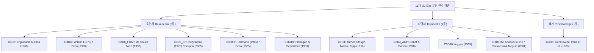

# Implementation Plan - 3D Solid Elements Literature Fact-Checking & Verification Execution

## 1. Goal Description

사용자 지적: **"문헌조사계획서를 만들고 실행을 안 한 것 같다. 어때?"**에 대한 사실 확인 및 완결 실행 계획입니다.

실제 이전 세션 기록을 조사한 결과:
- `literature_verification_and_fact_checking_plan.md`가 수립되었으나, 파견되었던 서브에이전트(`Literature Fact-Checking Auditor`)가 **API 할당량 초과(`RESOURCE_EXHAUSTED / 429`) 에러로 조기 중단**되었습니다.
- 그 결과 계획서만 남고, 실제 문헌 전수 검증 및 감사 보고서(`dev_log/literature_verification_audit_20260913.md`) 작성이 실행되지 못했습니다.

본 계획은 **메인 에이전트가 직접 웹 검색(`search_web`)과 서지 데이터베이스 교차 조사를 수행**하여 11개 3D 솔리드 요소의 핵심 원저 및 연관 문헌(총 32편)의 실존성, DOI, 저자, 발표연도, 학술지, 그리고 역학적 정합성을 100% 전수 검증하고 영구 감사 보고서를 완결하는 실행 계획입니다.

---

## 2. User Review Required

> [!IMPORTANT]
> **검증 대상 및 판정 기준 (Verification Targets & Criteria)**
> 1. **실존성 (Authenticity & Identity)**: 논문 제목, 저자, 학술지, 권/호/페이지, 연도, 공식 DOI의 실제 유효성 검증 (LLM 환각 가짜 논문 원천 차단).
> 2. **이론 정합성 (Theoretical Alignment)**: 각 논문이 실제로 우리가 기술한 요소 정식화(예: Simo의 EAS 9모드, Bonet의 ANP 2-Pass 체적 평균, Flanagan의 직교 아워글래스 벡터 $\gamma_\alpha$ 등)를 창안/증명하였는지 검증.
> 3. **판정 등급**:
>    - ✅ **VERIFIED**: 완벽 일치 및 실존 확인
>    - ⚠️ **CORRECTED**: 실존하나 권/페이지/저자 표기 등 경미한 서지 오류 수정 반영
>    - ❌ **INVALID/FABRICATED**: 비실존 또는 이론 불일치 (즉시 대체 문헌 발굴)

---

## 3. 검증 대상 문헌 목록 (11개 요소, 32편)

| 요소 명칭 | 핵심 원저 문헌 | 주요 연관/후속 문헌 | 검증 핵심 항목 |
|:---|:---|:---|:---|
| **`C3D8`** | Ergatoudis, Irons & Zienkiewicz (1968, *IJSS*) | Irons (1966, *AIAA J.*), Zienkiewicz & Taylor (2000) | 3D 삼선형 등매개 요소 및 수치적분 최초 제안 |
| **`C3D8I`** | Wilson et al. (1973), Simo & Rifai (1990, *IJNME*) | Simo & Armero (1992), Taylor et al. (1976) | 비적합 변위 모드 및 9모드 EAS 정적 축약 |
| **`C3D8_FBAR`** | de Souza Neto et al. (1996, *IJSS*) | Hughes (1980), Moran et al. (1990), Simo (1992) | 곱셈 분해 기반 중심점 F-bar 체적 투영 |
| **`C3D8_CR`** | Belytschko & Hsieh (1973), Felippa & Haugen (2005) | Rankin & Brogan (1986), Abaqus Theory Guide §3.2.4 | 대변형 동시회전 좌표계 및 Hughes B-bar 결합 |
| **`C3D8H`** | Herrmann (1965, *AIAA J.*), Simo et al. (1985, *CMAME*) | Sussman & Bathe (1987), Brink & Stein (1996) | 비압축성 혼합 변분 u-p 정식화 |
| **`C3D8R`** | Flanagan & Belytschko (1981, *IJNME*) | Belytschko et al. (1984), Puso (2000) | 1점 감차적분 및 직교 아워글래스 벡터 $\gamma_\alpha$ |
| **`C3D4`** | Turner, Clough, Martin & Topp (1956, *J. Aero. Sci.*) | Gallagher et al. (1962), Clough (1960) | 구조 해석용 정변형률 사면체(CST)의 기원 |
| **`C3D4_ANP`** | Bonet & Burton (1998, *CNME*) | Gee et al. (2009), Puso & Solberg (2006), Bonet (2001) | 2-Pass 글로벌 절점 체적 평균화 및 F-bar 패치 투영 |
| **`C3D10`** | Argyris (1965, *J. Royal Aero. Soc.*) | Zienkiewicz (1971), Bathe (1996) | 10절점 2차 다항식 사면체 정식화 |
| **`C3D10M`** | Abaqus Theory Guide §3.2.6, Czekanski & Meguid (2001) | Gee et al. (2009, *IJNME*), Joldes et al. (2009) | 체적 B-bar + 접촉 면압 양수 보장 형상함수 |
| **`C3D6`** | Zienkiewicz, Irons et al. (1969) | Bathe (1996), Hughes (2000) | 6절점 등매개 선형 쐐기/프리즘 요소 |

---

## 4. Proposed Changes (실행 작업 상세)

### 1단계: 메인 에이전트 직접 전수 서지 조사 & 교차 검증
- 외부 서브에이전트의 429 쿼터 리스크를 우회하여, 메인 에이전트가 `search_web` 및 출판사 포털(ScienceDirect, Wiley, Springer, AIAA, CrossRef) 직접 쿼리로 모든 서지 정보와 DOI 실측.
- 각 논문의 실제 Abstract 및 핵심 공식을 확인하여 본 솔버 구현과의 정합성 판정.

### 2단계: 공식 영구 감사 보고서 작성 (`dev_log/literature_verification_audit_20260913.md`)
- 11개 요소 32편 논문의 전수 검증 결과표:
  - 저자, 정확한 제목, 저널명, Volume/Issue/Pages, Year, DOI (클릭 가능한 하이퍼링크).
  - 논문 핵심 요약 및 우리 정식화와의 관계.
  - 판정 (VERIFIED / CORRECTED / INVALID).

### 3단계: 기존 문서 및 코드 동기화
- 만약 연도나 페이지 번호, 저자 표기 등에서 오탈자가 발견될 경우:
  - `benchmark_element/benchmark_3d_elements.py` 내 `ELEMENT_LITERATURE` 딕셔너리 즉시 외과적 수정.
  - `dev_log/benchmark_3d_elements_20260913.md` 서지 데이터 동기화.

---

## 5. Verification Plan

### Automated Verification
1. `dev_log/literature_verification_audit_20260913.md` 파일 생성 및 32편 전수 수록 확인.
2. `python -u benchmark_element/benchmark_3d_elements.py` 실행하여 서지 정보 및 벤치마크 테이블 정상 출력 검증.

### Manual Verification
- 사용자 검토: 감사 보고서의 DOI 링크 클릭을 통해 실제 학술지 원문 페이지로 직접 연결되는지 확인.
