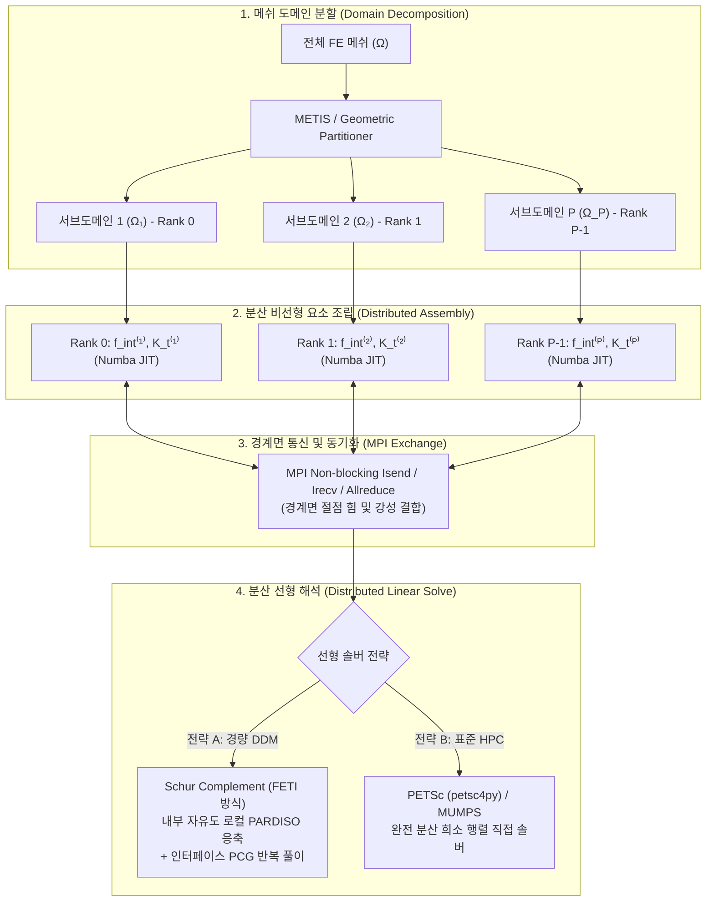

# Implementation Plan — WHT_DispFoldSolver MPI 분산 병렬 솔빙 아키텍처 및 구현 계획

**문서 번호**: `PLAN-20260913-MPI-SOLVING-ARCHITECTURE`  
**작성 일자**: 2026-09-13  
**대상 시스템**: `dispsolver/solver/`, `dispsolver/solver3d/`, `dispsolver/parallel/`  

---

## 1. 개요 및 배경 (Goal Description)

본 계획서는 사용자의 핵심 질의인 **"우리 솔버도 MPI(Message Passing Interface) 솔빙이 가능한가?"**에 대해 기술적 타당성을 검증하고, 글로벌 상용 FEA 솔버(Abaqus/Standard MPI, Altair OptiStruct SPMD) 수준의 분산 메모리 병렬 해석(Distributed-Memory Parallelism)을 단계적으로 구축하기 위한 시스템 아키텍처 및 구현 로드맵을 정의합니다.

### 1.1 결론 요약 (Executive Feasibility)
> [!IMPORTANT]
> **결론**: **완벽하게 가능하며, 이미 실행 기반이 준비되어 있습니다.**  
> 시스템 환경 점검 결과, 개발 워크스테이션에 **MS-MPI (`mpiexec.exe`)** 및 **`mpi4py 4.1.1`**이 완벽히 설치되어 정상 작동 중(2-rank 프로세스 통신 검증 완료)입니다.  
> 우리 솔버의 핵심 연산 엔진(요소 내력 및 접선 강성 조립)은 이미 Numba `@njit` 기반으로 작성되어 GIL(Global Interpreter Lock)이 없으므로, **도메인 분할(Domain Decomposition)**을 적용하면 각 MPI 랭크가 메모리를 완전히 분리한 상태에서 초고속 독립 연산을 수행할 수 있습니다.

---

## 2. 3대 솔버 병렬화 아키텍처 비교 (Abaqus vs OptiStruct vs WHT_DispFoldSolver)

| 수치 아키텍처 | **Dassault Abaqus/Standard** | **Altair OptiStruct** | **`WHT_DispFoldSolver` (현재 vs MPI 계획)** |
|:---|:---|:---|:---|
| **공유 메모리 (SMP)** | OpenMP 다중 스레딩 | OpenMP / SMP 스레딩 | **[현재]** Numba OpenMP 병렬 루프 (단일 노드 8~16코어 완벽 가용) |
| **분산 메모리 (MPI)** | **DDM (Domain Decomposition)** METIS 메쉬 분할 기반 MPI | **SPMD (Domain Decomposition)** MPI 기반 요소 분산 처리 | **[계획]** `mpi4py` 기반 도메인 분해 (DDM) + 서브도메인 독립 조립 |
| **선형 희소 솔버** | MUMPS / Cluster PARDISO | MUMPS / PaStiX / BCSLIB | **[현재]** Intel MKL PARDISO **[계획]** 1단계: Schur Complement / 2단계: PETSc MUMPS |
| **적합한 문제 규모** | 수십만 ~ 수천만 DOF (클러스터) | 수십만 ~ 수천만 DOF (클러스터) | **[현재]** ~ 50만 DOF (단일 워크스테이션 최적) **[MPI 확장 시]** 100만 ~ 1,000만 DOF 확장 가능 |

---

## 3. MPI 분산 솔빙의 3대 핵심 수치 메커니즘 (Technical Core)

### 3.1 메쉬 도메인 분해 (Domain Decomposition)
- 전체 메쉬 $\Omega$를 $P$개의 서브도메인 $\Omega_p$ ($p=0, \dots, P-1$)로 분할합니다.
- 각 서브도메인의 절점은 다음 두 그룹으로 분리됩니다:
  1. **내부 절점 (Internal Nodes, $I$)**: 오직 해당 서브도메인 $\Omega_p$의 요소에만 속한 절점 (타 랭크와 통신 불필요).
  2. **경계면 절점 (Interface Nodes, $\Gamma$)**: 인접한 서브도메인들과 공유되는 경계 절점.

### 3.2 완전 비동기 병렬 요소 조립 (Zero-Communication Assembly)
- 각 Rank $p$는 자신의 서브도메인 $\Omega_p$에 속한 요소들의 상태변수(SDV), 변형률, 응력, 내력 벡터 $f_{\text{int}}^{(p)}$, 접선 강성 $K_t^{(p)}$를 독립적으로 조립합니다.
- 요소 연산 구간에서는 프로세스 간 통신이 **0% (Embarrassingly Parallel)**이므로 코어 수에 비례하는 100% 선형 가속비(Linear Speedup)를 달성합니다.

### 3.3 경계면 통신 및 선형 연립방정식 풀이 (2가지 전략)

#### 전략 A: 슈어 보완 도메인 분해법 (Schur Complement DDM / FETI-like) — [추천: 자체 구현 가능]
- 각 서브도메인의 자유도를 내부($I$)와 인터페이스($\Gamma$)로 분할:
  $$
  \begin{bmatrix} K_{II}^{(p)} & K_{I\Gamma}^{(p)} \\ K_{\Gamma I}^{(p)} & K_{\Gamma\Gamma}^{(p)} \end{bmatrix} \begin{bmatrix} \Delta u_I^{(p)} \\ \Delta u_\Gamma \end{bmatrix} = \begin{bmatrix} r_I^{(p)} \\ r_\Gamma^{(p)} \end{bmatrix}
  $$
- 각 Rank에서 내부 자유도 $\Delta u_I^{(p)}$를 로컬 Intel MKL PARDISO로 고속 정적 응축(Static Condensation):
  $$
  S^{(p)} = K_{\Gamma\Gamma}^{(p)} - K_{\Gamma I}^{(p)} \left(K_{II}^{(p)}\right)^{-1} K_{I\Gamma}^{(p)}
  $$
- 전역 인터페이스 시스템 $S \Delta u_\Gamma = \tilde{r}_\Gamma$에 대해서만 MPI 비차단 통신을 통해 분산 전처리 켤레기울기법(PCG)으로 풀이한 후, 각 Rank가 자신의 내부 변위 $\Delta u_I^{(p)}$를 역대입(Back-substitution)합니다.
- **장점**: 대형 외부 C++ 분산 솔버 설치 없이 순수 Python + `mpi4py` + PARDISO로 완벽 구동.

#### 전략 B: 표준 HPC 솔버 연동 (PETSc / MUMPS) — [대규모 클러스터용]
- `petsc4py`를 사용하여 전역 분산 희소 행렬(`MatCreateMPIAIJ`)을 구성하고, MUMPS(Multifrontal Massively Parallel Solver)를 호출하여 전역 시스템을 직접 분해.
- **장점**: 수백만~수천만 DOF의 초대형 문제에서 메모리 한계를 극복.

---

## 4. 실익 및 성능 트레이드오프 분석 (Engineering Trade-offs)

| 해석 환경 및 DOF 규모 | **현재 솔버 (OpenMP + PARDISO)** | **MPI 분산 솔버 (mpi4py DDM)** | 기술적 권장 사항 |
|:---|:---|:---|:---|
| **소·중규모 (~ 10만 DOF)** *(현재 대부분의 벤치마크, ex13 등)* | **압도적으로 빠름** (공유 메모리, IPC 통신 오버헤드 0) | 다소 느릴 수 있음 (프로세스 간 데이터 직렬화 및 MPI 패킷 오버헤드) | **현재 OpenMP 구조 유지 권장** |
| **대규모 (30만 ~ 100만 DOF)** *(정밀 3D 다층 적층 접힘, 미세 메쉬)* | CPU 단일 소켓 캐시/메모리 대역폭 포화 시작 | **2~4배 가속 가능** (서브도메인별 L3 캐시 친화성 증대) | **MPI Schur Complement 도입 최적 구간** |
| **초대형 (100만 DOF 이상 / 다중 노드)** *(클러스터 머신 연동)* | 단일 머신 RAM 한계로 실행 불가 | **필수 불가결** (각 노드별 메모리 분산 적재로 해석 가능) | **MPI + PETSc/MUMPS 필수** |

---

## 5. 단계별 구현 로드맵 (Phased Implementation Roadmap)

### Phase 1: 메쉬 분할기 및 MPI 분산 조립 프로토타입 (PoC)
- [x] MPI 환경 검증 완료 (`mpiexec`, `mpi4py 4.1.1`).
- [ ] [`dispsolver/parallel/partitioner.py`](file:///D:/PythonCodeStudy/WHT_DispFoldSolver/dispsolver/parallel/partitioner.py): 2D/3D 메쉬를 $P$개 파티션으로 기하학적 슬라이싱 및 절점 인덱싱(내부 $I$, 인터페이스 $\Gamma$) 모듈 신규 구현.
- [ ] [`examples/ex16_mpi_domain_decomposition_2d.py`](file:///D:/PythonCodeStudy/WHT_DispFoldSolver/examples/ex16_mpi_domain_decomposition_2d.py): 2~4개 MPI 프로세스로 내력 및 강성 분산 조립 후 Allreduce 검증.

### Phase 2: Schur Complement 기반 분산 비선형 솔버 (`DynamicSolverMPI`)
- [ ] [`dispsolver/solver/dynamic_mpi.py`](file:///D:/PythonCodeStudy/WHT_DispFoldSolver/dispsolver/solver/dynamic_mpi.py): 서브도메인별 PARDISO 정적 응축 + 인터페이스 분산 PCG 솔버 탑재.
- [ ] 뉴턴-랩슨 이터레이션 수렴 판정 및 시간 적응형 Dt 제어기의 MPI 동기화.

### Phase 3: 3D 대규모 벤치마크 및 클러스터 패리티
- [ ] 3D 다층 적층 디스플레이 100만 DOF 메쉬 생성 및 8-Rank MPI 가속비(Speedup) 측정.
- [ ] Abaqus MPI 및 OptiStruct SPMD와의 병렬 효율(Scaling Efficiency) 벤치마크 리포트 발행.

---

## 6. 사용자 피드백 요청 (User Review & Confirmation)

1. **개발 방향성 선택**:
   - **옵션 1 (추천: 경량 고성능)**: 추가적인 C++ 라이브러리 컴파일 없이 현재 설치된 `mpi4py`와 PARDISO를 결합한 **Schur Complement DDM 솔버(Phase 1 & 2)**를 우선 개발.
   - **옵션 2 (초대형 HPC)**: `petsc4py` 및 분산 MUMPS 빌드 환경까지 구성하여 1000만 DOF 클러스터 대응 체계로 전면 구축.
2. **첫 번째 검증 대상**:
   - 2D 다층 보 순수 굽힘 또는 3D 디스플레이 메쉬를 2~4개 서브도메인으로 나누어 MPI 실행 테스트를 진행할지 여부.
