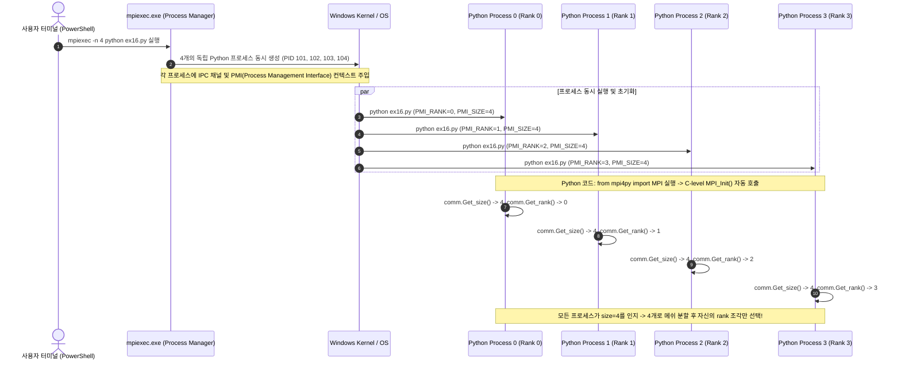

# Architectural Guide — `mpiexec` 프로세스 생성 및 MPI Rank/Size 전달 메커니즘

**문서 번호**: `ARCH-20260913-MPI-PROCESS-INJECTION`  
**작성 일자**: 2026-09-13  
**대상 개념**: MPI Process Manager, SPMD 패러다임, `mpi4py.MPI.COMM_WORLD`, 도메인 분할 메커니즘  

---

## 1. 사용자의 핵심 의문 (Core Question)

> *" `mpiexec -n 2` 또는 `4`로 지정한 프로세스 수가 어떻게 `ex16_~.py` 내부로 전달되는가? 파이썬 스크립트도 그 인자를 알고 있어야 몇 개로 분할할지 결정할 수 있는 것이 아닌가?"*

---

## 2. 결론 요약 (Executive Summary)

> [!IMPORTANT]
> **`mpiexec -n 4`는 `sys.argv`에 인자(`-n 4`)를 전달하는 방식이 아닙니다.**  
> `mpiexec`는 **동일한 파이썬 스크립트를 4개의 독립된 운영체제(OS) 프로세스로 동시에 실행(Spawn)**시키며, 각 프로세스의 통신 핸들(Socket / Named Pipe / IPC) 및 환경 변수에 **"전체 프로세스 수(`size = 4`)"**와 **"자신의 고유 번호(`rank = 0, 1, 2, 3`)"**를 시스템 레벨에서 주입합니다.  
> 파이썬 스크립트는 **`mpi4py`의 `MPI.COMM_WORLD` C-API 바인딩**을 통해 이 주입된 메타데이터를 즉시 조회하므로, 커맨드라인 인자를 별도로 넘기지 않아도 자신이 몇 개로 분할해야 하는지 완벽히 알 수 있습니다.

---

## 3. `mpiexec`의 내부 프로세스 스폰 및 통신 주입 메커니즘



---

## 4. `ex16_mpi_domain_decomposition_2d.py` 코드 상세 동작 분석

### 4.1 1단계: MPI 런타임 접속 및 환경 쿼리
```python
from mpi4py import MPI

comm = MPI.COMM_WORLD    # 전역 프로세스 통신 그룹(Communicator) 획득
rank = comm.Get_rank()   # 내 프로세스의 고유 ID (0, 1, 2, 또는 3)
size = comm.Get_size()   # 전체 프로세스 개수 (mpiexec -n으로 지정한 값 = 4)
```
- 파이썬 인터프리터가 시작될 때 `mpi4py`가 C 라이브러리의 `MPI_Init()`을 호출합니다.
- `comm.Get_size()`는 `mpiexec`가 생성한 월드 내의 총 프로세스 개수(`size=4`)를 반환합니다.
- `comm.Get_rank()`는 4개의 프로세스 중 자신이 몇 번째 프로세스인지(`0`, `1`, `2`, `3`)를 반환합니다.

### 4.2 2단계: 크기(`size`)에 맞춘 메쉬 분할 및 내 서브도메인 선택
```python
# 모든 프로세스가 동일하게 전체 메쉬 정보를 인지한 상태에서:
# 'size' (예: 4)개로 메쉬를 분할하라고 명령
subdomains = DomainPartitioner.partition(mesh_global, num_partitions=size, axis="x")

# 4개로 나뉜 서브도메인 리스트 중, '자신의 rank 번호'에 해당하는 조각만 소유!
my_subdomain = subdomains[rank]
```
- `num_partitions=size`에 의해 `DomainPartitioner`는 요소를 정확히 `size`개(예: 4개)의 청크로 분할합니다.
- Rank 0은 `subdomains[0]` (첫 번째 조각: $x \in [0, 25]$)
- Rank 1은 `subdomains[1]` (두 번째 조각: $x \in [25, 50]$)
- Rank 2은 `subdomains[2]` (세 번째 조각: $x \in [50, 75]$)
- Rank 3은 `subdomains[3]` (네 번째 조각: $x \in [75, 100]$)

### 4.3 3단계: 독립 연산 및 `Allreduce`를 통한 결과 통합
```python
# 각 랭크는 오직 자신에게 배정된 40개 요소만 Numba JIT로 초고속 조립 (통신 0%)
K_local, f_local = local_solver.assemble_system(u_local)

# 경계면 절점의 힘/강성을 모든 랭크가 합산(Sum)하여 동기화
comm.Allreduce(f_int_global_contrib, f_int_mpi, op=MPI.SUM)
comm.Allreduce(K_global_local_dense, K_global_mpi_dense, op=MPI.SUM)
```

---

## 5. 일반 CLI 인자(`sys.argv`) 방식과의 차이점 비교

| 비교 항목 | 일반 CLI 인자 방식 (`python script.py --nparts 4`) | **MPI 방식 (`mpiexec -n 4 python script.py`)** |
|:---|:---|:---|
| **프로세스 개수** | **단 1개의 Python 프로세스** (PID 1개) | **4개의 독립된 Python 프로세스** (PID 4개 동시 생성) |
| **인자 전달 경로** | 커맨드라인 문자열 파싱 (`sys.argv`, `argparse`) | OS 프로세스 관리자(PMI / IPC 소켓 / 환경변수) |
| **메모리 공간** | 1개의 메모리 공간 (GIL 공유로 CPU 병렬성 제한) | **4개의 완전히 독립된 물리 메모리 공간** (GIL 완전 회피) |
| **통신 방법** | 단일 프로세스 내 변수 공유 (스레딩) | **네트워크 / 공유메모리 고속 MPI 통신** (소켓/IPC) |
| **클러스터 확장** | 불가능 (단일 PC 내부로 제한) | **무한 확장 가능** (네트워크 케이블로 연결된 여러 대의 PC) |

---

## 6. 대규모 메쉬 처리 시의 아키텍처 진화 (참고)

현재 `ex16`은 요소 수 수만 개 수준에서 가장 효율적인 **복제 분할(Replicated Partitioning)**을 사용하고 있습니다:
1. **Replicated Partitioning (현재)**:
   - 가벼운 메쉬 형상 데이터를 모든 랭크가 각각 생성하여 3ms 만에 스스로 분할.
   - 대용량 메쉬 데이터 전송 통신 비용이 전혀 없음.
2. **Master-Partition & Scatter (1000만 요소 이상 초대형 HPC)**:
   - 메쉬가 수십 GB에 달해 단일 프로세스가 전체를 담을 수 없을 때는, Rank 0이 디스크에서 분할하여 각 랭크로 `comm.scatter()`를 통해 부분 메쉬만 스트리밍 전송.
