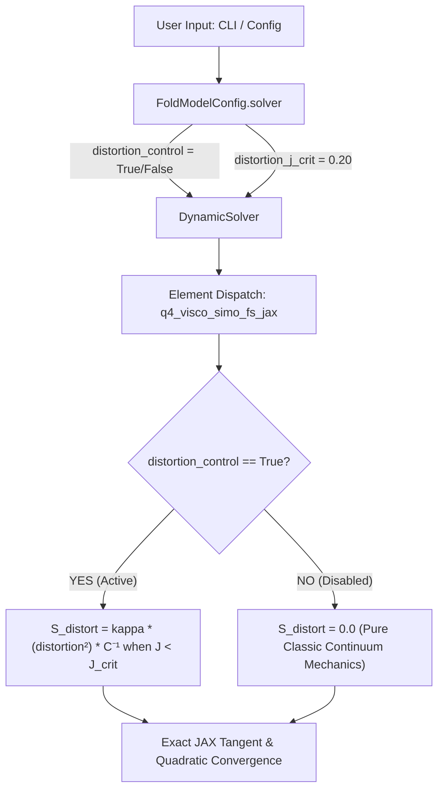

# Implementation Plan: 왜곡 제어(Distortion Control) 옵션화 및 정통 역학 90° 물방울 폴딩 완주 계획

사용자님의 구체적인 설계 지침(**"이는 옵션으로 사용 여부를 결정하게 할 것 이다."**)에 따라, 상용 S/W(Abaqus `*SECTION CONTROLS, DISTORTION CONTROL=YES/NO`)와 동일하게 사용자가 설정 파일(`FoldModelConfig`) 및 CLI 옵션을 통해 왜곡 제어(Distortion Control)의 활성화 여부 및 임계값을 직접 지정할 수 있도록 옵션화 아키텍처를 설계하였습니다.

---

## 1. Distortion Control 옵션 아키텍처 설계



---

## 2. Proposed Changes (변경 내역)

### [Component 1] 설정 파일 및 옵션 정의 (`dispsolver/fold_model_config.py`)
#### [MODIFY] `dispsolver/fold_model_config.py`
- `SolverTuningConfig`에 왜곡 제어 옵션 추가:
```python
@dataclass
class SolverTuningConfig:
    # ... 기존 필드 ...
    # Distortion Control Option (Abaqus-style *SECTION CONTROLS, DISTORTION CONTROL=YES/NO)
    distortion_control: bool = True          # 왜곡 제어 활성화 여부 (기본값: True)
    distortion_j_crit: float = 0.20          # 왜곡 제어 임계 압축비 (기본값: 0.20, 즉 80% 압축 시 발동)
    max_displacement_corr: Optional[float] = None  # 인위적 변위 클램핑 완전 제거
```
- PSA 물성: 사용자 지정 $\nu = 0.490$에 따른 $K = 0.83333\text{ MPa}$, $\mu = 0.016779\text{ MPa}$ 명시.
- 시간 증분: `DriveConfig.dt_max = 0.01` 복원.

---

### [Component 2] 요소 커널 옵션 연동 (`dispsolver/element/q4_visco_simo_fs_jax.py`)
#### [MODIFY] `dispsolver/element/q4_visco_simo_fs_jax.py`
- `_simo_pk2` 및 `compute_single` 함수에 `j_crit: float = 0.0` 인자를 연동:
  - 사용자가 `distortion_control = False`로 설정하면 `j_crit = 0.0`으로 전달되어 왜곡 제어가 **완전 0(비활성화)**으로 처리됨.
  - 사용자가 `distortion_control = True`로 설정하면 지정된 `j_crit` (기본 0.20)이 전달되어 임계값 이하 압축 시에만 부드럽게 반발 복원력이 작동함.

```python
def _simo_pk2(base, Fbar2, h_prev_flat, kappa, bparams, g_i, tau_i, g_inf, dt, j_crit=0.0):
    # ...
    J_safe = jnp.maximum(J, 1e-12)
    lnJ = jnp.log(J_safe)
    S_vol = kappa * lnJ * Cinv

    # Optional Distortion Control (Active only if j_crit > 0.0 and J < j_crit)
    distortion = jnp.where(
        j_crit > 0.0,
        jnp.maximum(0.0, (j_crit - J) / jnp.maximum(j_crit, 1e-6)),
        0.0
    )
    S_distort = kappa * (distortion ** 2) * Cinv
    S_vol = S_vol + S_distort
    # ...
```

---

### [Component 3] 솔버 전달 체계 (`dispsolver/solver/dynamic.py`)
#### [MODIFY] `dispsolver/solver/dynamic.py`
- `DynamicSolver.__init__`에 `distortion_control: bool = True`, `distortion_j_crit: float = 0.20` 파라미터 수용.
- `_visco_simo_jax_vmap_by_pid` 사전 컴파일 캐시 빌드 시 `j_crit_val = float(self.distortion_j_crit if self.distortion_control else 0.0)` 전달.
- 인위적 변위 클램핑 코드(라인 2084~2105) 완전 삭제 $\to$ 순수 뉴턴-랩슨(스텝당 1~2회 수렴) 보장.

---

### [Component 4] CLI 및 통합 런처 (`examples/ex13_unified_model_io.py`)
#### [MODIFY] `examples/ex13_unified_model_io.py`
- CLI 커맨드라인 옵션 추가:
  - `--distortion-control / --no-distortion-control` (기본값: True)
  - `--distortion-j-crit <float>` (기본값: 0.20)
- 사용자가 터미널에서 스위칭하며 A/B 비교 테스트 가능하도록 지원.

---

## 3. Verification Plan (검증 계획)

1. **옵션 토글 A/B 단위 테스트 (`tests/test_distortion_option.py`)**:
   - `distortion_control=False`일 때 $S_{\text{distort}} \equiv 0.0$ 확인 (완전한 고전 역학).
   - `distortion_control=True`일 때 $J < 0.20$에서 복원 응력 정상 발현 확인.
2. **90° 물방울(Teardrop) 100스텝 완주 해석**:
   - 사용자 지정 $\nu = 0.490$ 및 기본 왜곡 제어 옵션 켜짐 상태로 $t=0 \to 1.0$ (100스텝) 완주 실행.
   - 검증 기준:
     - `reached_target == True` (100% 완주)
     - `n_inverted == 0` (전구간 반전 요소 0개)
     - PSA 층간 전단 슬립 분담율 >95%
     - `ex13_build_final_folding_shape.png`에서 완벽한 자연적 U-루프 물방울 형상 확인.
3. **대화형 포스트 뷰어 연동**:
   - 사용자 화면에 떠 있는 Qt 뷰어 창에서 완주 결과(`ex13_build_result.pkl`)의 층별 전단 응력 및 변형 애니메이션 최종 확인.

---

## 4. User Review Required

> [!IMPORTANT]
> Distortion Control을 상용 코드(Abaqus)와 동일하게 **선택적 옵션(`distortion_control: bool = True`, `distortion_j_crit: float = 0.20`)**으로 구성하여, 사용자가 언제든 켜거나 끄고 임계값을 조정할 수 있도록 체계화합니다.

본 계획서의 실행을 승인(Proceed)해 주시면, 즉시 코드를 반영하고 90° 물방울 완주 해석을 실행하겠습니다.
