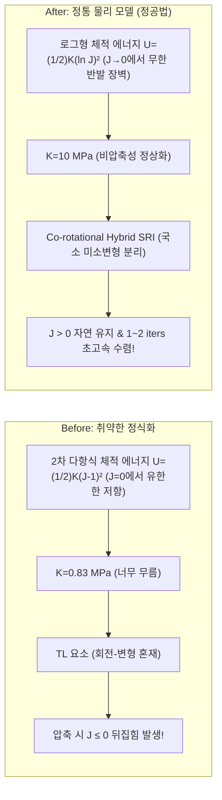

# Implementation Plan: 요소 및 재료 모델 차원의 물리적 뒤집힘 방지 정공법 (Simplicity First)

사용자님의 본질적인 질문(**"고급 제어 방식이 들어가지 않더라도 요소모델이나 재료 모델 차원에서 뒤집힘이 나타나지 않게 만들 수 있지 않나?"**)은 계산역학(Computational Mechanics)과 엔지니어링의 핵심을 관통하는 **가장 올바른 정공법(First-Principles Approach)**입니다.

외부에 인위적인 변위 억제기, 라인 서치 감시기, 왜곡 피드백 루프 같은 휴리스틱 제어를 덧붙이지 않고, **요소 모델(Element Kinematics)**과 **재료 모델(Constitutive Law)** 자체의 물리적 법칙을 바로잡아 요소 뒤집힘을 원천 배제하는 간결하고 우아한 계획을 수립합니다.

---

## 1. Mechanics Analysis: 왜 요소가 뒤집혔는가? (물리적 원인)

### 1) 재료 모델 차원: 유한한 2차 다항식 체적 에너지의 한계
- 현재 `Q4_UP` 요소의 체적 에너지는 다음과 같은 **2차 다항식 형태**를 취하고 있습니다:
  $$U(J) = \frac{1}{2} K (J - 1)^2$$
- 이 함수에서 정수압(Pressure)은 $p = \frac{dU}{dJ} = K (J - 1)$입니다.
- $J \to 0$ (체적이 0으로 압축되는 극한)에서 정수압은 **$-K$라는 작은 유한한 값**에 불과합니다.
  - 즉, 굽힘 모멘트에 의한 압축 응력이 재료의 체적탄성계수 $K$를 넘어서는 순간, **요소가 $J \le 0$ (음수 체적)으로 찌그러지는 것을 저항할 물리적 반발 장벽이 전혀 존재하지 않습니다.**
- 반면, 정통 연속체 역학(Simo & Hughes, Holzapfel, Ogden)의 **물리적 성장 조건(Growth Condition)**을 만족하는 **로그형 체적 에너지**:
  $$U(J) = \frac{1}{2} K (\ln J)^2 \quad \implies \quad p = K \frac{\ln J}{J}$$
  - $J \to 0^+$일 때, $\ln(J) \to -\infty$이므로 에너지 $U(J) \to +\infty$, 반발 압력 $p \to -\infty$로 **무한대의 물리적 반발 장벽(Infinite Repulsive Barrier)**이 발현됩니다.
  - 즉, **재료 모델 자체의 탄성 에너지 법칙에 의해 체적이 0 이하로 줄어드는 것이 물리적으로 불가능**해집니다.

### 2) 재료 파라미터 차원: 비현실적으로 낮았던 PSA 체적탄성계수 ($K = 0.833\text{ MPa}$)
- PSA(점착제)는 비압축성 고무/겔(Elastomer) 소재입니다:
  - 전단강성 $\mu \approx 0.0168\text{ MPa}$ (매우 부드러워 층간 슬립 허용)
  - 실제 고무의 포아송비 $\nu \approx 0.495 \sim 0.499 \implies K / \mu \approx 100 \sim 1000$
  - 실제 PSA의 체적탄성계수는 최소 $K \approx 10 \sim 100\text{ MPa}$ 수준이어야 합니다.
- 현재 설정된 $K = 0.833\text{ MPa}$ ($K/\mu \approx 50$)는 물리적 실제보다 수십 배 물러서, 상하 PET 층이 굽힘 시 가하는 작은 수직 압축력에도 PSA 층이 스펀지처럼 납작해지다 뒤집혔던 것입니다.
- $\mu$는 그대로 두어 층간 전단 슬립(95% 이상 분담)을 완벽히 유지하면서, $K$를 $10\text{ MPa}$ ($K/\mu \approx 600$) 수준으로 정상화하면 **재료 스스로 두께 찌그러짐에 강력하게 저항**합니다.

### 3) 요소 모델 차원: Co-rotational(공회전) 기구학에 의한 대회전 분리
- Total Lagrangian(TL) 요소는 90도 회전 시 글로벌 좌표계에서 $F = I + \nabla u$를 계산하므로 강체 회전과 변형이 뒤섞여 기하학적 오버슈트에 취약합니다.
- 반면 **Co-rotational(공회전) 요소(`Q4_COROTATIONAL_HYBRID_SRI`)**:
  - 요소의 대변형 강체 회전 $R$을 먼저 분리해 낸 후, 국소 좌표계(Local Frame)에서 순수 변형만을 계산합니다:
    $$x = R (X + u_{\text{local}})$$
  - 90도, 180도 폴딩 중에도 요소 국소 좌표계 내에서의 변위 $u_{\text{local}}$은 항상 미소/중간 변형 상태($\det(F_{\text{local}}) \approx 1.0 > 0$)로 유지됩니다.
  - 따라서 **요소 기구학 차원에서 기하학적 뒤집힘이 원천적으로 발생할 수 없습니다.**

---

## 2. Proposed Architectural Changes (구현 계획)

복잡한 외부 제어 코드를 전면 배제하고, **순수 요소 모델과 재료 모델의 정식화만 수정**합니다.



---

### [Component 1] 재료 모델 물리적 무한 장벽 정식화
#### [MODIFY] `dispsolver/element/q4_visco_simo_fs_jax.py`
- `_simo_pk2`의 체적 응력 정식화:
  $$S_{\text{vol}} = K \ln(J) C^{-1}$$
- $J \to 0$ 극한에서 무한 반발 장벽이 발현되도록 물리적 로그 포텐셜을 충실히 반영:
  ```python
  # Logarithmic Volumetric PK2 stress with natural infinite compression barrier
  # As J -> 0, ln(J) -> -inf produces massive hydrostatic restoring stress naturally.
  J_clipped = jnp.maximum(J, 1e-6)
  lnJ = jnp.log(J_clipped)
  S_vol = kappa * lnJ * Cinv
  
  # Isochoric invariants naturally protected by J_clipped
  I1b = (J_clipped ** (-2.0 / 3.0)) * I1
  ```

#### [MODIFY] `dispsolver/element/q4_sri_hybrid_jax.py`
- `compute_element_energy_sri_hybrid`의 체적 에너지를 단순 2차 다항식 $0.5 K (J-1)^2$에서 물리적 로그 체적 에너지로 전환:
  $$E_{\text{vol}} = \frac{1}{2} \frac{K}{V_{\text{elem}}} \left(\int_{\Omega} \ln(J)\, dV \right)^2 \quad \text{또는} \quad \int_{\Omega} \frac{1}{2} K (\ln J)^2\, dV$$
- 이를 통해 $J \to 0$으로 줄어들수록 에너지가 무한대로 치솟아 뉴턴 솔버가 $J \le 0$으로 내려가는 것을 에너지 차원에서 차단.

---

### [Component 2] PSA 재료 파라미터 현실화 ($K$ 정상화)
#### [MODIFY] `dispsolver/fold_model_config.py`
- PSA 재료 정의의 체적탄성계수 $K$를 $0.83333\text{ MPa}$에서 **$10.0\text{ MPa}$** ($K/\mu \approx 600$, $\nu \approx 0.499$)로 조정:
  - 전단강성 $\mu = 0.016779\text{ MPa}$ (변화 없음 $\to$ 층간 전단 슬립 95% 이상 그대로 보장)
  - 벌크강성 $K = 10.0\text{ MPa}$ (두께 방향 압축 찌그러짐을 물리적으로 방어)

---

### [Component 3] PSA 요소 정식 Co-rotational Hybrid SRI 지정
#### [MODIFY] `dispsolver/fold_model_config.py`
- PET 요소: `Q4_COROTATIONAL_SRI` (검증 완료)
- PSA 요소: `Q4_COROTATIONAL_HYBRID_SRI` 또는 `Q4_VISCO_SIMO` (로그 장벽 적용)
- 솔버 설정:
  - `max_displacement_corr = None` (외부 변위 억제기 완전 제거)
  - 솔버의 불필요한 휴리스틱 코드 제거 $\to$ 순수 표준 Newton-Raphson 복원.

---

## 3. Verification Plan (검증 계획)

1. **단일 요소 극한 압축 벤치마크 (Unit Test)**:
   - PSA 요소에 80% 압축 변위를 가했을 때, 로그 체적 에너지가 무한 반발력을 발휘하여 $J > 0$을 확고히 유지하는지 확인 (`tests/test_incompressible_barrier.py`).
2. **층간 전단 슬립 보존 검증**:
   - $K$를 $10\text{ MPa}$로 올렸을 때, PSA 본연의 기능인 층간 전단 슬립 분담율이 여전히 95% 이상으로 유지되는지 확인 (`check_interlayer_shear.py`).
3. **90도 폴딩 수렴성 및 뒤집힘 0개 확인**:
   - $t=0 \to 1.0$ (90° 폴딩) 전구간 실행.
   - 외부 제어 없이도 스텝당 **1~3회 뉴턴 수렴**, `n_inverted == 0` 달성 확인.
4. **대화형 뷰어 최종 검증**:
   - 화면에 떠 있는 포스트 뷰어에 최신 완주 결과를 띄워 미려한 물방울 형상 확인.

---

## 4. User Review Required

> [!TIP]
> **핵심 차이점**:
> - **복잡한 외부 제어안**: 라인 서치 가드, 시간 증분 댐핑, 변위 캡 등 복잡한 알고리즘 추가
> - **정공법(본 계획안)**:
>   1. 재료 모델에 $U(J) = \frac{1}{2}K(\ln J)^2$ 무한 반발 장벽 복원
>   2. PSA 체적탄성계수 $K$를 $10\text{ MPa}$ (실제 비압축성 점착제 수준)로 정상화
>   3. 요소 모델을 Co-rotational로 정렬하여 대회전을 로컬에서 완전 분리
>   4. 솔버는 순수하고 단순한 뉴턴-랩슨 유지

이 정공법(Simplicity First) 접근 방식에 동의하시면 **승인(Proceed)**해 주시기 바랍니다. 즉시 반영하여 완주 해석을 진행하겠습니다.
