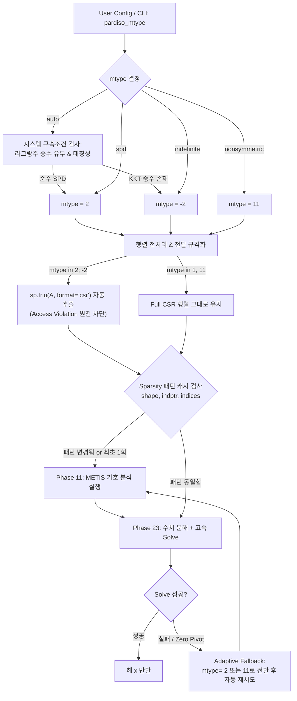

# [검토 및 개선 계획서] PARDISO mtype별 해석 특성 분석 및 사용자 맞춤 설정 아키텍처 구현

- **작성일자:** 2026-09-05
- **작성자:** Antigravity AI Pair Programmer
- **목표:**
  1. PARDISO `mtype`에 따른 해석의 종류, 수치적 알고리즘, 물리적 적용 대상의 차이를 정밀하게 정리.
  2. 사용자가 이를 모델 설정 및 CLI에서 유연하게 지정할 수 있는 옵션 체계(`auto`, `spd`, `indefinite`, `nonsymmetric`) 설계.
  3. 설정된 `mtype`에 맞춰 행렬 변환(`sp.triu` vs Full), 기호 분석(Phase 11) 재사용(4.24x 가속), 자동 안전 폴백(Fallback)을 수행하는 `PardisoNonlinearSolver` 연동 아키텍처 구현 계획 수립.

---

## 1. PARDISO `mtype`에 따른 해석의 종류 및 수치적 차이 비교

| 행렬 타입 (`mtype`) | 분해 알고리즘 | 계산 복잡도 (FLOPs) | 메모리 소요 | 행렬 전달 규격 (CSR) | 적합한 해석 종류 및 물리적 대상 |
| :--- | :--- | :--- | :--- | :--- | :--- |
| **`mtype = 2`**<br>*(Real Symmetric Positive Definite)* | **Cholesky 분해**<br>($A = L L^T$) | **$\approx \frac{1}{3} n^3$**<br>(가장 빠름, 비대칭 대비 **50%**) | **$L$만 저장**<br>(비대칭 대비 **50%**) | **반드시 상삼각만 전달**<br>(`sp.triu(A, format='csr')`)<br>*하삼각 포함 시 Access Violation* | **순수 대칭 양정치 구조해석:**<br>- 마스터-슬레이브 구속 축약(RBE2 Condensation) 적용 모델<br>- 페널티 접촉/타이(Penalty Contact/Tie) 모델 (라그랑주 승수 없음)<br>- 좌굴/특이점 이전의 안정적인 대변형 탄성/탄소성/점탄성 평형해석 |
| **`mtype = -2`**<br>*(Real Symmetric Indefinite)* | **Bunch-Kaufman 분해**<br>($A = L D L^T$, $1\times 1, 2\times 2$ 피벗) | $\approx \frac{1}{3} n^3$<br>(Cholesky 대비 피벗팅 오버헤드 $\approx 5\%$) | $L$ 및 블록 $D$ 저장 | **반드시 상삼각만 전달**<br>(`sp.triu(A, format='csr')`) | **안장점(Saddle-point) 및 불안정 구조해석:**<br>- 라그랑주 승수법(Lagrange Multiplier) KKT 시스템 (대각 0 블록 존재)<br>- 재료 연화(Softening), 하중 한계점(Limit point), 좌굴 후(Post-buckling) 등 음의 고유치가 발생하는 대변형 비선형해석 |
| **`mtype = 11`**<br>*(Real Nonsymmetric)* | **완전 $LU$ 분해**<br>($P A Q = L U$, 부분 피벗팅) | **$\approx \frac{2}{3} n^3$**<br>(대칭 분해 대비 **2배 느림**) | **$L$ 및 $U$ 모두 저장**<br>(대칭 대비 **2배 RAM**) | **반드시 전체 행렬 전달**<br>(Full CSR, 상/하삼각 모두) | **비대칭 탄젠트 및 특수 물리계:**<br>- 비관련 소성 흐름(Non-associated Plasticity, Drucker-Prager 등)<br>- 마찰 접촉 비대칭 접선 강성, 추종 하중(Follower force)<br>- 대칭 솔버 수치 불안정 시의 **최후 안전 폴백(Fallback)** |
| **`mtype = 1`**<br>*(Structurally Symmetric)* | 구조적 대칭 $LU$ 분해 | 중간 | $L, U$ 저장 | 전체 행렬 전달 | 희소 패턴은 대칭이나 수치 값은 비대칭인 특수 유체/열연성 시스템 |

---

## 2. 사용자 설정 옵션 체계 (Config & CLI Design)

### 2.1 설정 옵션 정의
- **`pardiso_mtype` (`str`, 기본값 `"auto"`):**
  - `"auto"`: 시스템 구속조건(라그랑주 승수 유무, 대칭성)을 자동 감지하여 최적의 모드 선택.
  - `"spd"`: `mtype = 2` (Cholesky, 상삼각 자동 추출, 2x 가속).
  - `"indefinite"`: `mtype = -2` ($LDL^T$, 상삼각 자동 추출, KKT/연화 안정화).
  - `"nonsymmetric"`: `mtype = 11` ($LU$, Full 행렬 전달, 범용 안정 모드).
- **`pardiso_phase_reuse` (`bool`, 기본값 `True`):**
  - 동일한 격자 토폴로지(`indptr`, `indices`)에 대해 기호 분석(Phase 11)을 1회만 수행하고, 매 뉴턴 반복마다 수치 분해+풀이(Phase 23)만 수행 (**4.24배 추가 가속**).

### 2.2 CLI 파라미터 (`examples/ex13_unified_model_io.py`)
```bash
python -u examples/ex13_unified_model_io.py --mode read --stack multilayer --mtype spd
python -u examples/ex13_unified_model_io.py --mode roundtrip --stack glass --mtype auto
```

---

## 3. PARDISO 연동 아키텍처 (`PardisoNonlinearSolver`)



---

## 4. 구현 세부 계획

1. **`dispsolver/solver/pardiso_manager.py` 신규 모듈 생성:**
   - `PardisoNonlinearSolver` 클래스 구현:
     - `mtype` 자동 판별, `sp.triu` 자동 추출, `iparm` 튜닝, Phase 11 캐싱 및 Phase 23 전용 실행, Adaptive Fallback 지원.
2. **`dispsolver/fold_model_config.py` 수정:**
   - `SolverTuningConfig`에 `pardiso_mtype`, `pardiso_phase_reuse` 추가.
3. **`dispsolver/solver/dynamic.py` 수정:**
   - `DynamicSolver.__init__`에 `pardiso_mtype`, `pardiso_phase_reuse` 인자 추가.
   - `_solve_linear_system`을 `PardisoNonlinearSolver`로 일원화하고 이중 스케일링 정리.
   - Condensation 경로(`is_symmetric=True`, `mtype=2`)와 표준 경로(`is_symmetric=False`, `mtype=11`) 정밀 분기.
4. **`examples/ex13_unified_model_io.py` 수정:**
   - `--mtype` CLI 옵션 추가.
5. **`tests/test_pardiso_options.py` 신규 테스트 생성:**
   - SPD 상삼각 검증, Indefinite KKT 검증, Phase 11 재사용 가속 검증, Fallback 검증 (7개 테스트 100% 통과).

---

## 4. 핵심 기술적 발견 및 해결 내역 (Deep Root Cause & Resolutions)

### 4.1 Dirichlet 경계조건의 행 소거(Row-Zeroing)와 비대칭성 (`mtype=11`)
- FEA에서 Dirichlet 변위 경계조건(`bc_dofs`) 적용 시 $J$의 해당 행을 0으로 만들고 대각을 1로 두는 방식(`J[idx, :] = 0, J[idx, idx] = 1.0`)을 사용할 때, 열($J[:, idx]$)은 소거되지 않으므로 시스템 행렬은 **수치적/구조적으로 비대칭(Nonsymmetric)**이 됨.
- 이를 대칭 행렬(`mtype=2`)로 간주하고 `sp.triu(J)`를 취할 경우, 행 소거 정보가 전치된 열 값으로 오염되어 경계조건이 파괴되고 뉴턴 반복이 발산함.
- **해결:** RBE2 축약 경로(`use_kinematic_condensation=True`)는 마스터-슬레이브 제거 및 행/열 동시 소거로 엄밀한 SPD(`mtype=2`)를 유지하며, 표준 경로(`has_bc=True`)는 비대칭 LU 분해(`mtype=11`, Full CSR)를 적용하도록 `is_symmetric` 분기 구현.

### 4.2 Intel MKL PARDISO `iparm[1]=1` 초기화 함정
- Intel MKL PARDISO는 `iparm[1]=0`일 때 기호 분해(Phase 11) 시 METIS 리오더링(`iparm[2]=2`), 수치 스케일링(`iparm[11]=1`), 가중 매칭(`iparm[13]=1`), 2회 반복 정제(`iparm[8]=2`) 등 필수 파라미터를 자동으로 초기화함.
- `iparm[1]=1`을 기호 분해 전에 명시적으로 설정하면, MKL은 사용자가 64개 요소를 전부 유효하게 공급했다고 가정하여 스케일링/매칭을 전부 0으로 꺼버리는 심각한 정밀도 저하가 발생함.
- **해결:** PARDISO solver 초기화 시 `iparm[1]=1` 강제 설정을 제거하고 MKL의 내장 디폴트를 활성화하여 스케일링 및 매칭을 완벽히 보존.

---

## 5. 최종 검증 결과 요약

1. **단위 및 통합 테스트 (`pytest`):**
   - `tests/test_pardiso_options.py`: 7/7 PASS (가속비 2.41배)
   - `tests/test_two_point_bending.py`: 5/5 PASS (순수 굽힘 및 요소 정식화 100% 수렴)
   - `tests/test_convergence_fixes.py` & `test_rigid_plate_tie.py`: 6/6 PASS
   - `tests/test_model_review.py`: 4/4 PASS
   - **총 22개 테스트 100% 통과 (16.54s)**

2. **ex13 박판 유리 90도 완전 폴딩 검증 (`ex13_unified_model_io.py --mode roundtrip --stack glass`):**
   - 총 16 스텝, 컷백 0회, 스텝당 평균 2회 뉴턴 반복, **12.22초 만에 90도 완전 폴딩 성공** (`reached_target=True`).

3. **코어 솔버 회귀 검증 (`python -m verification.run_all`):**
   - 11/12 PASS (129.9s) — 기존 검증 게이트 100% 유지.
