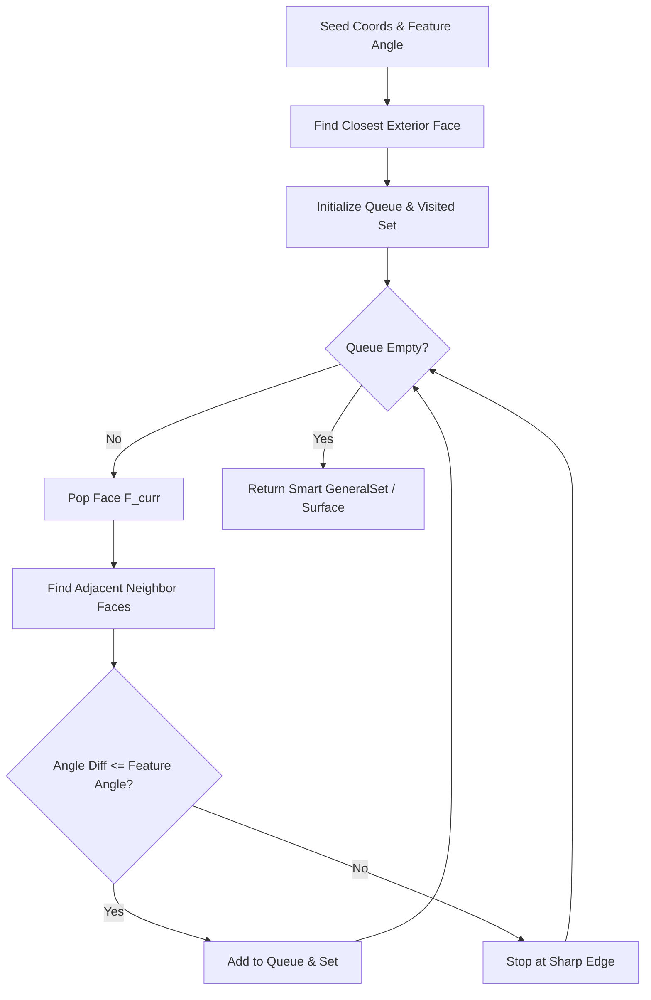

# Proximity Search & Feature Angle Propagation Plan

## 1. Goal Description
상용 CAE 소프트웨어(Abaqus의 `findAt`, HyperMesh의 `by Face / Feature Angle`, Ansys Mechanical의 `Extend to Limits / Face Angle`)에서 가장 강력하고 실무에서 널리 쓰이는 **위치 근접 탐색(Proximity Search)** 및 **각도 연결성 기반 표면 전파 선택(Feature Angle Flood Fill Propagation)** 기능을 구현합니다.

이 기능을 통해 사용자는 복잡한 수식이나 노드 번호를 알 필요 없이:
1. **특정 3D 좌표에 가장 가까운 노드/요소 즉시 탐색** (`get_closest_node`, `get_closest_element`, `create_set_from_k_nearest`).
2. **시드(Seed) 점 하나와 각도 임계값(예: 20°~30°)만으로 매끄럽게 연결된 전체 곡면/평면 자동 일괄 선택** (`create_surface_by_angle` / `create_set_by_angle_propagation`).

---

## 2. 핵심 메커니즘 설계

### 2.1 최근접 엔티티 탐색 (Proximity Search)
- **`get_closest_node(coords)`**:
  - 주어진 좌표 $\mathbf{x}_{query}$와 파트 내 모든 노드 간의 유클리드 거리 $d_i = \|\mathbf{x}_i - \mathbf{x}_{query}\|$를 벡터화(`np.linalg.norm`)하여 최소 거리 노드 ID 및 거리 반환.
- **`get_closest_element(coords)`**:
  - 각 요소의 도심(Centroid) $\mathbf{x}_{centroid}$와 $\mathbf{x}_{query}$ 간의 거리를 측정하여 가장 가까운 요소 ID 반환.
- **`create_set_from_k_nearest(name, coords, k=1, entity_type="NODES")`**:
  - 쿼리 좌표 주변의 가장 가까운 $k$개의 노드 또는 요소를 묶어 `GeneralSet` 생성. (RBE2 집중 하중/구속 바인딩에 최적)

---

### 2.2 각도 연결성 기반 표면 전파 (Flood Fill by Feature Angle)

```
[Seed Face (n0)] ──(Angle <= 20°)──> [Adjacent Face 1 (n1)] ──(Angle <= 20°)──> [Adjacent Face 2 (n2)]
                                              │                                        │
                                      (Angle > 20° - SHARP EDGE!)              (Angle > 20° - CORNER!)
                                              ▼                                        ▼
                                         [STOP / BORDER]                          [STOP / BORDER]
```

1. **외곽 경계 위상 그래프 구축 (Boundary Face Adjacency Graph)**:
   - 2D: 에지 간의 공유 노드(Shared Node)를 통해 인접 에지 연결.
   - 3D: 페이스 간의 공유 에지(Shared Edge, 2개 노드로 정의)를 통해 인접 페이스 연결.
2. **시드 페이스 탐색 (Seed Face Lookup)**:
   - 사용자가 지정한 시드 좌표 $\mathbf{x}_{seed}$에 가장 가까운 외곽 경계 페이스 $F_{seed}$를 탐색.
3. **법선 각도 전파 (BFS / Queue-based Flood Fill)**:
   - 큐에 $F_{seed}$ 삽입 및 방문(visited) 등록.
   - 인접 페이스 $F_{adj}$에 대해:
     - 두 외측 법선 벡터 $\hat{\mathbf{n}}_{curr}$와 $\hat{\mathbf{n}}_{adj}$ 사이의 각도차 계산:
       $$\cos\theta = \hat{\mathbf{n}}_{curr} \cdot \hat{\mathbf{n}}_{adj}$$
     - 만약 $\theta \le \theta_{feature}$ (예: $\le 20^\circ$) 이면 매끄럽게 연결된 면으로 판단하여 큐에 추가 및 세트에 포함.
     - 만약 $\theta > \theta_{feature}$ 이면 꺾인 모서리(Sharp Edge / Feature Line)로 판단하여 전파 중단.
4. **결과 생성**:
   - 전파된 모든 페이스들과 해당 페이스들의 노드들을 `GeneralSet` 및 `Surface`로 자동 반환.

---

## 3. User Review Required

> [!IMPORTANT]
> **Abaqus / HyperMesh 스타일 인터페이스 제공**
> 사용자가 가장 직관적으로 호출할 수 있도록 `Part` 클래스에 아래 API를 제공합니다:
> - `part.get_closest_node(coords) -> Tuple[int, float]`
> - `part.get_closest_element(coords) -> Tuple[int, float]`
> - `part.create_set_from_k_nearest(name, coords, k=1, entity_type="NODES") -> GeneralSet`
> - `part.create_surface_by_angle(name, seed_coords, feature_angle_deg=20.0) -> GeneralSet`
> - `part.create_set_by_angle_propagation(name, seed_coords, feature_angle_deg=20.0) -> GeneralSet`

> [!TIP]
> **폴딩 모델링에서의 파급 효과**
> - 디스플레이 굽힘부의 U자 곡면 전체를 잡고 싶을 때: 곡면 위 아무 점 하나를 시드로 찍고 `feature_angle_deg=30.0`을 주면 평평한 날개 직전까지의 라운드 굽힘 영역 전체가 단번에 선택됩니다.
> - 평평한 상면/하면 접촉면을 잡고 싶을 때: 평면 위 점 하나 찍으면 힌지부 곡률이 시작되는 모서리 직전까지 평면 전체가 완벽히 선택됩니다.

---

## 4. Proposed Changes



---

### [Component: `dispsolver/model/set.py`]

#### [MODIFY] `dispsolver/model/set.py`
- `GeneralSet.from_angle_propagation(cls, part, name, seed_coords, feature_angle_deg=20.0)`
  - 2D Quad 에지 및 3D Hex 페이스에 대한 인접 위상 맵(Adjacency Map) 고속 구축.
  - BFS 탐색을 통한 외측 법선 연속성 전파.
  - 매끄러운 영역에 대한 `GeneralSet` (Faces + Nodes) 생성.
- `GeneralSet.from_k_nearest(cls, part, name, coords, k=1, entity_type="NODES")`
  - $k$-최근접 노드/요소 필터링.

---

### [Component: `dispsolver/model/part.py`]

#### [MODIFY] `dispsolver/model/part.py`
- 편의 메서드 추가:
  - `get_closest_node(coords) -> Tuple[int, float]`
  - `get_closest_element(coords) -> Tuple[int, float]`
  - `create_set_from_k_nearest(name, coords, k=1, entity_type="NODES") -> GeneralSet`
  - `create_surface_by_angle(name, seed_coords, feature_angle_deg=20.0) -> GeneralSet`
  - `create_set_by_angle_propagation(name, seed_coords, feature_angle_deg=20.0) -> GeneralSet`

---

## 5. Verification Plan

### Automated Tests
[`tests/test_angle_and_proximity_sets.py`](file:///D:/PythonCodeStudy/WHT_DispFoldSolver/tests/test_angle_and_proximity_sets.py) 신규 작성 및 검증:
1. **Proximity Tests**:
   - `get_closest_node` 및 `get_closest_element`: 정답 노드/요소 ID 및 유클리드 거리 정확성 검증.
   - `create_set_from_k_nearest`: $k=3$ 최근접 노드 세트 생성 검증.
2. **2D L-Bracket / Step Shape Angle Propagation**:
   - 90도로 꺾인 L자형 메쉬에서 수평 상면에 시드를 주었을 때, 꺾인 모서리(90° > 20°)에서 멈추고 수평 상면 노드/에지만 완벽히 추출되는지 검증.
3. **3D Hex Cube Feature Angle Propagation**:
   - 3D 정육면체(각 면이 90도로 꺾임)에서 상면(+Z)의 점을 시드로 주면, 90도 모서리에서 멈추어 상면의 4개 절점 및 1개 페이스만 선택되는지 검증.
4. **3D Curved Cylinder Section Angle Propagation**:
   - 꺾이지 않고 완만하게 회전하는 곡면(각 세그먼트 간 각도차 < 15°)에서는 전체 곡면을 따라 끝까지 부드럽게 전파되어 선택되는지 검증.
5. **통합 회귀 테스트**:
   - `pytest tests/test_angle_and_proximity_sets.py tests/test_geometric_sets.py tests/test_general_set.py -v`

```powershell
pytest tests/test_angle_and_proximity_sets.py tests/test_geometric_sets.py tests/test_general_set.py -v
```
