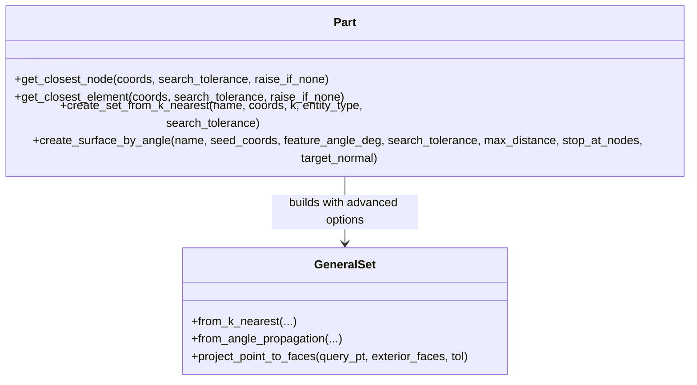

# Search Tolerance, Orthogonal Projection & Advanced CAE Selection Plan

## 1. Goal Description
사용자께서 제시하신 **"정확한 점 좌표를 알 수 없을 때의 허용 오차(`tolerance`) 기반 최근접 선택"** 요구사항을 바탕으로, 상용 CAE(Abaqus `findAt`, HyperMesh `Extend by Angle`, ANSA)의 실무 전처리 노하우를 집약한 **차세대 스마트 영역 선택 체계**를 설계합니다.

"더 고려할 게 없을까?"에 대한 전문 엔지니어링 분석을 통해, 실무에서 발생할 수 있는 5가지 핵심 문제(투영 오차, 박판 윗면/아랫면 침범, 다중 시드, 전파 차단 경계, 최대 반경 제한)를 모두 해결하는 완성형 솔루션을 제안합니다.

---

## 2. 실무 CAE 관점에서 반드시 더 고려해야 할 5가지 핵심 요소

```
┌──────────────────────────────────────────────────────────────────────────────────┐
│                           차세대 스마트 선택의 5대 핵심 고려사항                  │
├───────────────────────┬──────────────────────────────────────────────────────────┤
│ 1. Search Tolerance   │ • 공차 반경 R_tol 내 최근접 선택                                   │
│    (허용 오차 탐색)     │ • 공차 초과 시 엉뚱한 노드 선택 방지 (안전 가드 / raise_if_none)   │
├───────────────────────┼──────────────────────────────────────────────────────────┤
│ 2. Orthogonal Face    │ • 노드가 아닌 요소 한가운데(Face Interior)를 찍었을 때             │
│    Projection         │ • 점-노드 거리 대신 점-표면 수직 투영 거리(Orthogonal Distance)    │
│    (수직 면 투영)       │   및 내/외부 판정으로 완벽한 시드 페이스 자동 식별 (Abaqus findAt)  │
├───────────────────────┼──────────────────────────────────────────────────────────┤
│ 3. Multiple Seeds     │ • seed_coords에 단일 점뿐만 아니라 점 목록([[x,y,z], ...]) 지원     │
│    (복수 시드 일괄 전파)│ • 떨어져 있거나 대칭인 여러 면을 한 번의 호출로 통합 생성           │
├───────────────────────┼──────────────────────────────────────────────────────────┤
│ 4. Stop Boundaries    │ • 특정 노드/세트 라인(용접선, 파티션선)에서 전파 강제 차단        │
│    (전파 한계/차단 경계)│ • max_distance: 시드 점으로부터 R_max 이내까지만 선택              │
├───────────────────────┼──────────────────────────────────────────────────────────┤
│ 5. Wrap-Around Guard  │ • 얇은 박판(Thin sheet/Display panel)에서 두께가 매우 얇을 때      │
│    (박판 반대면 침범 방지)│ • 윗면을 찍었는데 모서리를 타고 아랫면까지 전파되는 현상 원천 차단 │
│                       │ • target_normal 방향 검사 및 90° 꺾임 모서리 완벽 차단           │
└───────────────────────┴──────────────────────────────────────────────────────────┘
```

---

## 3. 상세 기능별 설계

### 3.1 `search_tolerance` 옵션 (허용 오차 기반 안전 탐색)
- **문제점**: 사용자가 `(10.0, 0.0, 0.0)` 부근의 노드를 찾고자 할 때, 해당 부위에 메쉬가 없으면 저 멀리 `(0.0, 0.0, 0.0)`에 있는 엉뚱한 노드가 거리 10으로 반환되어 해석 조건이 엉뚱한 곳에 들어갈 위험이 있음.
- **설계**:
  ```python
  part.get_closest_node(coords, search_tolerance=0.1, raise_if_none=False)
  ```
  - `search_tolerance=None`: 무제한(unbounded) 최근접 탐색.
  - `search_tolerance=0.1`: 거리 $\le 0.1$ 이내에서만 검색. 없으면 `raise_if_none`에 따라 `None` 반환 또는 `EntityNotFoundError` 발생.

---

### 3.2 면 수직 투영 (Orthogonal Face Projection - Abaqus `findAt` 완벽 재현)
- **문제점**: 사용자가 CAD나 형상 표면 상의 임의의 점 $\mathbf{x}_{query}$를 찍었을 때, 그 점은 대개 **노드 바로 위가 아니라 요소 페이스 한가운데(Interior)**에 위치합니다.
- **해결 알고리즘**:
  1. 각 외곽 페이스 평면에 $\mathbf{x}_{query}$를 수직 투영:
     $$h = (\mathbf{x}_{query} - \mathbf{x}_{centroid}) \cdot \hat{\mathbf{n}}_{face}$$
     $$\mathbf{x}_{proj} = \mathbf{x}_{query} - h \hat{\mathbf{n}}_{face}$$
  2. 투영점 $\mathbf{x}_{proj}$가 해당 페이스의 폴리곤 경계 내부에 존재하는지 판정 (Point-in-Polygon / Barycentric 좌표).
  3. 폴리곤 내부이면서 수직 거리 $|h| \le \text{tolerance}$인 페이스를 **최우선 시드 페이스**로 즉시 매칭!
  4. 만약 정확히 투영되는 페이스가 없으면, 기존의 도심/노드 최소 유클리드 거리 방식으로 부드럽게 Fallback.

---

### 3.3 다중 시드(Multiple Seeds) 지원
- `seed_coords`에 `Sequence[float]`(단일 점)뿐만 아니라 `Sequence[Sequence[float]]`(점들의 목록)를 모두 수용:
  ```python
  # 좌/우 대칭 플레이트 상면을 한 번에 서피스로 생성
  top_surfaces = part.create_surface_by_angle(
      name="TOP_SURFACE_ALL",
      seed_coords=[[-25.0, 0.0, 0.5], [25.0, 0.0, 0.5]],
      feature_angle_deg=20.0,
      search_tolerance=0.2
  )
  ```

---

### 3.4 전파 차단 경계 (`stop_at_nodes`, `stop_at_sets`, `max_distance`)
- 평평한 판재라도 특정 파티션선(Partition line)이나 용접선, 힌지 시작 지점에서 전파를 멈추고 싶을 때:
  ```python
  part.create_surface_by_angle(
      name="HINGE_ZONE_ONLY",
      seed_coords=[0.0, 0.0, 0.5],
      feature_angle_deg=30.0,
      max_distance=10.0,          # 시드로부터 10mm 반경 이내만
      stop_at_sets=["PLATE_LEFT_EDGE", "PLATE_RIGHT_EDGE"]  # 해당 셋의 노드를 만나면 전파 중단
  )
  ```

---

### 3.5 박판 반대면 침범 방지 (Wrap-Around Guard)
- 두께 0.1mm의 극박판 디스플레이에서 윗면과 아랫면의 거리는 0.1mm에 불과함.
- `target_normal`: 시드 점을 찍었을 때 예상되는 면의 법선 방향(예: $+Y$ 또는 $+Z$)을 힌트로 주면, 반대 방향을 향하는 페이스나 두께 측면 페이스는 시드 선택 및 전파 단계에서 사전에 완벽히 필터링.

---

## 4. Proposed Changes



---

### [Component: `dispsolver/model/set.py`]

#### [MODIFY] `dispsolver/model/set.py`
1. `GeneralSet.from_k_nearest`:
   - `search_tolerance: Optional[float] = None` 인자 추가.
   - 공차 필터링 및 `raise_if_none` 옵션 지원.
2. `GeneralSet.from_angle_propagation`:
   - `seed_coords: Union[Sequence[float], Sequence[Sequence[float]]]` 다중 시드 지원.
   - `search_tolerance: Optional[float] = None` 지원.
   - `max_distance: Optional[float] = None` (시드로부터 최대 거리 제한).
   - `stop_at_nodes: Optional[Set[int]] = None` (전파 차단 노드 셋).
   - `target_normal: Optional[Sequence[float]] = None` (박판 반대면 침범 방지 법선 필터).
   - 페이스 수직 투영 탐색기(`_find_seed_face_by_projection`) 내장.

---

### [Component: `dispsolver/model/part.py`]

#### [MODIFY] `dispsolver/model/part.py`
- `get_closest_node(coords, search_tolerance=None, raise_if_none=False)`
- `get_closest_element(coords, search_tolerance=None, raise_if_none=False)`
- `create_surface_by_angle` 및 `create_set_by_angle_propagation`에 위 고급 옵션 일괄 연결.

---

## 5. Verification Plan

### Automated Tests
[`tests/test_advanced_selection.py`](file:///D:/PythonCodeStudy/WHT_DispFoldSolver/tests/test_advanced_selection.py) 작성:
1. **Search Tolerance Test**:
   - 공차 내 노드 정상 반환 검증.
   - 공차 초과 시 `None` 반환 및 `raise_if_none=True`일 때 `ValueError` 예외 발생 검증.
2. **Orthogonal Face Projection Test**:
   - 노드가 아닌 3D Hex 표면의 정확한 도심(Face interior) 점을 주었을 때, 해당 페이스가 정확히 시드로 매칭되는지 검증.
3. **Multiple Seeds Test**:
   - 떨어진 2개의 위치를 `seed_coords`로 전달하여 2개의 분리된 평면이 하나의 서피스로 통합 생성되는지 검증.
4. **Max Distance & Stop Boundary Test**:
   - 긴 직사각형 스트립에서 `max_distance=5.0`을 주어 5mm 이내의 면만 선택되는지 검증.
   - `stop_at_nodes`로 지정된 라인을 건너뛰지 않고 멈추는지 검증.
5. **Thin Sheet Wrap-Around Guard Test**:
   - 두께 0.1mm 박판에서 `target_normal=[0, 1, 0]`을 통해 상면만 선택되고 아랫면으로 침범하지 않는지 검증.

```powershell
pytest tests/test_advanced_selection.py tests/test_angle_and_proximity_sets.py tests/test_geometric_sets.py tests/test_general_set.py -v
```
