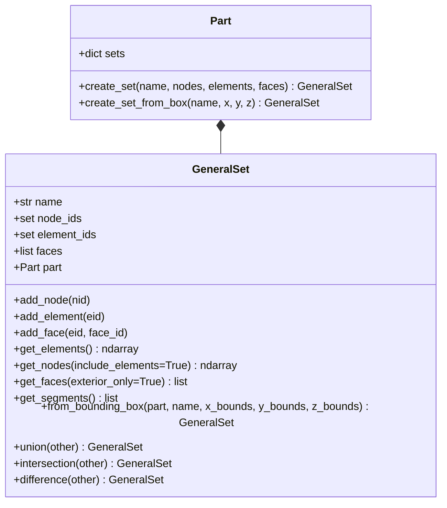

# Smart GeneralSet (통합 세트/리전) 아키텍처 구현 계획서

## 1. 개요 및 목적 (Goal Description)

사용자께서 제시하신 핵심 요구사항:
> *"set 정의 기능 구현! elem, node 면 되려나? set part는 어때? set part general 기능을 독자적으로 가지고 node가 필요하면 node 정보를, elem이 필요하면 elem을 segment 필요하면 segment set을 제공하는 기능 general 기능이다."*

Abaqus/CAE 및 상용 프리프로세서(HyperMesh, Ansa, Patran 등)의 핵심 편의 기능 중 하나는 **"세트의 다형성(Polymorphism) 및 연관 해결(Associative Resolution)"**입니다.
즉, 사용자가 특정 기하학적 영역을 세트로 한 번만 정의해 두면:
- **요소가 필요할 때 (`set.elements`)**: 세트의 요소 목록 반환
- **노드가 필요할 때 (`set.nodes`)**: 세트에 명시된 노드뿐만 아니라, **세트에 포함된 요소들을 구성하는 모든 구성 절점(Associated Nodes)**을 자동으로 탐색하여 반환
- **세그먼트/경계면이 필요할 때 (`set.faces` / `set.segments`)**: 세트 내 요소들의 외곽 경계면(Boundary Facets/Edges)을 기하학적으로 자동 추출하여 Surface Tie나 접촉면에 즉시 연결
- **좌표 기반 지능형 필터링 (`from_bounding_box`, `from_cylinder`)**: 번호를 일일이 찾지 않고 $X, Y, Z$ 좌표 범위로 노드/요소/페이스를 한 번에 수집하는 편의 기능

본 계획은 기존의 단순 `NodeSet`/`ElementSet` 분리 구조를 뛰어넘어, **자율적이고 독립적인 범용 세트 객체 `GeneralSet` (Smart Region)**을 설계하고 구현하는 것을 목표로 합니다.

---

## 2. 사용자 검토 요구사항 (User Review Required)

> [!IMPORTANT]
> **하위 호환성 유지**:
> 기존의 명시적 `NodeSet`, `ElementSet`, `Surface` 클래스는 그대로 유지하면서, 상위 통합 클래스로 `GeneralSet`을 도입합니다.
> `Part.create_set(name, ...)`을 호출하면 `GeneralSet`이 생성되며, 기존 `create_node_set`, `create_element_set`과의 완벽한 상호 변환을 지원합니다.

> [!TIP]
> **요소 기반 노드 자동 확장 (Associative Node Resolution)**:
> 예를 들어 사용자가 `part.create_set("TOP_LAYER", elements=[1, 2, 3])`으로 요소만 지정했더라도,
> 경계조건 설정 시 `set.get_nodes()`를 호출하면 요소 1, 2, 3을 구성하는 모든 노드 번호들의 합집합을 중복 없이 정렬하여 즉시 반환합니다.

---

## 3. 질문 사항 (Open Questions)

> [!NOTE]
> 1. **세그먼트(Face) 자동 추출 시 내부 공유면(Internal Faces) 제외 여부**:
>    - 요소 세트로부터 `get_faces()`나 `get_segments()`를 자동 추출할 때, 서로 맞닿아 있는 내부 공유면은 자동으로 상쇄(cancellation)시키고 **바깥쪽 외곽 경계면(Free Boundary Faces)**만 추출하는 것이 기본 동작입니다. 특정 내부 면이 필요한 경우 `faces` 파라미터로 명시할 수 있습니다.
> 2. **세트 연산자 오버로딩**:
>    - Python의 집합 연산자(`|`: 합집합, `&`: 교집합, `-`: 차집합)를 지원하여 `set_all = set_layer1 | set_layer2`와 같이 직관적으로 조합할 수 있도록 구현합니다.

---

## 4. `GeneralSet` 클래스 구조 및 아키텍처



---

## 5. 상세 구현 계획 (Proposed Changes)

### Component: `dispsolver/model/set.py`

#### [MODIFY] `dispsolver/model/set.py`
`GeneralSet` 클래스 신규 추가:
- **속성**:
  - `name`: 세트 고유 식별자
  - `node_ids`: 명시적으로 포함된 노드 ID 집합
  - `element_ids`: 명시적으로 포함된 요소 ID 집합
  - `faces`: 명시적으로 포함된 `ElementFace` 리스트
  - `part`: 소유자 `Part` 참조 (연관 절점 및 외곽면 역추적용)
- **핵심 메서드**:
  1. `get_elements() -> np.ndarray`:
     포함된 모든 요소 ID의 정렬된 int64 넘파이 배열 반환.
  2. `get_nodes(include_elements=True) -> np.ndarray`:
     명시적 노드 + (요소 세트가 있고 `include_elements=True`인 경우) 해당 요소들을 구성하는 모든 로컬 노드들의 합집합 반환.
  3. `get_faces(exterior_only=True) -> List[ElementFace]`:
     명시된 face가 있으면 그것을 반환. 없으면 요소 세트의 연결성을 분석하여 외곽 노출 면(외부 경계면)을 자동 판정하여 반환.
  4. `get_segments() -> List[Tuple[int, int]]`:
     2D 접촉 및 Tie에 즉시 사용할 수 있는 2절점 선분 `(node_a, node_b)` 리스트 반환.
  5. `from_bounding_box(part, name, x=None, y=None, z=None, entity_type="ALL") -> GeneralSet`:
     지정된 $X, Y, Z$ 좌표 범위 내에 위치한 노드, 요소(중심점 기준 또는 전 절점 기준), 페이스를 자동 필터링하여 일괄 수집하는 팩토리 메서드.
  6. **연산자 오버로딩**:
     `__or__` (합집합), `__and__` (교집합), `__sub__` (차집합) 구현.

---

### Component: `dispsolver/model/part.py`

#### [MODIFY] `dispsolver/model/part.py`
`Part` 클래스에 `GeneralSet` 연동 기능 확장:
- `self.sets: Dict[str, GeneralSet]` 추가 (Abaqus의 `part.sets` 컬렉션과 1:1 대응).
- `create_set(name, nodes=None, elements=None, faces=None) -> GeneralSet`:
  노드, 요소, 페이스를 한 번에 넘겨받아 통합 세트 생성.
- `create_set_from_box(name, x_range=None, y_range=None, z_range=None) -> GeneralSet`:
  좌표 상자 기반으로 노드와 요소를 자동 추출하여 세트 등록.
- `SectionAssignment` 시 `region` 인자가 `GeneralSet` 자체이거나 세트 이름 문자열인 경우 모두 지원.

---

### Component: `dispsolver/model/assembly.py`

#### [MODIFY] `dispsolver/model/assembly.py`
- `build_solver_system`에서 `inst.part.sets`의 `GeneralSet`들을 자동으로 전역 리졸브:
  - `"INST.SET"`으로 참조할 때, 노드가 필요하면 `get_nodes()`, 요소가 필요하면 `get_elements()`를 자동 호출하여 글로벌 ID로 매핑.
- `add_tie(name, master_set, slave_set)`:
  문자열 이름 대신 `GeneralSet` 객체를 직접 전달하면, 내부에서 자동으로 `get_faces()` 또는 `get_segments()`를 추출하여 서피스 타이 구속으로 변환.

---

## 6. 검증 계획 (Verification Plan)

### 6.1 단위 테스트 확장 (`tests/test_general_set.py`)
1. **단일 세트 다형성 검증**:
   - 요소 4개로 구성된 `GeneralSet` 생성 후 `get_elements()`와 `get_nodes()` 호출 시 구성 절점 9개가 완벽히 추출되는지 검증.
2. **외곽 페이스/세그먼트 자동 추출 검증**:
   - 2x2 메쉬에서 `set.get_faces(exterior_only=True)` 호출 시 내부 공유면 4개는 제외되고 바깥쪽 8개 에지만 정확히 추출되는지 검증.
3. **좌표 Bounding-Box 필터링 검증**:
   - $X \in [10, 20]$ 범위의 노드/요소가 정확히 세트에 수집되는지 검증.
4. **집합 연산자 검증**:
   - `set1 | set2`, `set1 & set2`, `set1 - set2` 연산 결과의 정확성 검증.
5. **Abaqus 스타일 솔버 연동 검증**:
   - `part.create_set_from_box("CLAMP_END", x_range=[-20, -19.9])`로 생성한 세트를 경계조건(`DisplacementBC`)에 직접 넘겨 해석이 정상 수행되는지 검증.

테스트 실행 명령어:
```powershell
pytest tests/test_general_set.py -v
```
