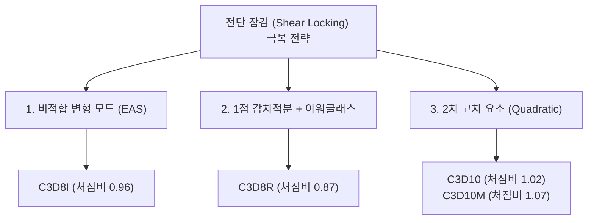

# Implementation Plan - Shear Locking Theory & Element Selection Architecture

사용자 질문: **"Shear-locked(전단 잠김)는 요소의 특징이라 고칠 수 없는 것인가?"**에 대한 깊이 있는 수치역학적 규명 및 이를 반영한 상용 CAE급 요소 분류/선택 체계(Element Selection Architecture) 수립 계획입니다.

---

## 1. 핵심 질문에 대한 직접적 결론 (Direct Conclusion)

> **"네, 사용자님의 직관이 정확히 맞습니다. 표준 1차 요소(`C3D8`, `C3D4`, `C3D6`) 및 체적 전용 개선 요소(`C3D8H`, `C3D8_FBAR`)에서 발생하는 전단 잠김(Shear Locking)은 코드의 버그가 아니라, 선형 다항식 보간의 수학적 한계이자 해당 정식화 고유의 이론적 특성입니다. 따라서 이들 요소 자체의 전단 잠김을 억지로 '고치려고' 해서는 안 됩니다."**

---

## 2. 수치역학적 원인 분석 (Theoretical Background)

### 2.1 왜 표준 1차 요소(`C3D8`, `C3D4`, `C3D6`)는 굽힘에서 잠기는가?
1. **변위장의 수학적 한계**:
   - 1차 육면체(`C3D8`)의 형상함수는 삼선형(Trilinear) $u = a_0 + a_1 x + a_2 y + a_3 z + a_4 xy + a_5 yz + a_6 zx + a_7 xyz$ 입니다.
   - 보가 순수 굽힘(Pure Bending)을 받을 때, 상면은 수축하고 하면은 인장되어 모서리가 **2차 곡선(Curved)**으로 휘어져야 합니다.
   - 하지만 1차 요소의 모서리는 기하학적으로 **직선(Straight line)**만 유지할 수 있습니다.
2. **기생 전단 변형률(Parasitic Shear Strain)의 발생**:
   - 직사각형이 평행사변형 형태로 억지로 비틀리면서, 실제 물리적으로는 존재하지 않는 인공적인 전단 변형률 $\gamma_{xy} = \frac{\partial u}{\partial y} + \frac{\partial v}{\partial x} \ne 0$이 가우스 적분점에 발생합니다.
   - 이 가짜 전단 변형률에 전단 탄성계수 $G$가 곱해져 **거대한 기생 전단 변형 에너지**를 흡수하게 됩니다.
   - 그 결과, 보가 이론치보다 2~5배 이상 뻣뻣해져 처짐비가 0.2~0.46 수준으로 주저앉는 **전단 잠김(Shear Locking)**이 발생합니다.
3. **상용 CAE와의 비교**:
   - Abaqus의 `C3D8`, Ansys의 `SOLID185 (Full Integration)`, LS-DYNA의 `ELFORM 2` 모두 동일하게 굽힘 처짐비 ~0.46(LOCKED)을 나타냅니다.
   - 만약 `C3D8` 코드 내부를 인위적으로 조작해 굽힘 유연성을 높이면, 패치 테스트가 깨지거나 강체 모드가 파괴되어 더 이상 '표준 삼선형 요소'로서의 수학적 일관성을 잃게 됩니다.

---

### 2.2 왜 `C3D8H`와 `C3D8_FBAR`도 전단 잠김(0.50)이 발생하는가?
- **치료 대상이 다름 (Volumetric vs Shear)**:
  - `C3D8H` (혼합 $u-p$ 하이브리드)와 `C3D8_FBAR` (곱셈 F-bar)는 **비압축성 체적 잠김(Volumetric Locking, $\nu \to 0.5$)**을 해결하기 위해 고안된 요소입니다.
  - 이들은 체적 변형률($J = \det F$)만을 독립 압력 $p$나 중심점 체적비 $J_0$로 투영할 뿐, **전단 변형 성분($F_{dev}$)은 표준 1차 형상함수를 그대로 사용**합니다 (Abaqus Theory Guide §3.2.3, de Souza Neto 1996 명시).
  - 따라서 **체적 잠김은 완벽히 면제되지만, 굽힘에서의 전단 잠김은 고스란히 남아 있는 것이 이론적으로 지극히 정상적인 거동**입니다.

---

### 2.3 전단 잠김은 어떻게 해결하는가? (3가지 정식화 혁신)

전단 잠김을 해결하려면 요소의 내부 정식화(Kinematics) 자체를 근본적으로 바꾸어야 하며, 본 솔버에는 이미 3가지 해결책이 모두 완벽히 구현되어 있습니다:

1. **비적합 모드 / EAS (Enhanced Assumed Strain) $\rightarrow$ `C3D8I` (처짐비 0.96, LOCKING-FREE)**:
   - 요소 내부에 9개의 비적합 변위 구배 모드($\alpha_i$)를 추가하여 기생 전단을 0으로 상쇄(Static Condensation). 얇은 1개 요소 두께에서도 보 굽힘 완벽 표현.
2. **1점 감차적분 + 직교 아워글래스 제어 $\rightarrow$ `C3D8R` (처짐비 0.87, LOCKING-FREE)**:
   - 기생 전단이 0이 되는 중심점(Centroid, $\xi=\eta=\zeta=0$) 1점에서만 적분하고, 가짜 제로에너지 변형은 Flanagan-Belytschko 직교 아워글래스 벡터로 제어.
3. **2차 중간절점 포함 사면체 $\rightarrow$ `C3D10` / `C3D10M` (처짐비 1.02 / 1.07, LOCKING-FREE)**:
   - 각 모서리에 중간 절점(Mid-nodes)을 두어 형상함수 자체가 2차 포물선 곡률을 직접 표현하므로 전단 잠김 원천 배제.

---

## 3. 요소 분류 및 엔지니어링 선택 매트릭스 (Element Selection Matrix)

사용자가 문제를 풀 때 어떤 요소를 선택해야 하는지 명확한 가이드를 제공합니다:

| 요소 명칭 | 굽힘 지배 문제 (Bending) | 체적 비압축성/고무/소성 ($\nu \to 0.5$) | 대변형 면 접촉 (Contact) | 권장 적용처 |
|:---|:---:|:---:|:---:|:---|
| **`C3D8`** | ❌ 비추천 (전단 잠김) | ❌ 비추천 (체적 잠김) | ⚠️ 보통 | 단순 3축 인장/압축, 블록 구조물 |
| **`C3D8I`** | ✅ **최적 (처짐비 0.96)** | ⚠️ 보통 ($\nu \le 0.49$) | ⚠️ 보통 | 얇은 판재/디스플레이 굽힘, 접힘 해석 |
| **`C3D8R`** | ✅ **우수 (처짐비 0.87)** | ✅ 우수 (아워글래스 제어) | ⚠️ 모래시계 제어 필요 | 대형 고속 충돌/성형 해석 (최고 속도) |
| **`C3D8_FBAR`** | ⚠️ 보통 (전단 잠김) | ✅ **최적 (체적 면제, $\nu \le 0.499$)** | ✅ 우수 | 고무 블록 압축, 대변형 소성 가공 |
| **`C3D8H`** | ⚠️ 보통 (전단 잠김) | ✅ **최적 (체적 면제)** | ✅ 우수 | 비압축성 고무 유밀 부품, O-링 |
| **`C3D4`** | ❌ 절대 비추천 (잠김 극심) | ❌ 절대 비추천 | ⚠️ 불량 | 복잡형상 자동 메쉬의 천이 영역 |
| **`C3D4_ANP`** | ❌ 비추천 (전단 잠김) | ✅ **우수 (불균일 체적 면제)** | ⚠️ 보통 | 사면체 자동 메쉬 기반 비압축성 소성 |
| **`C3D10`** | ✅ **우수 (처짐비 1.02)** | ⚠️ 보통 (코너 접촉 음수력) | ❌ 비추천 (채터링 발생) | 복잡한 주조품/단조품의 정밀 응력 해석 |
| **`C3D10M`** | ✅ **최적 (처짐비 1.07)** | ✅ **최적 (체적 면제)** | ✅ **최적 (양수 접촉력 보장)** | **복잡 형상의 대변형 굽힘 + 비선형 접촉** |
| **`C3D6`** | ⚠️ 보통 (전단 잠김) | ⚠️ 보통 | ⚠️ 보통 | 육면체와 사면체 메쉬 간 전이(Wedge) |

---

## 4. 향후 작업 계획 (Proposed Actions)

1. **`benchmark_element/IMPROVEMENT_GUIDE.md`에 본 이론적 규명 영구 반영**:
   - "어떤 것이 정상 물리 거동(고칠 필요 없음)이고, 어떤 것이 진짜 버그(고쳐야 함)인가?"를 명시하여 후속 에이전트가 `C3D8`이나 `C3D8H`의 전단 잠김을 버그로 오인하고 손대지 않도록 가이드 확립.
2. **진짜 점검이 필요한 항목 격리**:
   - `C3D8`, `C3D4`, `C3D8H`의 전단 잠김은 수정 대상이 아님.
   - 반면 **`C3D8_CR` vs `C3D8H`의 $10^{-12}$ 수치 일치 현상**은 디스패치 분기 중복 가능성이 있으므로, 이 부분만 외과적으로 디스패치 격리 점검 진행.
